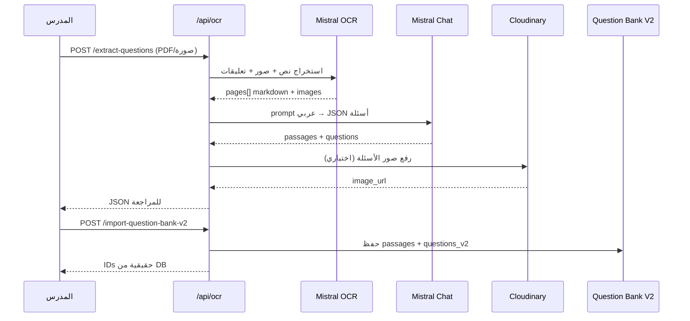

# استخراج الأسئلة بالذكاء الاصطناعي من PDF والصور — API

توثيق تفصيلي لنظام **استخراج الأسئلة تلقائياً** من ملفات PDF وصور الامتحانات/الواجبات باستخدام **Mistral AI**.

يدعم النظام:

- استخراج النص الخام (OCR) من PDF أو صورة أو **صور متعددة**
- تحديد **نطاق صفحات PDF** (`start_page` → `end_page`)
- استخراج **أسئلة منظمة** (نص السؤال + 4 اختيارات + الإجابة الصحيحة)
- استخراج **قطع قراءة مشتركة** (passages) مرتبطة بعدة أسئلة
- ربط **صور داخل الملف** (رسوم، جداول، معادلات) بالأسئلة
- استيراد النتيجة مباشرة إلى **بنك الأسئلة V2**

---

## Base URL

```txt
https://YOUR_API_DOMAIN/api/ocr
```

تطوير محلي:

```txt
http://localhost:8000/api/ocr
```

**المسار في الكود:** `src/routes.ts` → `/ocr` → `src/controllers/mistralOcr.ts`

---

## المصادقة

```http
Authorization: Bearer <ACCESS_TOKEN>
```

| الدور | الصلاحية |
|-------|----------|
| `teacher` | استخراج + استيراد لدروسه في بنك الأسئلة |
| `admin` | كامل |
| `employee` | استخراج + استيراد |

---

## أدوات الذكاء الاصطناعي

| المرحلة | الأداة | النموذج الافتراضي |
|---------|--------|-------------------|
| **OCR** — PDF/صورة → نص Markdown | Mistral OCR API | `mistral-ocr-latest` |
| **تحليل الأسئلة** — نص → JSON منظم | Mistral Chat API | `mistral-large-latest` |
| **رفع صور الأسئلة** | Cloudinary | — |

### Pipeline كامل



---

## متغيرات البيئة

```env
MISTRAL_API_KEY=...
MISTRAL_API_BASE_URL=https://api.mistral.ai/v1
MISTRAL_OCR_MODEL=mistral-ocr-latest
MISTRAL_CHAT_MODEL=mistral-large-latest

# حجم ملف OCR الأقصى بالميجابايت — افتراضي 512 — ضع 0 بلا حد
MISTRAL_OCR_MAX_FILE_SIZE_MB=512

# مطلوب عند include_question_images=true (رفع صور OCR إلى CDN)
CLOUDINARY_CLOUD_NAME=...
CLOUDINARY_API_KEY=...
CLOUDINARY_API_SECRET=...
CLOUDINARY_URL=...
```

---

## أنواع الملفات المدعومة

| النوع | MIME |
|-------|------|
| PDF | `application/pdf` |
| PNG | `image/png` |
| JPEG | `image/jpeg`, `image/jpg` |
| WebP | `image/webp` |
| GIF | `image/gif` |
| AVIF | `image/avif` |
| BMP | `image/bmp` |
| TIFF | `image/tiff` |

**الحد الأقصى لحجم الملف:** يُضبط عبر `MISTRAL_OCR_MAX_FILE_SIZE_MB` (افتراضي **512 MB**، و`0` = بلا حد من جهة التطبيق).  
**Content-Type:** `multipart/form-data` — حقل `file` أو `files`

> **إنتاج:** تأكد أيضاً أن الـ reverse proxy (nginx / Cloudflare / load balancer) يسمح بجسم الطلب بنفس الحجم أو أكبر (`client_max_body_size` في nginx مثلاً). ملفات PDF الطويلة تُقسَّم تلقائياً داخلياً (OCR كل 50 صفحة + تحليل أسئلة على دفعات).

---

## نظرة عامة على المسارات

```http
POST /extract-text              # OCR فقط — نص خام
POST /extract-questions         # OCR + AI — أسئلة منظمة
POST /import-question-bank-v2   # حفظ النتيجة في بنك الأسئلة V2
```

---

# 1) استخراج النص فقط (OCR)

### `POST /extract-text`

يحوّل PDF أو صورة إلى نص Markdown لكل صفحة **بدون** تحليل أسئلة.

**Auth:** `teacher` | `admin` | `employee`

| Field | إلزامي | الوصف |
|-------|--------|--------|
| `file` | واحد من الاثنين | PDF واحد أو صورة واحدة |
| `files` | واحد من الاثنين | صور متعددة (حتى 20) |
| `start_page` / `end_page` | لا | **PDF فقط** — نطاق الصفحات (1-based، شامل) |

**Response `200`:**

```json
{
  "success": true,
  "data": {
    "filename": "exam.pdf",
    "mime_type": "application/pdf",
    "document_type": "pdf",
    "model": "mistral-ocr-latest",
    "page_count": 3,
    "text": "النص الكامل المدمج من كل الصفحات...",
    "pages": [
      {
        "index": 0,
        "markdown": "محتوى الصفحة الأولى...",
        "images": []
      }
    ],
    "usage_info": {}
  }
}
```

**مثال curl:**

```bash
curl -X POST "http://localhost:8000/api/ocr/extract-text" \
  -H "Authorization: Bearer $TOKEN" \
  -F "file=@exam.pdf"
```

**متى تستخدمه؟** معاينة النص قبل الاستخراج، أو عندما تحتاج النص فقط بدون بنية أسئلة.

---

# 2) استخراج الأسئلة بالذكاء الاصطناعي

### `POST /extract-questions`

المسار الرئيسي: **PDF/صورة → أسئلة JSON جاهزة للمراجعة والاستيراد**.

**Auth:** `teacher` | `admin` | `employee`

| Field | إلزامي | Default | الوصف |
|-------|--------|---------|--------|
| `file` | واحد من الاثنين | — | PDF واحد **أو** صورة واحدة |
| `files` | واحد من الاثنين | — | **صور متعددة** (حتى 20 صورة) — لا يُستخدم مع PDF |
| `start_page` | لا | — | **PDF فقط** — رقم الصفحة الأولى للاستخراج (يبدأ من **1**) |
| `end_page` | لا | — | **PDF فقط** — رقم الصفحة الأخيرة (شامل). مثال: من 3 إلى 7 |
| `infer_correct_answer` | لا | `false` | إذا `true`، الـ AI قد يستنتج الإجابة الصحيحة إن لم تكن مكتوبة صراحة |
| `include_question_images` | لا | `true` | استخراج صور/رسوم من الملف وربطها بالأسئلة + رفعها لـ Cloudinary |

> يمكن تمرير الحقول الاختيارية في **body** أو **query**.

### رفع صور متعددة

```bash
curl -X POST "http://localhost:8000/api/ocr/extract-questions" \
  -H "Authorization: Bearer $TOKEN" \
  -F "files=@page1.jpg" \
  -F "files=@page2.jpg" \
  -F "files=@page3.jpg"
```

### PDF مع نطاق صفحات

```bash
curl -X POST "http://localhost:8000/api/ocr/extract-questions" \
  -H "Authorization: Bearer $TOKEN" \
  -F "file=@exam.pdf" \
  -F "start_page=3" \
  -F "end_page=7"
```

> **ملاحظات:**
> - أرقام الصفحات **1-based** (الصفحة الأولى = 1).
> - لا يوجد حد أقصى لعدد الصفحات في الطلب — الـ API يقسّم PDF تلقائياً إلى دفعات (حد مزوّد OCR = 50 صفحة/طلب داخلياً).
> - لا يمكن رفع PDF وصور معاً في نفس الطلب.

**مثال curl (ملف واحد):**

```bash
curl -X POST "http://localhost:8000/api/ocr/extract-questions" \
  -H "Authorization: Bearer $TOKEN" \
  -F "file=@exam.pdf" \
  -F "infer_correct_answer=true" \
  -F "include_question_images=true"
```

---

## Response `200` — الهيكل الكامل

```json
{
  "success": true,
  "data": {
    "filename": "exam.pdf",
    "mime_type": "application/pdf",
    "document_type": "pdf",
    "page_count": 2,
    "page_range": {
      "start_page": 3,
      "end_page": 7,
      "pages_processed": 5
    },
    "source_files": [
      { "filename": "page1.jpg", "mime_type": "image/jpeg" },
      { "filename": "page2.jpg", "mime_type": "image/jpeg" }
    ],
    "question_count": 5,
    "ocr_model": "mistral-ocr-latest",
    "chat_model": "mistral-large-latest",
    "infer_correct_answer": true,
    "passages": [
      {
        "passage_id": "passage_1",
        "title": "اقرأ النص التالي",
        "content": "نص القطعة الكامل الذي يتبعه عدة أسئلة..."
      }
    ],
    "extracted_images": [
      {
        "image_id": "page-0-image-0",
        "page_index": 0,
        "image_type": "diagram",
        "short_description": "رسم بياني",
        "summary": "رسم يوضح العلاقة بين السرعة والزمن",
        "extracted_text": null
      }
    ],
    "questions": [
      {
        "number": 1,
        "source_number": "1",
        "passage_id": "passage_1",
        "question_text": "ما الفكرة الرئيسية في النص؟",
        "options": [
          { "label": "أ", "text": "الخيار الأول" },
          { "label": "ب", "text": "الخيار الثاني" },
          { "label": "ج", "text": "الخيار الثالث" },
          { "label": "د", "text": "الخيار الرابع" }
        ],
        "question_images": [
          {
            "image_id": "page-0-image-0",
            "page_index": 0,
            "short_description": "رسم بياني",
            "image_url": "https://cdn.example.com/media/question-image.png"
          }
        ],
        "correct_answer": "ب",
        "correct_answer_index": 1,
        "correct_answer_inferred": true
      }
    ],
    "notes": "ملاحظات اختيارية من الـ AI"
  }
}
```

---

## قواعد الاستجابة المهمة

### القطع المشتركة (Passages)

| الحقل | الوصف |
|-------|--------|
| `passage_id` | معرف **مؤقت** (مثل `passage_1`) — ليس ID من قاعدة البيانات |
| `title` | عنوان اختياري للقطعة |
| `content` | نص القطعة كاملاً |

- إذا كان هناك **نص قراءة واحد** يتبعه عدة أسئلة → يُوضع في `passages[]` مرة واحدة.
- كل سؤال تابع يحمل نفس `passage_id`.
- **لا يُكرَّر** نص القطعة داخل `question_text`.

### الأسئلة

| الحقل | الوصف |
|-------|--------|
| `number` | رقم تسلسلي |
| `source_number` | الرقم كما في الملف الأصلي |
| `question_text` | نص السؤال فقط (بدون القطعة) |
| `options` | **إما فارغة** أو **بالضبط 4 اختيارات** |
| `correct_answer_index` | **يبدأ من 0**: أ=0، ب=1، ج=2، د=3 |
| `correct_answer_inferred` | `true` إذا استنتجها AI وليست مكتوبة صراحة |
| `question_images` | صور مرتبطة بالسؤال (رسم، جدول، معادلة) |

### الصور

- عند `include_question_images=true`:
  - Mistral OCR يُعلِّق على الصور داخل الملف (`bbox_annotation_format`)
  - الصور المرتبطة بالأسئلة تُرفع تلقائياً إلى **Cloudinary**
  - الاستجابة تحتوي `image_url` — **لا** `image_base64` (لتقليل الحجم)

---

## ما يفهمه الـ AI (قواعد الاستخراج)

الـ prompt العربي في `src/prompts/mistralQuestionExtraction.prompt.ts` يوجّه النموذج لـ:

1. عدم اختراع أسئلة غير موجودة في الملف
2. دعم **قطع قراءة** + أسئلة متعددة عليها
3. دعم **سؤال رئيسي/تمهيد** يتبعه أسئلة فرعية (التمهيد = passage)
4. ربط الأسئلة بصور من `IMAGE_CONTEXT` عبر `image_id`
5. الحفاظ على اللغة العربية كما في المصدر

---

# 3) استيراد الأسئلة إلى بنك الأسئلة V2

### `POST /import-question-bank-v2`

يحفظ JSON المستخرج (بعد مراجعة المدرس) في قاعدة البيانات.

**Auth:** `teacher` | `admin` | `employee`  
**Content-Type:** `application/json`

### Request Body

```json
{
  "lesson_id": 101,
  "extraction": {
    "passages": [
      {
        "passage_id": "passage_1",
        "title": "نص القراءة",
        "content": "النص الكامل..."
      }
    ],
    "questions": [
      {
        "number": 1,
        "passage_id": "passage_1",
        "question_text": "ما الفكرة الرئيسية؟",
        "options": [
          { "label": "أ", "text": "..." },
          { "label": "ب", "text": "..." },
          { "label": "ج", "text": "..." },
          { "label": "د", "text": "..." }
        ],
        "question_images": [],
        "correct_answer_index": 1
      }
    ]
  }
}
```

| Field | إلزامي | الوصف |
|-------|--------|--------|
| `lesson_id` | نعم | معرف الدرس في بنك الأسئلة |
| `extraction.passages` | لا | القطع المشتركة |
| `extraction.questions` | نعم | قائمة الأسئلة (واحد على الأقل) |

### Response `201`

```json
{
  "success": true,
  "message": "تم استيراد 5 سؤال",
  "data": {
    "passages": [
      {
        "temp_passage_id": "passage_1",
        "db_passage": {
          "id": 12,
          "lesson_id": 101,
          "title": "نص القراءة",
          "content": "...",
          "order_index": 0
        }
      }
    ],
    "questions": [
      {
        "id": 250,
        "question_text": "ما الفكرة الرئيسية؟",
        "question_type": "text_only",
        "lesson_id": 101,
        "passage_id": 12,
        "options": []
      }
    ],
    "skipped": []
  }
}
```

### الجداول المتأثرة

```txt
question_passages    ← القطع المشتركة
questions_v2         ← الأسئلة
question_options     ← 4 اختيارات لكل سؤال
question_media       ← صورة السؤال (إن وُجدت)
```

### صلاحيات الاستيراد

| الدور | الشرط |
|-------|--------|
| `admin` / `employee` | الدرس موجود |
| `teacher` | الدرس تابع لبنك أسئلة أنشأه المدرس |

---

# 4) التدفق الموصى به (Frontend)

## أ) استخراج → مراجعة → استيراد (بنك الأسئلة V2)

```
1. المدرس يرفع PDF/صورة
        ↓
2. POST /api/ocr/extract-questions
        ↓
3. عرض passages + questions للمراجعة والتعديل
        ↓
4. POST /api/ocr/import-question-bank-v2
   { lesson_id, extraction: { passages, questions } }
        ↓
5. الأسئلة محفوظة في بنك الأسئلة — جاهزة للاستخدام
```

## ب) استخراج → مكتبة المدرس الخاصة

```
1. POST /api/ocr/extract-questions
        ↓
2. تجميع الأسئلة حسب passage_id
        ↓
3. لكل قطعة:
   POST /api/teacher/questions/passage
   { lesson_id, title, content, questions: [...] }
        ↓
4. للأسئلة بدون قطعة:
   POST /api/teacher/questions/question
```

### مثال Mapping (TypeScript)

```typescript
const { passages, questions } = ocrResponse.data;

for (const passage of passages) {
  const linked = questions.filter((q) => q.passage_id === passage.passage_id);

  await api.post('/api/teacher/questions/passage', {
    lesson_id,
    title: passage.title,
    content: passage.content,
    questions: linked.map((q) => ({
      question_text: q.question_text,
      question_type: q.options.length ? 'choice' : 'text',
      choices: q.options.map((o) => o.text),
      answer: q.options[q.correct_answer_index ?? 0]?.text,
      image_url: q.question_images?.[0]?.image_url ?? null,
      correct_answer_index: q.correct_answer_index,
      difficulty_level: 'medium',
      points: 1,
    })),
  });
}
```

---

# 5) الأخطاء الشائعة

| HTTP | الرسالة | السبب / الحل |
|------|---------|--------------|
| `400` | `يجب رفع ملف واحد في الحقل file` | لم يُرفَع ملف |
| `400` | `يسمح برفع PDF أو صورة فقط` | نوع ملف غير مدعوم |
| `413` | `حجم الملف أكبر من الحد المسموح...` | زد `MISTRAL_OCR_MAX_FILE_SIZE_MB` أو ضع `0` بلا حد |
| `400` | `OCR provider returned invalid question JSON` | Mistral رجّع JSON غير مطابق للـ schema |
| `400` | `Validation failed` | body الاستيراد غير صالح (Zod) |
| `403` / خطأ | `ليس لديك صلاحية لإضافة أسئلة لهذا الدرس` | المدرس ليس مالك بنك الأسئلة |
| `500` | `MISTRAL_API_KEY is required` | المفتاح غير مضبوط في `.env` |
| `500` | `Mistral OCR failed: ...` | خطأ من Mistral (رصيد، ملف تالف، حجم) |
| `500` | `Mistral question extraction failed: ...` | فشل نموذج Chat |

### مثال خطأ JSON غير صالح

```json
{
  "success": false,
  "message": "OCR provider returned invalid question JSON",
  "errors": [
    {
      "path": ["questions", 0, "options"],
      "message": "options must be either empty or exactly 4 choices"
    }
  ]
}
```

---

# 6) ملاحظات تقنية

| الموضوع | التفاصيل |
|---------|----------|
| **التنفيذ** | متزامن (synchronous) — لا يوجد queue |
| **الملف المؤقت** | يُحفظ في `uploads/mistral-ocr/` ثم يُحذف بعد المعالجة |
| **معرفات القطع** | `passage_1` مؤقت → يتحول لـ `id` حقيقي عند الاستيراد |
| **حالة السؤال بعد الاستيراد** | `status: 'pending'` — يحتاج موافقة/نشر حسب workflow بنك الأسئلة |
| **سؤال بصورة فقط** | `question_type: 'text_with_image'` إذا وُجدت `question_images` |
| **تخطي أسئلة** | في `skipped[]` إذا لا نص ولا صورة |

---

# 7) مقارنة مع أنظمة أخرى في المنصة

| الميزة | `/api/ocr/extract-questions` | `/api/lesson-pdf-questions` | `/api/questions/lecture-exam-question` |
|--------|------------------------------|------------------------------|----------------------------------------|
| **الهدف** | استخراج أسئلة منظمة بالـ AI | كل صفحة PDF = سؤال صورة | رفع صور أسئلة يدوياً |
| **OCR + AI** | ✅ Mistral | ❌ | ❌ |
| **اختيارات منظمة** | ✅ | ❌ (الصورة فقط) | ❌ (الصورة فقط) |
| **قطع قراءة** | ✅ | ❌ | ❌ |
| **الاستيراد** | بنك V2 أو مكتبة المدرس | `lesson_pdf_questions` | امتحان محاضرة |

---

## الملفات المصدرية

| الملف | الدور |
|--------|--------|
| `src/controllers/mistralOcr.ts` | مسارات HTTP |
| `src/services/mistralOcr.ts` | Mistral OCR API |
| `src/services/mistralQuestionExtraction.ts` | Pipeline كامل + رفع Cloudinary |
| `src/services/questionExtractionImport.ts` | استيراد بنك V2 |
| `src/types/mistralQuestionExtraction.ts` | Zod schemas + types |
| `src/prompts/mistralQuestionExtraction.prompt.ts` | Prompt عربي للاستخراج |

---

## توثيق إضافي

- [`ocr-question-extraction-and-passages-api.md`](./ocr-question-extraction-and-passages-api.md) — نسخة إنجليزية + مسارات مكتبة المدرس
- [`lesson-pdf-questions-import.md`](./lesson-pdf-questions-import.md) — استيراد PDF كصور (بدون AI)
- [`lecture-exam-image-questions-api.md`](./lecture-exam-image-questions-api.md) — أسئلة امتحان بالصور

---

*آخر تحديث يتوافق مع `src/controllers/mistralOcr.ts` و`src/services/mistralQuestionExtraction.ts`.*
