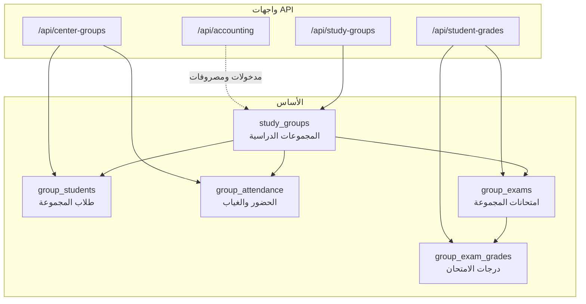

# توثيق نظام إدارة السنتر (Center Management System)

## نظرة عامة

نظام إدارة السنتر في هذا المشروع يخدم **المراكز التعليمية الحضورية** (سنتر دروس خصوصية) حيث يدير المدرس مجموعات طلاب بمواعيد ثابتة، يسجّل الحضور والغياب، يتابع مدفوعات الطلاب، ويسجّل درجات الامتحانات.

النظام **ليس** نظام الكورسات الأونلاين (`/api/course`) ولا مجموعات الباكدج (`/api/package-subject-groups`). هو مبني حول كيان أساسي واحد:

```text
study_groups  →  المجموعة الدراسية في السنتر
```

كل ما يتعلق بالطلاب والحضور والامتحانات يُربط بهذه المجموعة.

---

## المكوّنات الرئيسية



| الوحدة | المسار الأساسي | الغرض |
|--------|----------------|--------|
| المجموعات الدراسية | `/api/study-groups` | إنشاء المجموعات، إدارة الطلاب، الدفع، حضور تقليدي، QR بسيط |
| إدارة السنتر | `/api/center-groups` | طلاب السنتر، حضور متقدم، QR بـ JWT، تقارير حضور |
| درجات الطلاب | `/api/student-grades` | إضافة/تعديل/تقارير الدرجات (طرق متعددة) |
| الحسابات | `/api/accounting` | مدخولات ومصروفات المنصة (أدمن/موظف مالي) |
| امتحانات المجموعة | `/api/group-exams` | **معطّل حالياً (503)** |

---

## سير العمل النموذجي

### 1. إعداد المجموعة

1. المدرس يسجّل الدخول (`POST /api/login`).
2. ينشئ مجموعة دراسية:

```http
POST /api/study-groups
Authorization: Bearer <token>

{
  "name": "مجموعة رياضيات - السبت",
  "start_time": "14:00",
  "end_time": "16:00",
  "days": "السبت,الثلاثاء",
  "grade_id": 1
}
```

### 2. إضافة الطلاب

**طريقة أ — عبر study-groups (مع دعم tenant):**

```http
POST /api/study-groups/:groupId/students

{ "name": "أحمد محمد", "phone": "01000000000", "parent_phone": "01111111111" }
```

**طريقة ب — عبر center-groups (مع رقم تسلسلي داخل المجموعة):**

```http
POST /api/center-groups/:groupId/students

{ "name": "أحمد محمد" }
```

**إضافة جماعية بالأسماء فقط:**

```http
POST /api/center-groups/:groupId/students/bulk

{ "names": ["أحمد", "سارة", "محمد"] }
```

> عند إنشاء طالب جديد بدون حساب سابق، يُنشأ سجل في `users` بدور `student` وكلمة مرور عشوائية.

### 3. تسجيل الحضور

| الطريقة | المسار | الآلية |
|---------|--------|--------|
| يدوي ليوم واحد | `POST /api/study-groups/:groupId/attendance` | مصفوفة `{ student_id, status }` |
| يدوي (center) | `POST /api/center-groups/:groupId/attendance` | طالب واحد + تاريخ |
| جماعي | `POST /api/center-groups/:groupId/attendance/bulk` | عدة طلاب لنفس اليوم |
| QR — JWT | `POST /api/center-groups/:groupId/attendance/scan` | مسح `qr_payload` (موصى به للتطبيقات الحديثة) |
| QR — query string | `POST /api/study-groups/:groupId/scan-qr` | `qr_data` بصيغة `student_id=5&group_id=1` |

حالة الحضور: `present` أو `absent` فقط.

### 4. تسجيل الدرجات

**عبر study-groups (مباشرة على المجموعة):**

```http
POST /api/study-groups/:groupId/students/:studentId/exam-grades

{
  "exam_name": "امتحان الشهر الأول",
  "grade": 85,
  "total_grade": 100,
  "notes": "أداء جيد"
}
```

**عبر student-grades (بحث بالاسم):**

```http
POST /api/student-grades/

{
  "exam_name": "امتحان الشهر الأول",
  "student_id": 123,
  "grade": 85.5,
  "notes": "ملاحظة"
}
```

**إضافة مباشرة بمعرف المجموعة (تنشئ امتحاناً تلقائياً إن لم يوجد):**

```http
POST /api/student-grades/direct

{
  "group_id": 1,
  "student_id": 123,
  "exam_name": "واجب أسبوعي",
  "grade": 9,
  "total_grade": 10
}
```

### 5. متابعة المدفوعات

```http
PUT /api/study-groups/:groupId/students/:studentId

{
  "payment_status": "paid",
  "payment_amount": 500
}
```

القيم: `paid` / `unpaid`. عند التحويل إلى `paid` يُسجّل `payment_date` تلقائياً.

---

## قاعدة البيانات

### `study_groups` — المجموعة الدراسية

| العمود | الوصف |
|--------|--------|
| `id` | المعرف |
| `teacher_id` | المدرس المالك |
| `name` | اسم المجموعة |
| `start_time` / `end_time` | وقت الحصة |
| `days` | أيام الأسبوع (نص مفصول بفواصل) |
| `grade_id` | الصف الدراسي (اختياري) |

### `group_students` — عضوية الطالب

| العمود | الوصف |
|--------|--------|
| `group_id` | المجموعة |
| `student_id` | الطالب |
| `number_in_group` | رقم الطالب داخل المجموعة (1، 2، 3...) — يُستخدم في center-groups |
| `joined_at` | تاريخ الانضمام |

قيد فريد: `(group_id, student_id)` و `(group_id, number_in_group)`.

### `group_attendance` — الحضور

| العمود | الوصف |
|--------|--------|
| `group_id` | المجموعة |
| `student_id` | الطالب |
| `date` | التاريخ `YYYY-MM-DD` |
| `status` | `present` أو `absent` |

قيد فريد: `(group_id, student_id, date)` — التسجيل المتكرر يحدّث الحالة.

### `group_exams` و `group_exam_grades` — الامتحانات والدرجات

```sql
group_exams (id, group_id, name, total_grade, exam_date, ...)
group_exam_grades (id, exam_id, student_id, grade, notes, ...)
```

قيد فريد على الدرجة: `(exam_id, student_id)`.

### حقول الدفع على `users`

| العمود | الوصف |
|--------|--------|
| `payment_status` | `paid` / `unpaid` |
| `payment_amount` | المبلغ |
| `payment_date` | تاريخ آخر دفع |

---

## واجهات API بالتفصيل

### أ) `/api/study-groups` — المجموعات الدراسية

**المصادقة:** معظم عمليات الكتابة تتطلب `admin` أو `teacher`.

| Method | المسار | الوصف |
|--------|--------|--------|
| `POST` | `/` | إنشاء مجموعة |
| `PUT` | `/:id` | تحديث مجموعة (المالك فقط) |
| `DELETE` | `/:id` | حذف مجموعة (المالك فقط) |
| `GET` | `/all` | كل المجموعات (عام) |
| `GET` | `/teacher/my-groups` | مجموعات المدرس الحالي |
| `GET` | `/teacher/my-students` | كل طلاب المدرس عبر مجموعاته |
| `GET` | `/:id` | تفاصيل مجموعة |
| `POST` | `/:groupId/students` | إضافة طالب (موجود أو جديد) |
| `DELETE` | `/:groupId/students/:studentId` | إزالة طالب |
| `GET` | `/:groupId/students` | قائمة الطلاب |
| `PUT` | `/:groupId/students/:studentId` | تحديث بيانات/دفع الطالب |
| `POST` | `/:groupId/attendance` | تسجيل حضور يوم |
| `GET` | `/:groupId/attendance?date=` | حضور يوم محدد |
| `GET` | `/:groupId/attendance-range` | تقرير مدى زمني (`period=week\|month` أو `days=N`) |
| `GET` | `/:groupId/students/:studentId/attendance-details` | تفاصيل حضور طالب |
| `GET` | `/:groupId/attendance-summary` | ملخص حضور المجموعة لشهر |
| `POST` | `/:groupId/students/:studentId/exam-grades` | إضافة درجة امتحان |
| `GET` | `/:groupId/students/:studentId/exam-grades` | درجات طالب في المجموعة |
| `POST` | `/:groupId/scan-qr` | حضور عبر QR (query string) |

**الملفات المصدرية:**
- `src/controllers/studyGroups.ts`
- `src/services/studyGroups.ts`

**توثيق إضافي:** `doc/study-groups-api.md`

---

### ب) `/api/center-groups` — واجهة السنتر المتخصصة

تركّز على إدارة الطلاب والحضور مع **QR آمن (JWT)** و**رقم تسلسلي** لكل طالب داخل المجموعة.

**المصادقة:** `admin` أو `teacher` (المدرس يصل لمجموعاته فقط).

| Method | المسار | الوصف |
|--------|--------|--------|
| `POST` | `/:groupId/students` | إضافة طالب (`name` مطلوب) |
| `POST` | `/:groupId/students/bulk` | إضافة عدة طلاب بالأسماء |
| `GET` | `/:groupId/students` | الطلاب + `qrPayload` + `qrCodeDataUrl` لكل طالب |
| `GET` | `/:groupId/students/:studentId` | تفاصيل طالب + إحصائيات حضور |
| `POST` | `/:groupId/attendance/scan` | حضور بمسح QR (JWT) |
| `POST` | `/:groupId/attendance` | تسجيل حضور طالب واحد |
| `POST` | `/:groupId/attendance/bulk` | حضور جماعي |
| `GET` | `/:groupId/attendance?date=` | حضور يوم + الطلاب غير المسجّلين |
| `GET` | `/:groupId/attendance` | ملخص عام (مع `start_date` و `end_date`) |
| `GET` | `/:groupId/attendance/students/:studentId` | سجل حضور طالب |

#### نظام QR في center-groups

1. عند جلب الطلاب، كل طالب يحصل على:
   - `qrPayload`: JWT موقّع يحتوي `{ groupId, studentId, type: 'attendance' }` — صلاحية سنة.
   - `qrCodeDataUrl`: صورة QR جاهزة (Base64).

2. عند المسح:

```http
POST /api/center-groups/:groupId/attendance/scan

{ "qr_payload": "<JWT من QR>" }
```

3. يُسجّل حضور **اليوم الحالي** تلقائياً كـ `present`.

**الملفات المصدرية:**
- `src/controllers/centerGroups.ts`
- `src/services/centerGroups.ts`

---

### ج) `/api/student-grades` — إدارة الدرجات

| Method | المسار | الوصف |
|--------|--------|--------|
| `POST` | `/` | إضافة درجة (بالبحث عن `exam_name`) |
| `POST` | `/direct` | إضافة مباشرة بـ `group_id` |
| `POST` | `/direct/bulk` | إضافة جماعية مباشرة |
| `POST` | `/bulk` | إضافة جماعية بالاسم |
| `PUT` | `/:id` | تحديث درجة |
| `DELETE` | `/:id` | حذف درجة |
| `GET` | `/student/:studentId` | درجات طالب |
| `GET` | `/group/:groupId/student/:studentId` | درجات طالب في مجموعة |
| `GET` | `/exam/:examName` | درجات امتحان بالاسم |
| `GET` | `/exams/list` | قائمة امتحانات المدرس |
| `GET` | `/group/:groupId/students` | طلاب مجموعة مع درجاتهم |
| `GET` | `/group/:groupId/report` | تقرير مجموعة |
| `GET` | `/exam/:examName/report` | تقرير امتحان |

**الملفات المصدرية:** `src/controllers/studentGrades.ts`

**توثيق إضافي:**
- `doc/student-grades-api.md`
- `doc/add-student-grade-api.md`

---

### د) `/api/group-exams` — معطّل

جميع طلبات `/api/group-exams/*` تُرجع **503**:

```json
{
  "error": "نظام امتحان المجموعة معطل مؤقتاً",
  "message": "تم إلغاء نظام امتحان المجموعة بناءً على طلب الإدارة"
}
```

> استخدم بدلاً منه: `POST /api/study-groups/.../exam-grades` أو `/api/student-grades/*`.

---

### هـ) `/api/accounting` — الحسابات (اختياري)

لإدارة المدخولات والمصروفات على مستوى المنصة/السنتر (ليس مدفوعات طالب فردية).

| Method | المسار | الوصف |
|--------|--------|--------|
| `POST` | `/income` | إضافة مدخول |
| `POST` | `/expenses` | إضافة مصروف |
| `GET` | `/income` | قائمة المدخولات |
| `GET` | `/expenses` | قائمة المصروفات |
| `GET` | `/summary` | ملخص مالي |
| `GET` | `/budget` | الميزانية الشهرية |

**الصلاحيات:** `admin` أو `employee` بصلاحية `can_manage_accounting`.

**توثيق إضافي:** `doc/accounting_api.md`

---

## الفرق بين `study-groups` و `center-groups`

| الجانب | study-groups | center-groups |
|--------|--------------|---------------|
| إنشاء المجموعات | ✅ | ❌ (يستخدم مجموعة موجودة) |
| إدارة الدفع | ✅ | ❌ |
| رقم الطالب في المجموعة | ❌ | ✅ `number_in_group` |
| QR للحضور | query string بسيط | JWT آمن + صورة QR |
| تقارير حضور شهرية | ✅ `attendance-summary` | ✅ ملخص بمدى زمني |
| tenant عند إضافة طالب | ✅ يمرّر `tenant_id` | ❌ (بحث عام بالهاتف) |
| الدرجات | ✅ مسار مدمج | ❌ (استخدم student-grades) |

**توصية للفرونت إند الجديد:**
- إدارة المجموعات والدفع → `study-groups`
- شاشة الحضور اليومي و QR → `center-groups`
- شاشة الدرجات والتقارير → `student-grades`

---

## الصلاحيات

| الدور | الصلاحيات |
|-------|-----------|
| `teacher` | إدارة مجموعاته فقط (إنشاء، طلاب، حضور، درجات) |
| `admin` | كل المجموعات بدون قيد الملكية |
| `employee` | الحسابات فقط (بصلاحية محددة) |

التحقق من الملكية:

```text
study_groups.teacher_id === req.user.id
```

المدرس لا يستطيع تعديل مجموعة مدرس آخر (403).

---

## المصادقة

```http
Authorization: Bearer <JWT>
Content-Type: application/json
```

التوكن يُستخرج من `POST /api/login` بدور `teacher` أو `admin`.

---

## الملفات المصدرية

| الملف | الدور |
|-------|--------|
| `src/controllers/studyGroups.ts` | متحكم المجموعات الدراسية |
| `src/services/studyGroups.ts` | منطق المجموعات وإنشاء الطلاب |
| `src/controllers/centerGroups.ts` | متحكم السنتر (حضور + QR) |
| `src/services/centerGroups.ts` | منطق السنتر |
| `src/controllers/studentGrades.ts` | متحكم الدرجات |
| `src/controllers/groupExams.ts` | معطّل (503) |
| `src/controllers/accounting.ts` | متحكم الحسابات |
| `src/routes.ts` | تسجيل المسارات |

### Migrations ذات الصلة

- `migrations/1700000000025_create_simple_study_groups.sql`
- `migrations/1700000000028_add_student_details.sql` (حقول الدفع)
- `migrations/1700000000029_create_attendance_table.sql`
- `migrations/1700000000036_create_group_exams_system.sql`
- `migrations/1700000010002_group_students_number_in_group.sql`

---

## أخطاء شائعة

| الخطأ | السبب المحتمل |
|-------|----------------|
| `403` — لا يمكنك... | المدرس يحاول الوصول لمجموعة غير مملوكة له |
| `400` — الطالب موجود بالفعل في المجموعة | تكرار إضافة نفس الطالب |
| `400` — رمز QR غير صالح | JWT منتهي أو من مجموعة أخرى |
| `404` — Group not found | `groupId` خاطئ |
| `503` على group-exams | النظام معطّل — استخدم student-grades |
| `400` — Invalid credentials | مشكلة تسجيل دخول وليست من نظام السنتر |

---

## توثيق مرتبط

| الموضوع | الملف |
|---------|--------|
| المجموعات الدراسية (تفصيلي) | `doc/study-groups-api.md` |
| درجات الطلاب | `doc/student-grades-api.md` |
| إضافة الدرجات (دليل شامل) | `doc/add-student-grade-api.md` |
| امتحانات المجموعة (قديم — معطّل) | `doc/group-exams-api.md` |
| الحسابات | `doc/accounting_api.md` |
| Multi-tenant | `doc/multi-tenant-saas-architecture.md` |

---

## ملاحظات Multi-Tenant

- مسار `study-groups` عند إضافة طالب يتحقق من `tenant_id` عبر `req.tenant`.
- مسار `center-groups` يبحث عن الطلاب بالهاتف بشكل عام (`role = student`) دون فلتر tenant صريح في بعض العمليات.
- راجع `doc/multi-tenant-saas-architecture.md` قبل نشر السنتر على عدة منصات.

---

## مثال تكامل سريع (JavaScript)

```javascript
const API = 'https://your-api.com/api';
const token = '...';

// 1) مجموعاتي
const groups = await fetch(`${API}/study-groups/teacher/my-groups`, {
  headers: { Authorization: `Bearer ${token}` },
}).then((r) => r.json());

const groupId = groups.groups[0].id;

// 2) طلاب المجموعة مع QR
const roster = await fetch(`${API}/center-groups/${groupId}/students`, {
  headers: { Authorization: `Bearer ${token}` },
}).then((r) => r.json());

// 3) مسح حضور
await fetch(`${API}/center-groups/${groupId}/attendance/scan`, {
  method: 'POST',
  headers: {
    Authorization: `Bearer ${token}`,
    'Content-Type': 'application/json',
  },
  body: JSON.stringify({ qr_payload: roster.students[0].qrPayload }),
});

// 4) إضافة درجة
await fetch(`${API}/student-grades/direct`, {
  method: 'POST',
  headers: {
    Authorization: `Bearer ${token}`,
    'Content-Type': 'application/json',
  },
  body: JSON.stringify({
    group_id: groupId,
    student_id: roster.students[0].student_id,
    exam_name: 'امتحان أسبوعي',
    grade: 18,
    total_grade: 20,
  }),
});
```
