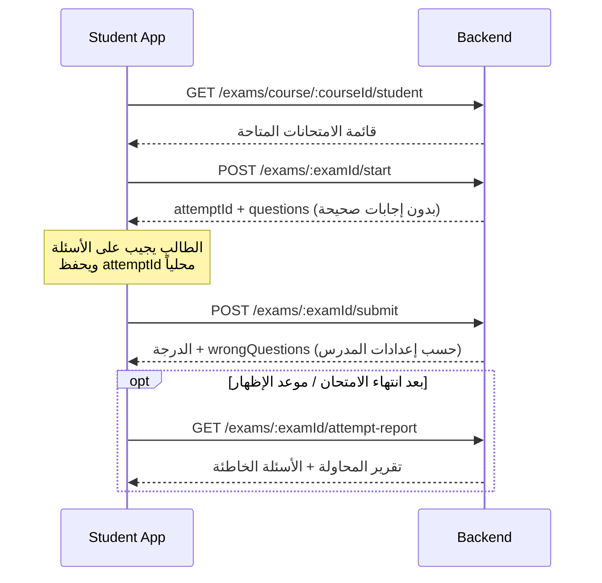

# API الامتحان الشامل للطالب (Course Level Exam — Student)

> **Base URL:** `/api`  
> **الصلاحيات:** `student` فقط (ما لم يُذكر غير ذلك)  
> **المصادقة:** `Authorization: Bearer <STUDENT_TOKEN>`

---

## تدفق الطالب (Flow)



### ملاحظة مهمة — `attemptId`

- يُرجَع من **`POST /api/exams/:examId/start`** في الحقل `attemptId`.
- **يجب حفظه** في الفرونت (state / localStorage / session) وإرساله عند التسليم.
- إذا لم يُرسَل `attemptId` عند التسليم، يحاول السيرفر تلقائياً استخدام **آخر محاولة `in_progress`** للطالب.
- إذا لا توجد محاولة نشطة → خطأ `400`.

---

## 1) قائمة الامتحانات الشاملة للكورس

```http
GET /api/exams/course/:courseId/student
```

### Response `200`

```json
{
  "exams": [
    {
      "id": 12,
      "course_id": 3,
      "course_title": "فيزياء 3 ثانوي",
      "title": "امتحان شامل",
      "duration_minutes": 60,
      "questions_count": 20,
      "is_visible_to_students": true,
      "visibility_end_date": "2026-09-01T23:59:59.000Z",
      "available_from": null,
      "show_answers_immediately": false,
      "answers_release_mode": "after_end",
      "answers_visible_at": null,
      "is_active": true,
      "attempt_limit": 1,
      "configuredQuestionsCount": 20,
      "actualQuestionsCount": 40,
      "question_display_mode": "random",
      "availability_status": "open",
      "attempts_count": 0,
      "last_attempt_number": 0,
      "can_attempt": true,
      "attempts_remaining": 1
    }
  ]
}
```

---

## 2) تفاصيل امتحان واحد

```http
GET /api/exams/:examId
```

### Response `200`

```json
{
  "exam": {
    "id": 12,
    "course_id": 3,
    "course_title": "فيزياء 3 ثانوي",
    "title": "امتحان شامل",
    "duration_minutes": 60,
    "questions_count": 20,
    "question_display_mode": "ordered",
    "answers_release_mode": "after_end",
    "visibility_end_date": "2026-09-01T23:59:59.000Z",
    "attempt_limit": 1
  }
}
```

---

## 3) بدء المحاولة + جلب الأسئلة

```http
POST /api/exams/:examId/start
```

**لا يحتاج Body.**

### Response `200` — محاولة جديدة أو استئناف محاولة نشطة

```json
{
  "attemptId": 55,
  "examId": 12,
  "examTitle": "امتحان شامل",
  "durationMinutes": 60,
  "questionsCount": 20,
  "startedAt": "2026-09-01T10:00:00.000Z",
  "questions": [
    {
      "id": 101,
      "type": "TEXT",
      "questionText": "ما وحدة القوة؟",
      "questionImage": null,
      "optionA": "نيوتن",
      "optionB": "جول",
      "optionC": "وات",
      "optionD": "باسكال"
    }
  ]
}
```

> الأسئلة **بدون** `correctAnswer`.

### Response `403` — محاولة واحدة فقط وتم التسليم سابقاً

```json
{
  "message": "You have already completed this exam. Only one attempt is allowed.",
  "previousAttempt": {
    "attemptId": 55,
    "totalGrade": 16,
    "maxGrade": 20,
    "submittedAt": "2026-09-01T10:45:00.000Z",
    "showAnswers": false,
    "releaseReason": null,
    "answersReleaseMode": "after_end",
    "examEndAt": "2026-09-01T23:59:59.000Z",
    "answersVisibleAt": null,
    "wrongQuestions": []
  }
}
```

---

## 4) تسليم الامتحان

```http
POST /api/exams/:examId/submit
Content-Type: application/json
```

**مسار بديل (نفس المنطق):**

```http
POST /api/course/course-exam/:examId/submit
```

### Body — الشكل الموصى به

```json
{
  "attemptId": 55,
  "answers": [
    { "questionId": 101, "selectedAnswer": "A" },
    { "questionId": 102, "selectedAnswer": "B" }
  ]
}
```

### أشكال Body مدعومة

| الشكل | مثال |
|--------|------|
| `attemptId` أو `attempt_id` | `"attemptId": 55` |
| مصفوفة `answers` | `[{ "questionId": 1, "selectedAnswer": "A" }]` |
| `questionIds` + `selectedAnswers` | `"questionIds": [1,2], "selectedAnswers": ["A","B"]` |
| كائن `answers` | `{ "answers": { "101": "A", "102": "C" } }` |
| مفاتيح بديلة للإجابة | `selected_answer`, `answer`, `choice`, `option`, `0/1/2/3` |

> إذا **لم يُرسَل** `attemptId`، يُستخدم تلقائياً آخر محاولة `in_progress`.

### Response `200` — بعد التسليم

```json
{
  "attemptId": 55,
  "totalGrade": 16,
  "maxGrade": 20,
  "correctCount": 16,
  "wrongCount": 4,
  "showAnswers": false,
  "releaseReason": "",
  "answersVisibleAt": null,
  "wrongQuestions": [],
  "startedAt": "2026-09-01T10:00:00.000Z",
  "submittedAt": "2026-09-01T10:45:00.000Z"
}
```

عند `showAnswers: true` يُملأ `wrongQuestions` و`releaseReason` (مثل `immediate` أو `after_end`).

---

## 5) تقرير المحاولة (بعد موعد إظهار الإجابات)

```http
GET /api/exams/:examId/attempt-report
GET /api/exams/:examId/attempt-report?attemptId=55
```

### Response — قبل الإظهار

```json
{
  "examType": "course",
  "showAnswers": false,
  "answersReleaseMode": "after_end",
  "examEndAt": "2026-09-01T23:59:59.000Z",
  "message": "Answers will be available after the exam ends",
  "attempt": {
    "attemptId": 55,
    "totalGrade": 16,
    "maxGrade": 20,
    "correctCount": 16,
    "wrongCount": 4,
    "submittedAt": "2026-09-01T10:45:00.000Z"
  },
  "wrongQuestions": []
}
```

### Response — بعد الإظهار

```json
{
  "showAnswers": true,
  "releaseReason": "after_end",
  "attempt": { "attemptId": 55, "totalGrade": 16, "maxGrade": 20 },
  "wrongQuestions": [
    {
      "questionId": 102,
      "questionText": "ما وحدة الطاقة؟",
      "correctAnswer": "A",
      "yourAnswer": "B",
      "optionA": "جول",
      "optionB": "نيوتن",
      "optionC": "وات",
      "optionD": "باسكال"
    }
  ]
}
```

---

## 6) الأسئلة الخاطئة فقط

```http
GET /api/exams/:examId/wrong-questions
```

نفس منطق `attempt-report` لكن يركز على `wrongQuestions`.

---

## 7) تقرير كامل (كل الأسئلة + إجاباتك)

```http
GET /api/exams/:examId/my-report
```

يعرض **كل** الأسئلة مع `yourAnswer` و`correctAnswer` — فقط بعد السماح بإظهار الإجابات.

---

## جدول رسائل الأخطاء الكامل

### أخطاء عامة (Controller)

| HTTP | `message` | متى |
|------|-----------|-----|
| `400` | `Invalid course id` | `courseId` غير رقم في GET قائمة الامتحانات |
| `400` | `Invalid exam id` | `examId` غير رقم |
| `400` | `Invalid attempt id` | `attemptId` في query غير صالح |
| `400` | `Invalid identifiers` | محاضرة — معرفات غير صالحة |
| `401` | (بدون body / Unauthorized) | توكن مفقود أو غير صالح |
| `403` | (Forbidden) | دور المستخدم ليس `student` |
| `500` | `Failed to fetch exams` | خطأ داخلي — قائمة الامتحانات |
| `500` | `Failed to submit exam attempt` | خطأ داخلي — التسليم |
| `500` | `Failed to fetch attempt report` | خطأ داخلي — التقرير |
| `500` | `Failed to fetch wrong questions` | خطأ داخلي — الأسئلة الخاطئة |

### GET `/api/exams/course/:courseId/student`

| HTTP | `message` |
|------|-----------|
| `403` | `You are not enrolled in this course` |

### GET `/api/exams/:examId`

| HTTP | `message` |
|------|-----------|
| `404` | `Exam not found` |

### POST `/api/exams/:examId/start`

| HTTP | `message` | ملاحظات |
|------|-----------|---------|
| `403` | `You are not enrolled in this course` | |
| `403` | `This exam is not active` | |
| `403` | `This exam is not visible to students` | |
| `403` | `This exam has ended. You can view it but cannot start a new attempt.` | انتهى `visibility_end_date` |
| `403` | `This exam is not open yet` | لم يبدأ `available_from` |
| `403` | `This exam is not ready yet` | بنك الأسئلة أقل من `questions_count` |
| `403` | `This exam is no longer available` | حالة أخرى |
| `403` | `You have used all allowed attempts for this exam` | استنفاد المحاولات |
| `403` | `You have already completed this exam. Only one attempt is allowed.` | + `previousAttempt` في body |
| `404` | `Exam not found` | ليس امتحاناً شاملاً → قد يُجرَّب مسار المحاضرة |

### POST `/api/exams/:examId/submit`

| HTTP | `message` |
|------|-----------|
| `400` | `answers required: send answers as array of { questionId, selectedAnswer }, or questionIds + selectedAnswers arrays, or answers as { "questionId": "A", ... }` |
| `400` | `attemptId is required, or start the exam first (POST /api/exams/:examId/start)` | لا `attemptId` ولا محاولة `in_progress` |
| `400` | `Invalid questionId in answers` |
| `400` | `Each answer must include selected option (...). Value: A/B/C/D ... Received: {...}` |
| `400` | `This attempt has already been submitted` |
| `403` | `You are not enrolled in this course` |
| `404` | `Attempt not found` |
| `404` | `Exam not found` | يُجرَّب مسار محاضرة إن وُجد |

### GET `/api/exams/:examId/attempt-report`

| HTTP | `message` |
|------|-----------|
| `403` | `You are not enrolled in this course` |
| `404` | `Exam not found` |
| `404` | `No completed attempt found for this exam` |

### GET `/api/exams/:examId/wrong-questions`

| HTTP | `message` |
|------|-----------|
| `403` | `You are not enrolled in this course` |
| `404` | `Exam not found` |
| `404` | `No completed attempt found for this exam` |

> قبل موعد الإظهار: **لا خطأ** — يرجع `200` مع `showAnswers: false`.

### GET `/api/exams/:examId/my-report`

| HTTP | `message` |
|------|-----------|
| `403` | `You are not enrolled in this course` |
| `403` | `Answers will be available after the exam ends` | `after_end` |
| `403` | `Answers will be available after the scheduled time` | `scheduled` |
| `403` | `Answers will be available X hour(s) after submission` | `after_hours` |
| `403` | `Answers are not available yet` | |
| `403` | `لا يمكن عرض تقرير الإجابات حالياً (...)` | legacy |
| `404` | `Exam not found` |
| `404` | `No completed attempt found for this exam` |
| `404` | `لا توجد محاولة مُسلَّمة لهذا الامتحان` |

---

## نصائح للفرونت (تجنب خطأ attemptId)

1. بعد `POST /start` → احفظ `attemptId` فوراً.
2. عند `POST /submit` → أرسل دائماً:
   ```json
   { "attemptId": savedAttemptId, "answers": [...] }
   ```
3. عند إعادة فتح الصفحة → استدعِ `POST /start` أولاً (يرجع المحاولة النشطة + `attemptId`).
4. لا تعتمد على التسليم بدون `start` — إذا انتهت الجلسة وليس هناك `in_progress` سيظهر الخطأ.

---

## توثيق مرتبط

- [`course-level-exams.md`](./course-level-exams.md) — إعدادات المدرس
- [`course-exam-question-apis.md`](./course-exam-question-apis.md) — أسئلة الامتحان (مدرس)
