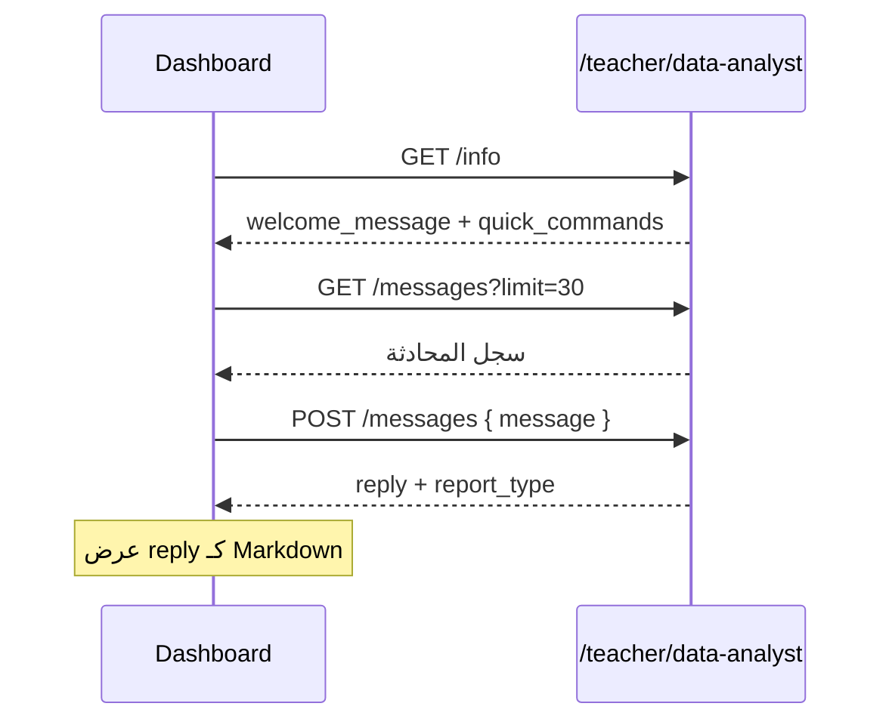

# Data Analyst Chatbot API — محلل البيانات

توثيق تكامل شات بوت **محلل البيانات** مع الواجهة الأمامية. البوت يحلّل بيانات الطلاب داخل المنصة ويُنتج تقارير عربية مبنية **فقط** على بيانات النظام (مع تنسيق اختياري عبر DeepSeek).

---

## Base URL

إنتاج:

```txt
https://YOUR_API_DOMAIN/api/teacher/data-analyst
```

تطوير محلي:

```txt
http://localhost:8000/api/teacher/data-analyst
```

---

## المصادقة والسياق

| الشرط | التفاصيل |
|--------|-----------|
| **الدور** | `teacher` أو `admin` |
| **الهيدر** | `Authorization: Bearer <ACCESS_TOKEN>` |
| **Content-Type** | `application/json` لطلبات `POST` |
| **الـ Tenant** | يُستنتج تلقائياً من النطاق أو الهيدر `X-Tenant-Subdomain` حسب إعدادات المنصة (`tenantContextMiddleware`). إن لم يُحدد، يُستخدم `tenant_id = 1` (الافتراضي). |

> **ملاحظة للمدرس:** التقارير تُقيَّد دائماً على **طلاب وكورسات المدرس المسجّل دخوله** فقط. لا يمكن طلب تقرير لطالب غير مشترك في أحد كورساته.

---

## نظرة عامة على المسارات

```http
GET  /info
GET  /messages
POST /messages
```

| المسار | الوظيفة |
|--------|---------|
| `GET /info` | معلومات البوت، القدرات، رسالة الترحيب، أوامر سريعة |
| `GET /messages` | سجل المحادثة (ترقيم صفحات) |
| `POST /messages` | إرسال رسالة والحصول على تقرير |

---

## أنواع التقارير (`report_type`)

| القيمة | المعنى |
|--------|--------|
| `student` | تقرير طالب معيّن |
| `course` | تقرير كورس معيّن |
| `general` | تقرير عام / ملخص شامل للمحاضر |
| `other` | ترحيب، توجيه، أو رسالة غير مصنّفة كتقرير |

---

## 1) معلومات البوت

```http
GET /info
```

### الاستجابة `200`

```json
{
  "success": true,
  "bot": {
    "name": "محلل البيانات",
    "welcome_message": "مرحباً، أنا **محلل البيانات** 📊\n...",
    "capabilities": [
      "تقرير تفصيلي لطالب معين (بالكود أو الاسم)",
      "تقرير كورس معين (بالكود)",
      "تقرير عام شامل لكل الطلاب والكورسات"
    ],
    "examples": [
      "تقرير عام شامل",
      "تقرير الطالب 15",
      "تقرير الطالب أحمد",
      "تقرير الكورس 3"
    ]
  },
  "quick_commands": [
    { "label": "تقرير عام", "payload": "تقرير عام شامل" },
    { "label": "تقرير طالب بالكود", "payload": "تقرير الطالب " },
    { "label": "تقرير كورس", "payload": "تقرير الكورس " }
  ]
}
```

**استخدام مقترح في الواجهة:** عرض `welcome_message` عند فتح الشات لأول مرة، وعرض `quick_commands` كأزرار ترسل `payload` مباشرة في `POST /messages`.

---

## 2) سجل المحادثة

```http
GET /messages?limit=30&offset=0
```

### Query parameters

| الحقل | الافتراضي | الوصف |
|--------|-----------|--------|
| `limit` | `30` | عدد الرسائل (1–100) |
| `offset` | `0` | إزاحة للترقيم |

### الاستجابة `200`

```json
{
  "success": true,
  "messages": [
    {
      "id": 1,
      "teacher_id": 42,
      "role": "teacher",
      "message": "تقرير عام شامل",
      "report_type": null,
      "context": {},
      "created_at": "2026-06-16T12:00:00.000Z"
    },
    {
      "id": 2,
      "teacher_id": 42,
      "role": "assistant",
      "message": "# التقرير العام للمحاضر\n...",
      "report_type": "general",
      "context": {},
      "created_at": "2026-06-16T12:00:05.000Z"
    }
  ],
  "pagination": {
    "limit": 30,
    "offset": 0,
    "total": 24,
    "has_more": false
  }
}
```

### حقول الرسالة

| الحقل | النوع | الوصف |
|--------|--------|--------|
| `id` | number | معرف الرسالة |
| `teacher_id` | number | معرف المدرس |
| `role` | `"teacher"` \| `"assistant"` | مرسل الرسالة |
| `message` | string | نص الرسالة (Markdown في ردود البوت) |
| `report_type` | string \| null | نوع التقرير إن وُجد (`student`, `course`, `general`, `other`) |
| `context` | object | بيانات إضافية (مثل `student_id`, `course_id`) |
| `created_at` | ISO datetime | وقت الإنشاء |

> الرسائل تُرجع **مرتبة زمنياً تصاعدياً** داخل الصفحة (الأقدم أولاً).

---

## 3) إرسال رسالة والحصول على تقرير

```http
POST /messages
```

### الجسم (JSON)

```json
{
  "message": "تقرير الطالب 15"
}
```

| الحقل | إلزامي | القيود |
|--------|--------|--------|
| `message` | نعم | نص 1–4000 حرف |

### الاستجابة الناجحة `201`

```json
{
  "success": true,
  "bot_name": "محلل البيانات",
  "user_message": {
    "id": 10,
    "teacher_id": 42,
    "role": "teacher",
    "message": "تقرير الطالب 15",
    "report_type": null,
    "context": {},
    "created_at": "2026-06-16T12:10:00.000Z"
  },
  "assistant_message": {
    "id": 11,
    "teacher_id": 42,
    "role": "assistant",
    "message": "# تقرير الطالب: أحمد...\n",
    "report_type": "student",
    "context": { "student_id": 15, "tenant_id": 3 },
    "created_at": "2026-06-16T12:10:03.000Z"
  },
  "reply": "# تقرير الطالب: أحمد...\n",
  "report_type": "student"
}
```

| الحقل | الوصف |
|--------|--------|
| `reply` | نص رد البوت (نفس `assistant_message.message`) — مناسب للعرض المباشر |
| `report_type` | تصنيف الطلب |
| `user_message` / `assistant_message` | السجل المحفوظ في قاعدة البيانات |

### أخطاء شائعة

| الحالة | السبب |
|--------|--------|
| `400` — `Validation failed` | `message` فارغ أو أطول من 4000 حرف |
| `401` | توكن غير صالح أو منتهٍ |
| `403` | دور المستخدم ليس `teacher` ولا `admin` |

> أخطاء منطق التقرير (طالب غير موجود، كورس لا يخص المدرس) تُرجع **داخل `reply`** بنص عربي توضيحي مع `201` — وليس بالضرورة HTTP 4xx.

---

## كيف يفهم البوت الطلبات؟

البوت يحلّل نص `message` بالكلمات المفتاحية ويستخرج المعرفات. لا حاجة لمعاملات JSON إضافية.

### تقرير طالب (`student`)

**بالكود:**

```txt
تقرير الطالب 15
تقرير طالب 15
تحليل الطالب 15
طالب 15
كود 15
```

**بالاسم:**

```txt
تقرير الطالب أحمد
تحليل طالب محمد علي
تقرير عن الطالب سارة
```

- إن وُجد **طالب واحد** مطابق → يُنشأ التقرير.
- إن وُجد **أكثر من طالب** بنفس الاسم → يرد البوت بقائمة الأكواد ويطلب إرسال **كود الطالب** في الرسالة التالية (مثلاً `15` فقط).
- يُستخدم آخر **10** رسائل من السجل كسياق للمتابعة (طالب أو كورس).

### تقرير كورس (`course`)

**بالكود:**

```txt
تقرير الكورس 3
تقرير كورس 3
تحليل الكورس 3
كورس 3
course 3
```

**بالاسم:**

```txt
تقرير الكورس فيزياء
تحليل كورس الرياضيات
تقرير عن كورس كيمياء
```

- إن وُجد **كورس واحد** مطابق → يُنشأ التقرير.
- إن وُجد **أكثر من كورس** بنفس الاسم (أو جزء من الاسم) → يرد البوت بقائمة الأكواد ويطلب إرسال **كود الكورس** في الرسالة التالية.
- إن كُتب «تقرير كورس» **بدون اسم أو رقم** → يرد بقائمة كورسات المدرس.

### تقرير عام (`general`)

```txt
تقرير عام شامل
ملخص شامل
تقرير شامل
تحليل شامل
إحصائيات عامة
نظرة عامة
تقرير
إحصائيات
تحليل
```

### رسائل أخرى (`other`)

أي نص لا يطابق الأنماط أعلاه → رسالة ترحيب مع أمثلة.

---

## محتوى التقارير (مصادر البيانات)

البيانات تُجمع من خدمات المنصة الداخلية فقط:

| نوع التقرير | المصادر |
|-------------|---------|
| **طالب** | `TeacherReportsService` — اشتراكات، محاضرات، مشاهدة فيديو، امتحانات محاضرة، امتحانات مستوى الكورس، درجات، نسب مشاهدة |
| **كورس** | `TeacherDailyCourseReportService` + `AnalyticsIntelligenceService.getCourseAnalytics` |
| **عام** | `DataAnalystReportsService` (ملخص المحاضر) + تقارير يومية لكل صف/كورس |

### تقرير الطالب يتضمن (عند توفر البيانات)

- عدد الكورسات المسجّل فيها
- المحاضرات المشاهدة / الإجمالي
- نسبة التقدم والمشاهدة لكل كورس
- عدد الامتحانات المحلولة والمتبقية
- درجات الامتحانات ومتوسطها
- نقاط قوة وضعف (في التنسيق الاحتياطي أو عبر AI)

### تقرير الكورس يتضمن

- عدد الطلاب المسجّلين
- متوسط نسبة المشاهدة
- إحصائيات آخر امتحان (إن وُجد)
- أكثر الطلاب نشاطاً وأقلهم نشاطاً
- أسئلة ضعيفة (من التقرير اليومي)

### التقرير العام يتضمن

- إجمالي الطلاب وعدد الكورسات
- متوسط المشاهدة ومتوسط درجات الامتحانات
- ترتيب أفضل الطلاب
- الطلاب المعرضون للتأخر/التسرب (حسب نشاط ودرجات)
- ملخص لكل كورس (حسب الصف الدراسي)

---

## تنسيق الرد (AI + Fallback)

1. تُجمع البيانات الخام من قاعدة البيانات.
2. تُرسل إلى **DeepSeek** (`deepseek-chat`) مع system prompt ثابت لبوت «محلل البيانات».
3. إن فشل الـ AI → يُستخدم **قالب Markdown احتياطي** داخل الخادم.

الرد النهائي غالباً **Markdown** (عناوين `#`، قوائم `-`، نص عريض `**`). يُفضّل عرضه بمكوّن يدعم Markdown في الواجهة.

---

## أمثلة `curl`

### معلومات البوت

```bash
curl -X GET "http://localhost:8000/api/teacher/data-analyst/info" \
  -H "Authorization: Bearer YOUR_TOKEN"
```

### تقرير عام

```bash
curl -X POST "http://localhost:8000/api/teacher/data-analyst/messages" \
  -H "Authorization: Bearer YOUR_TOKEN" \
  -H "Content-Type: application/json" \
  -d "{\"message\":\"تقرير عام شامل\"}"
```

### تقرير طالب بالكود

```bash
curl -X POST "http://localhost:8000/api/teacher/data-analyst/messages" \
  -H "Authorization: Bearer YOUR_TOKEN" \
  -H "Content-Type: application/json" \
  -d "{\"message\":\"تقرير الطالب 15\"}"
```

### تقرير كورس

```bash
curl -X POST "http://localhost:8000/api/teacher/data-analyst/messages" \
  -H "Authorization: Bearer YOUR_TOKEN" \
  -H "Content-Type: application/json" \
  -d "{\"message\":\"تقرير الكورس 3\"}"
```

### تقرير كورس بالاسم

```bash
curl -X POST "http://localhost:8000/api/teacher/data-analyst/messages" \
  -H "Authorization: Bearer YOUR_TOKEN" \
  -H "Content-Type: application/json" \
  -d "{\"message\":\"تقرير الكورس فيزياء\"}"
```

### سجل المحادثة

```bash
curl -X GET "http://localhost:8000/api/teacher/data-analyst/messages?limit=20&offset=0" \
  -H "Authorization: Bearer YOUR_TOKEN"
```

---

## تكامل الواجهة (Frontend) — تدفق مقترح



1. عند فتح الشاشة: `GET /info` + `GET /messages`.
2. عند إرسال المستخدم: `POST /messages` ثم إلحاق `user_message` و `assistant_message` بالواجهة.
3. أزرار `quick_commands`: أرسل `payload` كما هو (أضف الكود يدوياً لأزرار الطالب/الكورس).
4. إذا `report_type === "student"` وكان الرد يطلب كوداً → اعرض حقل إدخال رقم فقط في الرسالة التالية.

---

## قاعدة البيانات

السجل يُخزَّن في:

```txt
teacher_data_analyst_messages
```

Migration:

```txt
migrations/1772108800000_teacher_data_analyst_chatbot.sql
```

شغّل الترحيل قبل الاستخدام:

```bash
npm run migrate up
```

---

## الملفات المصدرية

| الملف | الدور |
|--------|--------|
| `src/controllers/dataAnalystChatbot.ts` | مسارات HTTP |
| `src/services/dataAnalystChatbot.ts` | منطق الشات، AI، حفظ السجل |
| `src/services/dataAnalystReports.ts` | تجميع بيانات التقارير |
| `src/services/dataAnalyst.prompts.ts` | اسم البوت والـ system prompt |
| `src/routes.ts` | تسجيل الراوتر على `/teacher/data-analyst` |

---

## علاقة بمسارات أخرى

| المسار | الفرق |
|--------|--------|
| `GET /api/analytics/*` | APIs تحليلية خام (JSON structured) بدون شات |
| `GET /api/course/.../students/.../report` | تقرير طالب REST مباشر بدون AI |

شات **محلل البيانات** مخصص لتقارير تحليلية منسقة بالمحادثة وتاريخ محفوظ.

---

*آخر تحديث يتوافق مع `src/controllers/dataAnalystChatbot.ts` و`src/services/dataAnalystChatbot.ts`.*
