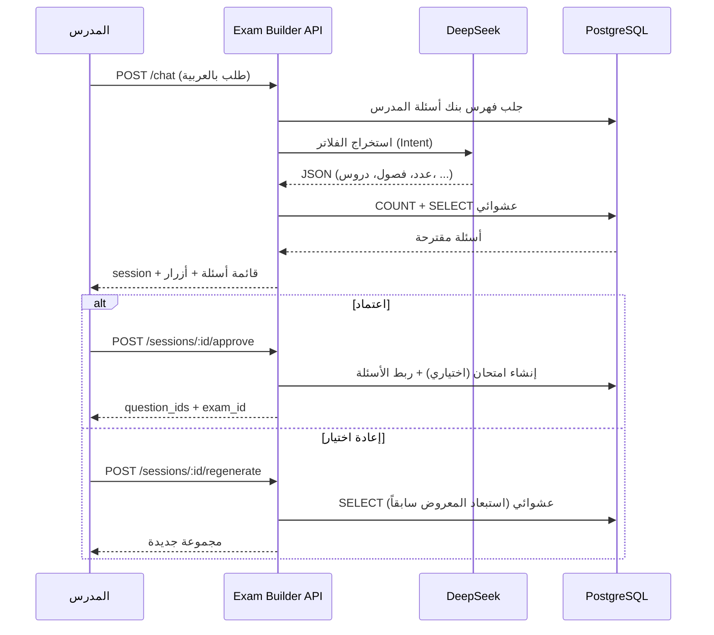

# ChatBot توليد الامتحانات من بنك الأسئلة — Exam Builder Chatbot API

> **Base URL:** `/api/teacher/exam-builder`  
> **Controller:** `src/controllers/examBuilderChatbot.ts`  
> **Service:** `src/services/examBuilderChatbot.ts`  
> **Migration:** `migrations/1773300000000_exam_builder_chatbot.sql`  
> **الدور:** `teacher` فقط

---

## 1. نظرة عامة

ChatBot ذكي يساعد المحاضر في **اختيار أسئلة عشوائية** من **بنك أسئلته الخاص** لإنشاء امتحان، بناءً على طلب باللغة الطبيعية (عربي).

### ما يفعله

| ✅ يفعل | ❌ لا يفعل |
|---------|-----------|
| تحليل طلب المدرس (عدد، فصول، دروس، نوع، صعوبة) | إنشاء أسئلة جديدة بالذكاء الاصطناعي |
| البحث في `questions_v2` + `questions` (legacy) | استخدام أسئلة محاضرين آخرين |
| اختيار عشوائي `ORDER BY RANDOM()` | تكرار نفس الأسئلة داخل امتحان واحد |
| عرض مقترح + اعتماد / إعادة اختيار | |

### تدفق الاستخدام



---

## 2. Base URL والمصادقة

### Production

```txt
https://YOUR_API_DOMAIN/api/teacher/exam-builder
```

### Local

```txt
http://localhost:8000/api/teacher/exam-builder
```

**المسار في الكود:** `src/routes.ts` → `/teacher/exam-builder`

### المصادقة

```http
Authorization: Bearer <TEACHER_JWT>
```

| الدور | الصلاحية |
|-------|----------|
| `teacher` | كل endpoints |
| غير ذلك | `403 Forbidden` |

---

## 3. أدوات الذكاء الاصطناعي

| المرحلة | الأداة | الاستخدام |
|---------|--------|-----------|
| تحليل الطلب (Intent) | **DeepSeek** (`deepseek-chat`) | استخراج عدد الأسئلة، الفصول، الدروس، النوع، الصعوبة |
| اختيار الأسئلة | **PostgreSQL** | `ORDER BY RANDOM()` — بدون توليد أسئلة |

**Fallback:** إن فشل DeepSeek، يُستخدم parser بسيط بالكلمات المفتاحية (عدد، فصل، صعوبة، MCQ).

**متغيرات البيئة:**

```env
DEEPSEEK_API_KEY=...
DEEPSEEK_API_URL=https://api.deepseek.com
```

---

## 4. بنك الأسئلة المستخدم

| الجدول | الوصف |
|--------|--------|
| `questions_v2` | بنك الأسئلة الموحد (الأساسي) |
| `questions` | بنك legacy (يُدمج عند العد والاختيار) |

**فلترة الوصول (نفس `/api/teacher/subjects`):**

- الدروس ضمن مواد المدرس في جدول **`teacher_subjects`** (المصدر الأساسي)
- أو مواد في **`teacher_permissions`** (للتوافق مع النظام القديم)
- جميع الأسئلة غير المرفوضة (`status != rejected`) داخل هذه الدروس — من `questions_v2` و`questions`
- بالإضافة لأي أسئلة أنشأها المدرس بنفسه (`teacher_id`)

**أنواع الأسئلة المدعومة:**

```txt
text_only | text_with_image | image_choices
```

**مستويات الصعوبة:**

```txt
easy | medium | hard
```

**طلب «MCQ» أو «اختيار من متعدد»** → يُفلتر على `text_only` + `text_with_image`.

---

## 5. قاعدة البيانات (ChatBot)

### Migration

`migrations/1773300000000_exam_builder_chatbot.sql`

### `exam_builder_chatbot_sessions`

| الحقل | النوع | الوصف |
|-------|--------|--------|
| `id` | `UUID` | معرّف الجلسة |
| `teacher_id` | `INTEGER` | المدرس |
| `status` | `TEXT` | `proposed` \| `approved` \| `cancelled` |
| `user_message` | `TEXT` | الطلب الأصلي |
| `parsed_filters` | `JSONB` | الفلاتر المحلولة |
| `selected_questions` | `JSONB` | الأسئلة المعروضة حالياً |
| `shown_question_ids` | `INTEGER[]` | كل الأسئلة المعروضة (لاستبعادها عند إعادة التوليد) |
| `available_count` | `INTEGER` | إجمالي المتاح مطابقاً للفلاتر |
| `requested_count` | `INTEGER` | العدد المطلوب |
| `exam_id` | `INTEGER` | يُملأ بعد الاعتماد مع إنشاء امتحان |
| `exam_type` | `TEXT` | `lecture-exam` \| `course-exam` |

### `exam_builder_chatbot_messages`

سجل محادثة المدرس مع البوت (`teacher` / `assistant`).

---

## 6. Endpoints

```http
GET  /history
GET  /sessions
GET  /messages
POST /chat
GET  /sessions/:sessionId
POST /sessions/:sessionId/regenerate
POST /sessions/:sessionId/approve
GET  /questions/:source/:questionId/preview
```

---

## 7. GET /history — سجل الطلبات السابقة (موصى به للفرونت)

يعرض كل طلبات توليد الأسئلة السابقة مع الرد والأسئلة المقترحة.

```http
GET /api/teacher/exam-builder/history?limit=20&offset=0&status=approved
```

| Query | الوصف |
|-------|--------|
| `limit` | 1–50 (افتراضي: 20) |
| `offset` | للترقيم |
| `status` | اختياري: `proposed` \| `approved` \| `cancelled` |

**Response:**

```json
{
  "success": true,
  "history": [
    {
      "session_id": "a1b2c3d4-e5f6-7890-abcd-ef1234567890",
      "user_message": "أنشئ امتحان 10 أسئلة من الفصل الأول",
      "assistant_reply": "تم العثور على 320 سؤالاً...",
      "status": "approved",
      "questions_count": 10,
      "requested_count": 10,
      "available_count": 320,
      "parsed_filters": { "...": "..." },
      "selected_questions": [ "... أسئلة كاملة مع options و media" ],
      "exam_id": 88,
      "exam_type": "lecture-exam",
      "created_at": "2026-06-27T22:00:00.000Z",
      "updated_at": "2026-06-27T22:05:00.000Z"
    }
  ],
  "pagination": {
    "limit": 20,
    "offset": 0,
    "total": 15,
    "has_more": false
  }
}
```

> **`GET /sessions`** — نفس البيانات مع المفتاح `sessions` بدلاً من `history`.

---

## 8. GET /info

معلومات البوت، رسالة الترحيب، وأمثلة سريعة للواجهة.

```http
GET /api/teacher/exam-builder/info
```

**Response:**

```json
{
  "success": true,
  "bot": {
    "name": "مساعد إنشاء الامتحانات",
    "description": "يختار أسئلة عشوائية من بنك أسئلتك بناءً على طلبك باللغة الطبيعية",
    "welcome_message": "مرحباً 👋\nأنا مساعدك لإنشاء الامتحانات من **بنك أسئلتك** فقط.\n...",
    "quick_examples": [
      {
        "label": "10 أسئلة من الفصل الأول",
        "message": "أنشئ امتحان من 10 أسئلة من الفصل الأول"
      }
    ],
    "max_questions": 100,
    "supported_question_types": ["text_only", "text_with_image", "image_choices"],
    "supported_difficulties": ["easy", "medium", "hard"]
  }
}
```

---

## 8. GET /catalog

فهرس فصول ودروس بنك أسئلة المدرس مع عدد الأسئلة في كل درس (للعرض أو التحقق).

```http
GET /api/teacher/exam-builder/catalog
```

**Response (مقتطف):**

```json
{
  "success": true,
  "catalog": [
    {
      "id": 5,
      "name": "الفصل الأول",
      "order_num": 1,
      "subject_name": "الفيزياء",
      "question_count": 320,
      "lessons": [
        {
          "id": 12,
          "name": "المتجهات",
          "order_num": 1,
          "question_count": 45
        }
      ]
    }
  ]
}
```

---

## 9. POST /chat — إرسال طلب واختيار أسئلة

```http
POST /api/teacher/exam-builder/chat
Content-Type: application/json
```

**Body:**

```json
{
  "message": "أنشئ امتحان مكون من 10 أسئلة من الفصل الأول"
}
```

| الحقل | إجباري | الوصف |
|-------|--------|--------|
| `message` | نعم | 1–4000 حرف |

### أمثلة طلبات مدعومة

- «أنشئ امتحان 10 أسئلة على درس المتجهات»
- «اعمل امتحان من الفصل الأول والثاني 25 سؤال»
- «أريد 15 سؤال MCQ من درس العناصر»
- «أنشئ امتحان من الدروس 1 و2 و3»
- «امتحان متوسط الصعوبة من وحدة الكهرباء»

**Response `201`:**

```json
{
  "success": true,
  "status": "proposal_ready",
  "bot_name": "مساعد إنشاء الامتحانات",
  "reply": "تم العثور على **320** سؤالاً مطابقاً للفلاتر.\nاخترت لك **10** سؤالاً عشوائياً.\n...",
  "thinking_ms": 842,
  "session": {
    "id": "a1b2c3d4-e5f6-7890-abcd-ef1234567890",
    "teacher_id": 7,
    "status": "proposed",
    "user_message": "أنشئ امتحان مكون من 10 أسئلة من الفصل الأول",
    "parsed_filters": {
      "lesson_ids": [12, 13, 14],
      "chapter_ids": [5],
      "question_types": null,
      "difficulty_levels": null,
      "question_count": 10,
      "exam_title": null,
      "matched_chapters": [{ "id": 5, "name": "الفصل الأول" }],
      "matched_lessons": [{ "id": 12, "name": "المتجهات", "chapter_name": "الفصل الأول" }],
      "unresolved_notes": []
    },
    "selected_questions": [
      {
        "id": 101,
        "source": "v2",
        "question_type": "text_with_image",
        "difficulty_level": "medium",
        "points": 1,
        "lesson_id": 12,
        "lesson_name": "المتجهات",
        "chapter_id": 5,
        "chapter_name": "الفصل الأول",
        "preview_excerpt": "ما ناتج جمع المتجهين…",
        "question": {
          "id": 101,
          "question_text": "ما ناتج جمع المتجهين...",
          "question_type": "text_with_image",
          "correct_answer_index": 0,
          "options": [
            { "option_index": 0, "text_content": "أ) ..." }
          ],
          "media": {
            "media_url": "https://..."
          }
        }
      }
    ],
    "shown_question_ids": [101, 102],
    "available_count": 320,
    "requested_count": 10,
    "exam_id": null,
    "exam_type": null,
    "created_at": "2026-06-16T10:00:00.000Z",
    "updated_at": "2026-06-16T10:00:00.000Z"
  },
  "questions": [ "... نفس محتوى selected_questions — جاهزة للعرض مباشرة" ],
  "actions": {
    "can_approve": true,
    "can_regenerate": true
  },
  "assistant_message": {
    "id": 55,
    "role": "assistant",
    "message": "...",
    "session_id": "a1b2c3d4-...",
    "payload": { "thinking_ms": 842, "questions_count": 10 },
    "created_at": "2026-06-16T10:00:00.000Z"
  }
}
```

### حالات `status`

| القيمة | المعنى |
|--------|--------|
| `proposal_ready` | وُجدت أسئلة — اعرض الجدول + زرّي اعتماد / إعادة اختيار |
| `message_only` | رد نصي فقط (ترحيب، لا أسئلة، بنك فارغ، ...) |

### عدد أقل من المطلوب

إذا `selected_questions.length < requested_count`، يُذكر ذلك في `reply` مع `available_count`.

---

## 10. GET /sessions/:sessionId

استرجاع حالة جلسة (مثلاً بعد refresh الصفحة).

```http
GET /api/teacher/exam-builder/sessions/{sessionId}
```

**Response `200`:** `{ "success": true, "session": { ... } }`  
**Response `404`:** الجلسة غير موجودة أو لا تخص المدرس.

---

## 11. POST /sessions/:sessionId/regenerate — إعادة اختيار

يختار **مجموعة جديدة** بنفس الفلاتر، مع **استبعاد** الأسئلة المعروضة سابقاً في نفس الجلسة.

```http
POST /api/teacher/exam-builder/sessions/{sessionId}/regenerate
```

**Body:** فارغ `{}`

**Response `200`:**

```json
{
  "success": true,
  "status": "proposal_ready",
  "reply": "🔄 **تم اختيار مجموعة جديدة من الأسئلة.**\n...",
  "thinking_ms": 120,
  "session": { "...": "..." },
  "actions": {
    "can_approve": true,
    "can_regenerate": true
  }
}
```

**قواعد:**

- لا يعمل إذا `session.status !== 'proposed'` → `400`
- إن نفدت البدائل مع الاستبعاد، يُعاد الاختيار من البداية (بدون استبعاد)
- إن لم يتبقَّ أي سؤال → `400`

---

## 12. POST /sessions/:sessionId/approve — اعتماد الأسئلة

### 12.1 اعتماد فقط (لملء نموذج إنشاء الامتحان في الفرونت)

```http
POST /api/teacher/exam-builder/sessions/{sessionId}/approve
Content-Type: application/json
```

```json
{
  "create_exam": false
}
```

**Response:**

```json
{
  "success": true,
  "status": "approved",
  "message": "تم اعتماد الأسئلة",
  "session": { "status": "approved", "...": "..." },
  "question_ids": [101, 102, 103],
  "questions": [ "...SelectedQuestionSummary[]" ],
  "exam_id": null,
  "exam_type": null,
  "redirect": {
    "question_ids": [101, 102, 103],
    "filters": { "...": "..." }
  }
}
```

استخدم `question_ids` مع:

- `POST /api/exams/:examId/questions/from-bank` (امتحان محاضرة)
- أو نموذج إنشاء الامتحان في الواجهة

### 12.2 اعتماد + إنشاء امتحان محاضرة

```json
{
  "lecture_id": 42,
  "title": "امتحان المتجهات",
  "type": "exam",
  "duration": 60,
  "total_grade": 100
}
```

### 12.3 اعتماد + إنشاء امتحان كورس

```json
{
  "course_id": 10,
  "title": "امتحان الفصل الأول",
  "duration_minutes": 45
}
```

**Response (مع امتحان):**

```json
{
  "success": true,
  "status": "approved",
  "message": "تم اعتماد الأسئلة وإنشاء الامتحان",
  "exam_id": 88,
  "exam_type": "lecture-exam",
  "question_ids": [101, 102],
  "redirect": {
    "exam_id": 88,
    "exam_type": "lecture-exam",
    "question_ids": [101, 102]
  }
}
```

| الحقل | إجباري | الوصف |
|-------|--------|--------|
| `create_exam` | لا | `false` = اعتماد فقط. افتراضي: `true` إذا وُجد `lecture_id` أو `course_id` |
| `lecture_id` | لا* | *مطلوب لإنشاء امتحان محاضرة |
| `course_id` | لا* | *مطلوب لإنشاء امتحان كورس |
| `title` | لا | عنوان الامتحان (افتراضي من الطلب أو «امتحان من بنك الأسئلة») |
| `type` | لا | نوع امتحان المحاضرة: `exam` \| `assignment` |
| `duration` | لا | مدة امتحان المحاضرة (دقائق) |
| `duration_minutes` | لا | مدة امتحان الكورس |
| `total_grade` | لا | الدرجة الكلية لامتحان المحاضرة |

---

## 13. GET /questions/:source/:questionId/preview

معاينة السؤال بالكامل (نص، خيارات، صورة، إجابة صحيحة).

```http
GET /api/teacher/exam-builder/questions/v2/101/preview
```

| Param | القيم |
|-------|-------|
| `source` | `v1` (legacy) \| `v2` |
| `questionId` | معرّف السؤال في الجدول المناسب |

**Response (v2):**

```json
{
  "success": true,
  "data": {
    "source": "v2",
    "question": {
      "id": 101,
      "question_text": "...",
      "question_type": "text_only",
      "difficulty_level": "medium",
      "options": [
        { "option_index": 0, "text_content": "أ) ..." }
      ],
      "correct_answer_index": 1
    },
    "lesson_name": "المتجهات",
    "chapter_name": "الفصل الأول"
  }
}
```

> يُسمح فقط بأسئلة `teacher_id` = المدرس الحالي → `404` خلاف ذلك.

---

## 14. GET /messages — سجل المحادثة

```http
GET /api/teacher/exam-builder/messages?limit=30&offset=0
```

**Response:**

```json
{
  "success": true,
  "messages": [
    {
      "id": 54,
      "role": "teacher",
      "message": "أنشئ امتحان 10 أسئلة...",
      "session_id": null,
      "payload": {},
      "created_at": "..."
    },
    {
      "id": 55,
      "role": "assistant",
      "message": "تم العثور على 320 سؤالاً...",
      "session_id": "a1b2c3d4-...",
      "payload": { "questions_count": 10 },
      "created_at": "..."
    }
  ],
  "pagination": {
    "limit": 30,
    "offset": 0,
    "total": 12,
    "has_more": false
  }
}
```

---

## 15. تكامل الواجهة (Frontend UX)

### 15.1 شاشة الشات

1. عند الفتح: `GET /info` → رسالة ترحيب + `quick_examples` كأزرار.
2. المدرس يرسل رسالة → `POST /chat`.
3. أثناء الانتظار: spinner «جاري التفكير…» (استخدم `thinking_ms` للعرض إن رغبت).
4. عرض `reply` + cards من `questions` أو `session.selected_questions` — **كل سؤال كامل** (نص، خيارات، صورة) بدون طلب preview إضافي.

### 15.2 أعمدة مقترحة للجدول

| العمود | المصدر |
|--------|--------|
| # | ترتيب |
| مقتطف السؤال | `preview_excerpt` (للجدول المختصر) |
| السؤال الكامل | `question` (نص، options، media، correct_answer_index) |
| معاينة إضافية | اختياري — `GET .../preview` إن احتجت تحديث السؤال لاحقاً |

### 15.3 الأزرار

| الزر | API |
|------|-----|
| ✅ اعتماد هذه الأسئلة | `POST /sessions/:id/approve` |
| 🔄 إعادة اختيار | `POST /sessions/:id/regenerate` |

### 15.4 بعد الاعتماد

- **بدون امتحان:** مرّر `redirect.question_ids` لصفحة/مودال إنشاء الامتحان.
- **مع امتحان:** redirect إلى `exam_id` حسب `exam_type`:
  - `lecture-exam` → محرر امتحان المحاضرة
  - `course-exam` → محرر امتحان الكورس

---

## 16. أخطاء شائعة

| HTTP | السبب |
|------|--------|
| `400` | `message` فارغ / validation فشل |
| `400` | إعادة توليد بعد الاعتماد |
| `400` | لا أسئلة بديلة |
| `400` | اعتماد جلسة معتمدة مسبقاً |
| `403` | ليس `teacher` |
| `404` | جلسة أو سؤال غير موجود أو لا يخص المدرس |

**رد عند بنك فارغ (`status: message_only`):**

```json
{
  "reply": "لا توجد أسئلة في بنك أسئلتك بعد. أضف أسئلة من بنك الأسئلة أولاً ثم عد للمحاولة.",
  "session": null
}
```

---

## 17. ملفات الكود ذات الصلة

| الملف | الدور |
|-------|--------|
| `src/controllers/examBuilderChatbot.ts` | Routes |
| `src/services/examBuilderChatbot.ts` | Intent، اختيار عشوائي، جلسات |
| `src/services/examBuilderChatbot.prompts.ts` | Prompts DeepSeek |
| `src/services/examFlow.ts` | `createExam` + `addQuestionsFromBank` (محاضرة) |
| `src/services/courseLevelExams.ts` | امتحان الكورس |
| `src/services/questionBankV2.ts` | معاينة أسئلة v2 |
| `src/routes.ts` | تسجيل `/teacher/exam-builder` |

---

## 18. أمثلة cURL

```bash
# معلومات البوت
curl "http://localhost:8000/api/teacher/exam-builder/info" \
  -H "Authorization: Bearer $TOKEN"

# إرسال طلب
curl -X POST "http://localhost:8000/api/teacher/exam-builder/chat" \
  -H "Authorization: Bearer $TOKEN" \
  -H "Content-Type: application/json" \
  -d '{"message":"أنشئ امتحان 10 أسئلة من الفصل الأول"}'

# إعادة اختيار
curl -X POST "http://localhost:8000/api/teacher/exam-builder/sessions/SESSION_UUID/regenerate" \
  -H "Authorization: Bearer $TOKEN"

# اعتماد + إنشاء امتحان محاضرة
curl -X POST "http://localhost:8000/api/teacher/exam-builder/sessions/SESSION_UUID/approve" \
  -H "Authorization: Bearer $TOKEN" \
  -H "Content-Type: application/json" \
  -d '{"lecture_id":42,"title":"امتحان المتجهات","duration":60}'

# معاينة سؤال
curl "http://localhost:8000/api/teacher/exam-builder/questions/v2/101/preview" \
  -H "Authorization: Bearer $TOKEN"
```

---

## 19. تشغيل Migration

```bash
# حسب آلية migrations في المشروع، أو يدوياً:
psql -d YOUR_DB -f migrations/1773300000000_exam_builder_chatbot.sql
```

---

## 20. ملاحظات

- الحد الأقصى للأسئلة في طلب واحد: **100**.
- العدد الافتراضي إن لم يُذكر: **10**.
- `shown_question_ids` تتراكم عبر عمليات `regenerate` لتقليل التكرار.
- لا يُنشئ ChatBot أسئلة؛ يعتمد فقط على البنك الموجود.
- للربط مع امتحان موجود: استخدم `approve` بـ `create_exam: false` ثم `POST /api/exams/:examId/questions/from-bank`.
