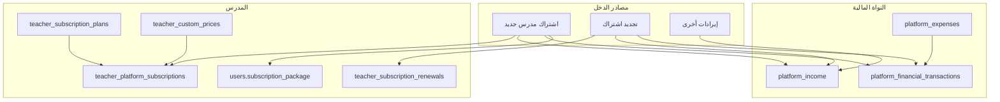
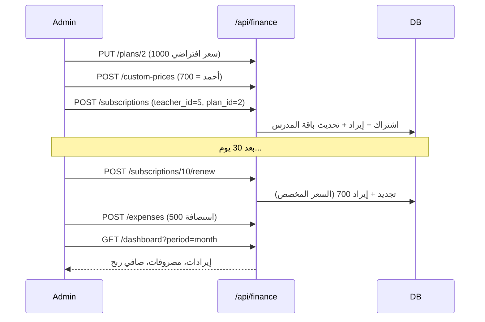

# نظام الحسابات والمالية — دليل شامل

> **الجمهور:** الأدمن، الموظف المالي  
> **Base URL الجديد:** `/api/finance`  
> **Base URL القديم (توافق):** `/api/accounting`  
> **السياق:** يجب أن يكون الطلب على tenant **`default`** (لوحة الإدارة المركزية)

**توثيق API تفصيلي:** [`financial-management-api.md`](./financial-management-api.md)  
**توثيق المحاسبة القديمة:** [`accounting_api.md`](./accounting_api.md)

---

## 1. نظرة عامة

نظام الحسابات يتيح لمشغّل المنصة:

- متابعة **إجمالي الإيرادات** و**المصروفات** و**صافي الأرباح**.
- إدارة **اشتراكات المدرسين** في الباقات (أساسية، احترافية، متقدمة، ماسية).
- تطبيق **أسعار مخصصة** وخصومات لكل مدرس مع توثيق السبب.
- تسجيل **التجديدات** وربطها تلقائياً بالإيرادات.
- استخراج **تقارير مالية** (يومي / أسبوعي / شهري / سنوي).
- الاحتفاظ بـ **سجل تدقيق** لكل عملية مالية.



---

## 2. المصادقة والصلاحيات

```http
Authorization: Bearer <JWT>
X-Tenant-Subdomain: default
```

| الدور | الوصول |
|-------|--------|
| `admin` | كامل |
| `employee` | يحتاج إحدى الصلاحيات: `financial_management`، `accounting_management`، `manage_accounting`، `can_manage_accounting` |

---

## 3. هيكل قاعدة البيانات

### 3.1 جداول الاشتراكات (جديدة)

| الجدول | الوظيفة |
|--------|---------|
| `teacher_subscription_plans` | كتالوج الباقات: اسم، سعر افتراضي، مدة، مميزات |
| `teacher_custom_prices` | سعر مخصص لمدرس معيّن + سبب الخصم + صلاحية |
| `teacher_platform_subscriptions` | اشتراك المدرس الحالي (رقم، تواريخ، حالة، سعر فعلي) |
| `teacher_subscription_renewals` | سجل كل تجديد سابق |

### 3.2 جداول المحاسبة (موجودة + موسّعة)

| الجدول | الوظيفة |
|--------|---------|
| `platform_income` | الإيرادات المسجّلة (اشتراكات، كورسات، أخرى) |
| `platform_expenses` | المصروفات حسب التصنيف |
| `monthly_budget` | الميزانية الشهرية (من النظام القديم) |
| `platform_financial_transactions` | سجل موحّد للتقارير السريعة |
| `platform_financial_audit_logs` | سجل التدقيق (قبل/بعد + المنفّذ) |

### 3.3 ما لا يُخلط معه

| اسم | الاستخدام الفعلي |
|-----|------------------|
| `packages` | **باقات الطلاب** (كورسات/مواد) — ليس اشتراك المدرس |
| `users.subscription_package` | الباقة **الحالية** للمدرس (bronze/silver/gold/diamond) — تُحدَّث تلقائياً عند الاشتراك/التجديد |

**Migration:** `migrations/1772800000000_teacher_financial_system.sql`

---

## 4. باقات المدرسين

| code | الاسم | السعر | لايف/شهر | الطلاب | AI امتحانات | دعم علمي | محلل بيانات | سوشيال |
|------|-------|-------|----------|--------|-------------|----------|-------------|--------|
| `bronze` | الانطلاقة | 1500 ج.م | 6 | 80 | — | — | — | — |
| `silver` | التوسع | 2000 ج.م | 10 | 150 | — | — | — | — |
| `gold` | الاحتراف | 3000 ج.م | 16 | 300 | ✓ | ✓ | — | — |
| `diamond` | التميز | 4000 ج.م | ∞ | ∞ | ✓ | ✓ | ✓ | ✓ |

```http
GET /api/finance/plans
PUT /api/finance/plans/:id
GET /api/teacher/subscription/plan-access
```

`plan-access` يُرجع للمدرس صلاحيات باقته (للإظهار في الواجهة) + استخدام اللايفات والطلاب.

يمكن تعديل: `name_ar`، `default_price`، `duration_days`، `features`، `is_active`.

---

## 5. مرونة التسعير

السعر **ليس ثابتاً** لكل المدرسين.

### آلية الحساب

```
1. هل للمدرس سعر مخصص نشط للباقة؟  → نعم: استخدم custom_price
2. وإلا                              → استخدم default_price من الباقة
```

### تعيين سعر مخصص

```http
POST /api/finance/custom-prices
```

```json
{
  "teacher_id": 5,
  "plan_id": 2,
  "custom_price": 700,
  "discount_reason": "عرض افتتاحي للمدرس أحمد",
  "valid_from": "2026-01-01",
  "valid_until": "2026-12-31"
}
```

| المدرس | الباقة | السعر الافتراضي | السعر الفعلي |
|--------|--------|-----------------|--------------|
| أحمد | silver | 1000 | **700** (مخصص) |
| محمد | silver | 1000 | **850** (مخصص) |
| علي | silver | 1000 | 1000 (افتراضي) |

**معاينة السعر قبل الاشتراك:**

```http
GET /api/finance/custom-prices/resolve?teacher_id=5&plan_id=2
```

**سجل الأسعار لمدرس:**

```http
GET /api/finance/custom-prices/teacher/5?include_inactive=true
```

كل تعديل سعر يُسجَّل في `platform_financial_audit_logs` مع `discount_reason` و`created_by`.

---

## 6. إدارة الاشتراكات

### 6.1 إنشاء اشتراك

```http
POST /api/finance/subscriptions
```

```json
{
  "teacher_id": 5,
  "plan_id": 2,
  "starts_at": "2026-06-01",
  "ends_at": "2026-07-01",
  "payment_method": "bank_transfer",
  "paid_amount": 500,
  "notes": "دفع جزئي — المتبقي لاحقاً"
}
```

`paid_amount` اختياري — إن لم يُرسل يُعتبر الدفع **كاملاً** بقيمة `actual_price`. يمكن إنشاء اشتراك بدفع جزئي أو بدون دفع (`paid_amount: 0`).

`ends_at` اختياري — إن لم يُرسل يُحسب من مدة الباقة (`duration_days`).

**ما يحدث تلقائياً:**

1. حساب السعر (مخصص أو افتراضي).
2. إنشاء اشتراك برقم فريد مثل `SUB-2026-000001`.
3. تسجيل إيراد في `platform_income` بقيمة **المبلغ المدفوع فقط** (`paid_amount`).
4. إنشاء فاتورة في `teacher_subscription_invoices` مع `paid_amount` و`remaining_amount` وحالة الدفع.
5. تحديث `users.subscription_package` و`subscription_package_assigned_at`.
6. إضافة سطر في `platform_financial_transactions` (بقيمة المدفوع فقط).
7. تسجيل في سجل التدقيق.

### 6.2 حقول الاشتراك

| الحقل | الوصف |
|-------|--------|
| `subscription_number` | رقم الاشتراك |
| `teacher_id` / `plan_id` | المدرس والباقة |
| `actual_price` | إجمالي قيمة الباقة/الاشتراك |
| `paid_amount` | المبلغ المدفوع حتى الآن |
| `remaining_amount` | المبلغ المتبقي على المدرس |
| `payment_status` | `paid` \| `partial` \| `unpaid` |
| `starts_at` / `ends_at` | فترة الاشتراك |
| `status` | `active` \| `expired` \| `suspended` \| `cancelled` |
| `payment_method` | `cash` \| `bank_transfer` \| `online_payment` |
| `notes` | ملاحظات |

### 6.3 حالات الاشتراك

| الحالة | المعنى |
|--------|--------|
| `active` | فعال |
| `expired` | منتهي (يُحدَّث تلقائياً عند تجاوز `ends_at`) |
| `suspended` | معلق |
| `cancelled` | ملغي |

```http
PATCH /api/finance/subscriptions/:id/status
```

```json
{ "status": "suspended", "notes": "تأخير في الدفع" }
```

عند `status: "cancelled"` يُنفَّذ نفس منطق **إلغاء الاشتراك** الكامل (انظر 6.3.3).

### 6.3.3 إلغاء وحذف الاشتراك

**إلغاء** (يُبقي السجل في القائمة بحالة `cancelled`):

```http
POST /api/finance/subscriptions/:id/cancel
```

```json
{ "reason": "طلب المدرس", "notes": "ملاحظة إضافية" }
```

أو عبر `PATCH .../status` مع `{ "status": "cancelled" }`.

عند الإلغاء:
- `status = cancelled` و`remaining_amount = 0`
- إلغاء الفواتير المفتوحة (`unpaid` / `partial`) المرتبطة بالاشتراك
- **خصم المبالغ المدفوعة فعلياً من إجمالي الإيرادات** (`platform_income` + معاملات `direction = in`)
- تسجيل معاملة عكسية `subscription_cancellation` في `platform_financial_transactions`
- تعطيل منصة المدرس إن لم يعد لديه اشتراك `active` آخر
- مزامنة `users.subscription_package` (أو إرجاعها إلى `bronze` إن لم يبقَ اشتراك)

**حذف من السجل** (لإزالة الاشتراك من القائمة بعد الإلغاء):

```http
DELETE /api/finance/subscriptions/:id
DELETE /api/finance/subscriptions/:id?force=true
```

| الحالة | السلوك |
|--------|--------|
| `cancelled` / `expired` / `suspended` | يُسمح بالحذف |
| `active` | مرفوض — ألغِ الاشتراك أولاً |
| مبلغ متبقي `remaining_amount > 0` | مرفوض إلا مع `?force=true` |

الحذف يزيل صف الاشتراك؛ سجلات الدفعات المرتبطة تُحذف تلقائياً (CASCADE)، والفواتير تبقى لكن `subscription_id` يصبح `NULL`.

### 6.3.1 المدرسون على وشك انتهاء الباقة (3 أيام)

قائمة تُحدَّث يومياً (حسب `CURRENT_DATE` في قاعدة البيانات):

```http
GET /api/finance/subscriptions/expiring-soon?days=3
```

تظهر أيضاً في لوحة التحكم: `expiring_soon_subscriptions` ضمن `GET /api/finance/dashboard`.

### 6.3.2 تنبيه المدرس

```http
GET /api/teacher/subscription/expiry-alert
```

يعمل من نطاق منصة المدرس (ليس النطاق الافتراضي `default`).

يُظهر للمدرس تنبيهاً إذا كانت باقته تنتهي خلال 3 أيام. يختفي تلقائياً بعد التجديد.

### 6.4 التجديد

```http
POST /api/finance/subscriptions/:id/renew
```

```json
{
  "payment_method": "cash",
  "paid_amount": 300,
  "notes": "دفعة جزئية عند التجديد"
}
```

**عند التجديد:**

- يُنشأ سجل في `teacher_subscription_renewals` مع `paid_amount` و`remaining_amount`.
- يُضاف إيراد جديد بقيمة المدفوع فقط.
- تُنشأ **فاتورة تجديد** للمدرس والأدمن.

### 6.4.1 تسجيل دفعة لاحقة

```http
POST /api/finance/subscriptions/:id/payments
```

```json
{
  "amount": 200,
  "payment_method": "cash",
  "notes": "باقي المبلغ",
  "payment_date": "2026-06-15"
}
```

يُحدَّث `paid_amount` و`remaining_amount` على الاشتراك، وتُسجَّل الدفعة في `teacher_subscription_payments`.

### 6.4.2 المستحقات (من عليه متبقي)

```http
GET /api/finance/subscriptions/outstanding-balances
GET /api/finance/subscriptions?has_remaining=true
GET /api/finance/subscriptions?payment_status=partial
```

تظهر أيضاً في لوحة التحكم: `outstanding_balances` و`outstanding_balances_total`.

### 6.4.3 ترقية الباقة خلال الشهر

ترقية المدرس من باقة أدنى إلى أعلى **بدون تغيير** `starts_at` و`ends_at` — يُدفع **فرق السعر** فقط.

**معاينة الفرق قبل الترقية:**

```http
GET /api/finance/subscriptions/:id/upgrade-quote?plan_id=3
```

**Response:**

```json
{
  "success": true,
  "data": {
    "from_plan": { "code": "silver", "name_ar": "التوسع", "actual_price": 2000 },
    "to_plan": { "code": "gold", "name_ar": "الاحتراف", "actual_price": 3000 },
    "upgrade_amount": 1000,
    "current_paid_amount": 2000,
    "after_upgrade": {
      "actual_price": 3000,
      "paid_amount": 2000,
      "remaining_amount": 1000
    }
  }
}
```

**تنفيذ الترقية:**

```http
POST /api/finance/subscriptions/:id/upgrade
```

```json
{
  "plan_id": 3,
  "paid_amount": 1000,
  "payment_method": "cash",
  "notes": "ترقية من التوسع إلى الاحتراف"
}
```

| الحقل | الوصف |
|-------|--------|
| `plan_id` | الباقة الجديدة (أعلى من الحالية) |
| `actual_price` | اختياري — تجاوز سعر الباقة الجديدة |
| `paid_amount` | المبلغ المدفوع الآن (افتراضياً = فرق السعر كامل) |

**ما يحدث تلقائياً:**

1. `upgrade_amount` = سعر الباقة الجديدة − سعر الاشتراك الحالي.
2. تحديث `plan_id` و`actual_price` على نفس الاشتراك (نفس الفترة).
3. `paid_amount` على الاشتراك += المدفوع في الترقية.
4. تحديث `users.subscription_package` للباقة الجديدة (بدون إعادة ضبط دورة اللايفات).
5. فاتورة نوع `upgrade` + إيراد + سجل في `teacher_subscription_upgrades`.

### 6.5 فواتير الاشتراك

جدول `teacher_subscription_invoices` — فاتورة لكل اشتراك جديد أو تجديد أو ترقية.

| الحقل | الوصف |
|-------|--------|
| `invoice_number` | رقم الفاتورة `INV-2026-000001` |
| `invoice_type` | `subscription` \| `renewal` |
| `amount` | إجمالي قيمة الفاتورة |
| `paid_amount` / `remaining_amount` | المدفوع والمتبقي |
| `payment_method` | طريقة الدفع |
| `period_start` / `period_end` | فترة الاشتراك المغطاة |
| `status` | `paid` \| `partial` \| `unpaid` \| `cancelled` |

**للأدمن:**

```http
GET /api/finance/invoices?teacher_id=16
GET /api/finance/invoices/:id
```

**للمدرس:**

```http
GET /api/teacher/subscription/invoices
GET /api/teacher/subscription/invoices/:id
```

### 6.6 قائمة الاشتراكات

```http
GET /api/finance/subscriptions?status=active&limit=20&offset=0
GET /api/finance/subscriptions?expiring_within_days=7
GET /api/finance/subscriptions?search=أحمد
GET /api/finance/subscriptions/:id
```

---

## 7. المصروفات

```http
POST   /api/finance/expenses
PUT    /api/finance/expenses/:id
DELETE /api/finance/expenses/:id
GET    /api/finance/expenses/list
```

### التصنيفات

| code | التصنيف بالعربية |
|------|------------------|
| `salaries` | رواتب |
| `marketing` | تسويق وإعلانات |
| `hosting` | استضافة وسيرفرات |
| `development` | تطوير وبرمجة |
| `support` | دعم فني |
| `operational` | مصروفات تشغيلية |
| `maintenance` | صيانة |
| `other` | أخرى |

### مثال

```json
{
  "title": "فاتورة استضافة يونيو",
  "description": "سيرفر الإنتاج",
  "amount": 1200,
  "category": "hosting",
  "expense_type": "monthly",
  "payment_method": "bank_transfer",
  "transaction_date": "2026-06-01"
}
```

كل مصروف يُسجَّل في سجل التدقيق و`platform_financial_transactions` (اتجاه `out`).

---

## 8. الأرباح والخسائر

```
إجمالي الإيرادات = مجموع platform_income (+ اشتراكات وتجديدات)
إجمالي المصروفات = مجموع platform_expenses
صافي الربح      = الإيرادات − المصروفات
```

### لوحة التحكم

```http
GET /api/finance/dashboard?period=month
```

`period`: `today` | `week` | `month` | `year` | `all`

**تعرض:**

- إجمالي الإيرادات والمصروفات وصافي الربح.
- عدد الاشتراكات النشطة والمنتهية.
- إيرادات التجديدات فقط (`renewal_revenue`).
- آخر 10 تجديدات.
- أعلى الباقات والمدرسين من حيث الإيرادات.

---

## 9. التقارير المالية

### تفاصيل الإيرادات (مدرس / باقة / مبلغ)

```http
GET /api/finance/income/details
GET /api/finance/income/details?teacher_id=5
GET /api/finance/income/details?plan_code=silver&start_date=2026-01-01
GET /api/finance/income/details?search=أحمد&payment_type=subscription
```

| Query | الوصف |
|-------|--------|
| `teacher_id` | مدرس محدد |
| `subscription_id` | اشتراك محدد |
| `plan_code` | `bronze` \| `silver` \| `gold` \| `diamond` |
| `payment_type` | `subscription` \| `renewal` \| `upgrade` \| `additional_payment` \| `reversal` |
| `start_date` / `end_date` | فلترة بالتاريخ |
| `search` | بحث باسم المدرس أو الإيميل أو رقم الاشتراك |
| `counted_only=true` | الإيرادات الفعالة فقط (لم تُلغَ) |
| `include_reversals=false` | إخفاء عمليات الاسترداد عند الإلغاء |
| `limit` / `offset` | ترقيم |

**مثال استجابة:**

```json
{
  "success": true,
  "data": {
    "items": [
      {
        "entry_id": 12,
        "payment_type": "subscription",
        "payment_type_label_ar": "اشتراك جديد",
        "amount": 1000,
        "transaction_date": "2026-03-01",
        "description": "أحمد محمد دفع 1000 واشترك في الباقة الاحترافية (#SUB-2026-000012)",
        "teacher": { "id": 5, "name": "أحمد محمد", "email": "ahmed@example.com" },
        "plan": { "id": 2, "code": "silver", "name_ar": "الباقة الاحترافية" },
        "subscription": { "id": 12, "subscription_number": "SUB-2026-000012", "status": "active" },
        "is_counted_in_revenue": true
      }
    ],
    "summary": {
      "gross_collected": 1000,
      "active_revenue": 1000,
      "reversed_amount": 0
    },
    "total": 1,
    "limit": 50,
    "offset": 0
  }
}
```

### تقرير الإيرادات

```http
GET /api/finance/reports/revenue?start_date=2026-01-01&end_date=2026-06-30&group_by=plan
```

`group_by`: `plan` | `teacher` | `day`

### تقرير المصروفات

```http
GET /api/finance/reports/expenses?start_date=2026-01-01&category=hosting
```

### تقرير الأرباح

```http
GET /api/finance/reports/profit
```

يرجع أرباح: اليوم، الأسبوع، الشهر، السنة، وكل الفترات.

### تقرير الاشتراكات

```http
GET /api/finance/reports/subscriptions?status=active
GET /api/finance/reports/subscriptions?expiring_within_days=7
```

---

## 10. سجل التدقيق (Audit Log)

```http
GET /api/finance/audit-logs?entity_type=teacher_custom_price&limit=50
```

| يُسجَّل تلقائياً | entity_type |
|------------------|-------------|
| إنشاء/تعديل باقة | `teacher_subscription_plan` |
| سعر مخصص | `teacher_custom_price` |
| اشتراك | `teacher_platform_subscription` |
| تجديد | `teacher_subscription_renewal` |
| مصروف | `platform_expense` |

كل سجل يحتوي: `actor_id`، `action` (create/update/delete)، `before_data`، `after_data`، `created_at`.

---

## 11. سير العمل الكامل (مثال عملي)



### أوامر cURL

```bash
# 1) تعيين سعر مخصص
curl -X POST "http://localhost:8000/api/finance/custom-prices" \
  -H "Authorization: Bearer $TOKEN" \
  -H "X-Tenant-Subdomain: default" \
  -H "Content-Type: application/json" \
  -d '{"teacher_id":5,"plan_id":2,"custom_price":700,"discount_reason":"عرض خاص"}'

# 2) إنشاء اشتراك
curl -X POST "http://localhost:8000/api/finance/subscriptions" \
  -H "Authorization: Bearer $TOKEN" \
  -H "X-Tenant-Subdomain: default" \
  -H "Content-Type: application/json" \
  -d '{"teacher_id":5,"plan_id":2,"payment_method":"cash"}'

# 3) لوحة مالية
curl "http://localhost:8000/api/finance/dashboard?period=month" \
  -H "Authorization: Bearer $TOKEN" \
  -H "X-Tenant-Subdomain: default"
```

---

## 12. النظام القديم `/api/accounting`

ما زال يعمل للتوافق مع الواجهات القديمة:

| القديم | الجديد الموصى به |
|--------|------------------|
| `POST /accounting/income` | يُنشأ تلقائياً عند الاشتراك/التجديد |
| `POST /accounting/expenses` | `POST /finance/expenses` (مع audit) |
| `GET /accounting/stats` | `GET /finance/dashboard` |
| `POST /accounting/budget` | `POST /accounting/budget` (لم يُنقل بعد) |

---

## 13. التوسع المستقبلي

- **بوابات الدفع:** الحقل `payment_method` + `source_id` في الإيرادات جاهز لربط webhook لاحقاً.
- **مصادر دخل جديدة:** أضف `source_type` في `platform_income` وسجّل في `platform_financial_transactions`.
- **فواتير PDF:** يمكن البناء فوق `teacher_platform_subscriptions` و`platform_income`.

---

## 14. أخطاء شائعة

| HTTP | السبب |
|------|--------|
| `403` | ليس على tenant `default` أو بدون صلاحية مالية |
| `400` | `teacher_id` أو `plan_id` غير صحيح |
| `404` | اشتراك أو باقة غير موجودة |

---

## 15. ملخص مسارات API

| المسار | الوظيفة |
|--------|---------|
| `GET /finance/dashboard` | لوحة مالية |
| `GET/PUT /finance/plans` | باقات المدرسين |
| `POST /finance/custom-prices` | سعر مخصص |
| `GET/POST /finance/subscriptions` | اشتراكات |
| `GET /finance/income/details` | تفاصيل إيرادات المدرسين |
| `POST /finance/subscriptions/:id/cancel` | إلغاء اشتراك |
| `DELETE /finance/subscriptions/:id` | حذف اشتراك من السجل |
| `POST /finance/subscriptions/:id/renew` | تجديد |
| `POST/PUT/DELETE /finance/expenses` | مصروفات |
| `GET /finance/reports/*` | تقارير |
| `GET /finance/audit-logs` | سجل التدقيق |
