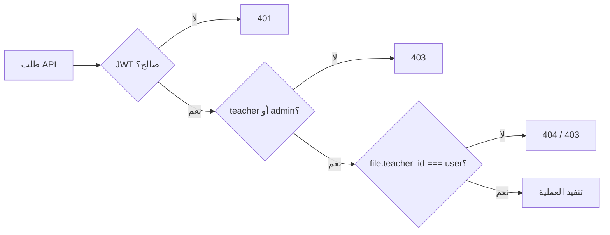

# ملفاتي (My Files) — API إدارة ملفات المدرس

توثيق نظام **ملفاتي**: مكتبة سحابية داخلية لكل مدرس لرفع وتنظيم وإدارة المواد التعليمية (PDF، عروض، صور، مستندات…) واستخدامها لاحقاً في المحاضرات والامتحانات والواجبات.

---

## Base URL 

```txt
https://YOUR_API_DOMAIN/api/teacher
```

تطوير محلي: 

```txt
http://localhost:8000/api/teacher
```

**المسارات في الكود:** `src/routes.ts` → `/teacher/files` و `/teacher/file-categories`

---

## المصادقة

```http
Authorization: Bearer <ACCESS_TOKEN>
```

| الدور | الصلاحية |
|-------|----------|
| `teacher` | إدارة ملفاته وتصنيفاته فقط |
| `admin` | نفس العمليات؛ يمكن تمرير `teacher_id` للعمل نيابة عن مدرس |

> لا يوجد دور `super-admin` في النظام — الإدارة العليا تستخدم `admin`.

**للأدمن — تحديد المدرس:**

```http
?teacher_id=5
```

أو في body: `teacher_id` / `teacherId`

---

## التخزين (Storage)

يُحدَّد مزود التخزين من متغير البيئة `FILE_STORAGE_PROVIDER`:

| القيمة | الوصف |
|--------|--------|
| `cloudinary` | **الافتراضي** — رفع إلى Cloudinary CDN |
| `s3` | Amazon S3 + رابط تحميل موقّع |
| `local` | تخزين محلي في `uploads/teacher-library/` |

```env
FILE_STORAGE_PROVIDER=cloudinary

# Local
TEACHER_FILES_LOCAL_DIR=uploads/teacher-library
TEACHER_FILES_SIGNED_URL_TTL_SECONDS=3600

# AWS S3
AWS_REGION=eu-central-1
AWS_S3_BUCKET=your-bucket
AWS_ACCESS_KEY_ID=...
AWS_SECRET_ACCESS_KEY=...
AWS_S3_PUBLIC_BASE_URL=https://your-bucket.s3.amazonaws.com

# Cloudinary (مطلوب عند cloudinary)
CLOUDINARY_URL=...
CLOUDINARY_CLOUD_NAME=...
CLOUDINARY_API_KEY=...
CLOUDINARY_API_SECRET=...
```

---

## قاعدة البيانات

### `file_categories`

| العمود | الوصف |
|--------|--------|
| `id` | المعرف |
| `teacher_id` | المدرس المالك |
| `name` | اسم التصنيف (فريد لكل مدرس) |

### `teacher_files`

| العمود | الوصف |
|--------|--------|
| `id` | المعرف |
| `teacher_id` | المدرس المالك |
| `name` | اسم العرض للملف |
| `description` | وصف اختياري |
| `file_url` | رابط الوصول للملف |
| `file_key` | مفتاح التخزين (UUID أو public_id) |
| `file_size` | الحجم بالبايت |
| `file_extension` | الامتداد بدون نقطة |
| `mime_type` | نوع MIME |
| `category_id` | تصنيف اختياري |
| `downloads_count` | عدد مرات التحميل |
| `deleted_at` | **Soft delete** — غير null = محذوف |

---

## نظرة عامة على المسارات

```http
# ── الملفات ──
POST   /files
POST   /files/bulk-upload
GET    /files
GET    /files/statistics
GET    /files/:id
GET    /files/:id/preview
GET    /files/:id/view
GET    /files/:id/content
GET    /files/:id/download
PUT    /files/:id
DELETE /files/:id
DELETE /files/bulk

# ── التصنيفات ──
POST   /file-categories
GET    /file-categories
PUT    /file-categories/:id
DELETE /file-categories/:id
```

---

## قيود الرفع

| القيد | القيمة |
|-------|--------|
| الحد الأقصى للحجم | **100 MB** لكل ملف |
| الرفع الجماعي | حتى **20** ملف في طلب واحد |
| Rate limit — رفع | 60 طلب / 15 دقيقة |
| Rate limit — تحميل | 200 طلب / 15 دقيقة |
| Rate limit — رفع جماعي | 20 طلب / 15 دقيقة |

### الأنواع المسموحة

```txt
pdf, doc, docx, xls, xlsx, ppt, pptx, zip, jpg, jpeg, png, webp
```

### أنواع ممنوعة (أمنياً)

```txt
exe, bat, cmd, sh, js, html, php, msi, dll, ...
```

- يتم فحص **MIME Type** فعلياً عبر `file-type`
- الملف يُخزَّن باسم **UUID** — لا يُحفظ الاسم الأصلي على السيرفر

---

# 1) الملفات

## `POST /files` — رفع ملف

**Auth:** `teacher` | `admin`  
**Content-Type:** `multipart/form-data`

| Field | إلزامي | الوصف |
|-------|--------|--------|
| `file` | نعم | الملف |
| `name` | نعم | اسم العرض |
| `description` | لا | وصف |
| `categoryId` | لا | معرف التصنيف |
| `teacher_id` | لا | للأدمن فقط |

**Response `201`:**

```json
{
  "success": true,
  "message": "File uploaded successfully",
  "data": {
    "id": 12,
    "teacherId": 5,
    "name": "Organic Chemistry Notes",
    "description": "Chapter 1",
    "fileUrl": "https://res.cloudinary.com/.../media/uuid.pdf",
    "fileKey": "media/uuid",
    "fileSize": 2456789,
    "fileExtension": "pdf",
    "mimeType": "application/pdf",
    "categoryId": 1,
    "categoryName": "Exams",
    "downloadsCount": 0,
    "previewType": "pdf",
    "canPreviewInline": true,
    "viewUrl": "/api/teacher/files/12/view",
    "contentUrl": "/api/teacher/files/12/content",
    "createdAt": "2026-06-17T10:00:00.000Z",
    "updatedAt": "2026-06-17T10:00:00.000Z"
  }
}
```

**مثال curl:**

```bash
curl -X POST "http://localhost:8000/api/teacher/files" \
  -H "Authorization: Bearer $TOKEN" \
  -F "name=Organic Chemistry Notes" \
  -F "description=Chapter 1" \
  -F "categoryId=1" \
  -F "file=@notes.pdf"
```

---

## `POST /files/bulk-upload` — رفع عدة ملفات

**Auth:** `teacher` | `admin`  
**Content-Type:** `multipart/form-data`

| Field | إلزامي | الوصف |
|-------|--------|--------|
| `files` | نعم | حتى 20 ملف (نفس اسم الحقل متكرر) |
| `categoryId` | لا | تصنيف مشترك |
| `description` | لا | وصف مشترك |
| `namePrefix` | لا | بادئة تُضاف لاسم كل ملف |

**Response `201`:**

```json
{
  "success": true,
  "message": "تم رفع 3 ملف بنجاح",
  "data": {
    "uploaded": [ /* مصفوفة ملفات */ ],
    "errors": [
      { "fileName": "bad.exe", "error": "نوع الملف غير مسموح لأسباب أمنية" }
    ]
  }
}
```

**مثال curl:**

```bash
curl -X POST "http://localhost:8000/api/teacher/files/bulk-upload" \
  -H "Authorization: Bearer $TOKEN" \
  -F "categoryId=1" \
  -F "files=@file1.pdf" \
  -F "files=@file2.pptx" \
  -F "files=@file3.png"
```

---

## `GET /files` — قائمة الملفات

**Auth:** `teacher` | `admin`

**Query:**

| Param | Default | الوصف |
|-------|---------|--------|
| `page` | `1` | رقم الصفحة |
| `limit` | `20` | عدد العناصر (حد أقصى 100) |
| `search` | — | بحث في الاسم والوصف |
| `categoryId` | — | فلترة حسب التصنيف |
| `fileType` | — | `pdf`, `ppt`, `images` (jpg/png/webp), … |
| `sortBy` | `created_at` | `created_at` \| `name` \| `file_size` \| `downloads_count` |
| `sortOrder` | `desc` | `asc` \| `desc` |
| `teacher_id` | — | للأدمن |

**Response `200`:**

```json
{
  "success": true,
  "data": {
    "items": [
      {
        "id": 12,
        "teacherId": 5,
        "name": "Organic Chemistry Notes",
        "description": "Chapter 1",
        "fileUrl": "https://...",
        "fileKey": "media/uuid",
        "fileSize": 2456789,
        "fileExtension": "pdf",
        "mimeType": "application/pdf",
        "categoryId": 1,
        "categoryName": "Exams",
        "downloadsCount": 3,
        "createdAt": "2026-06-17T10:00:00.000Z",
        "updatedAt": "2026-06-17T10:00:00.000Z"
      }
    ],
    "pagination": {
      "page": 1,
      "limit": 20,
      "total": 45,
      "totalPages": 3
    }
  }
}
```

**مثال:**

```http
GET /api/teacher/files?page=1&limit=20&search=chemistry&categoryId=1&fileType=pdf&sortBy=name&sortOrder=asc
```

---

## `GET /files/statistics` — إحصائيات

**Auth:** `teacher` | `admin`

**Response `200`:**

```json
{
  "success": true,
  "data": {
    "totalFiles": 250,
    "totalStorageUsed": "8.4 GB",
    "totalStorageUsedBytes": 9019431321,
    "totalDownloads": 1540,
    "filesByType": {
      "pdf": 120,
      "ppt": 45,
      "pptx": 12,
      "images": 50,
      "docx": 23
    }
  }
}
```

> `images` = تجميع jpg, jpeg, png, webp

---

## `GET /files/:id` — ملف واحد

**Auth:** `teacher` | `admin`

**Response `200`:** `{ "success": true, "data": { ... } }`  
**Response `404`:** `{ "success": false, "message": "الملف غير موجود" }`

> الحقول الجديدة في `data`:
> - `previewType`: `image` \| `pdf` \| `none`
> - `canPreviewInline`: هل يمكن عرضه داخل الموقع
> - `viewUrl`: مسار العرض المباشر
> - `contentUrl`: مسار استخراج المحتوى النصي

---

## `GET /files/:id/preview` — بيانات العرض الاحترافية (موصى به للواجهة)

**Auth:** `teacher` | `admin`

```http
GET /api/teacher/files/12/preview?includeText=true
```

| Query | Default | الوصف |
|-------|---------|--------|
| `includeText` | `false` | استخراج نص PDF + تقسيمه فقرات |

**Response `200`:** يتضمن `file`, `preview`, `display`, `urls`, `actions`, `content` — جاهز لبناء شاشة عرض احترافية بدون منطق إضافي في الفرونت.

```json
{
  "success": true,
  "data": {
    "file": {
      "id": 12,
      "name": "Organic Chemistry Notes",
      "fileSizeLabel": "2.4 MB",
      "icon": "pdf",
      "viewerComponent": "pdf-viewer",
      "absoluteViewUrl": "https://api.example.com/api/teacher/files/12/view"
    },
    "preview": {
      "type": "pdf",
      "mode": "inline",
      "viewerComponent": "pdf-viewer",
      "canPreviewInline": true,
      "canExtractText": true
    },
    "display": {
      "icon": "pdf",
      "extensionLabel": "PDF",
      "fileSizeLabel": "2.4 MB",
      "badgeColor": "red"
    },
    "urls": {
      "view": "https://api.example.com/api/teacher/files/12/view",
      "download": "https://api.example.com/api/teacher/files/12/download",
      "content": "https://api.example.com/api/teacher/files/12/content"
    },
    "actions": {
      "primary": { "type": "view", "label": "عرض الملف", "url": "..." },
      "secondary": { "type": "content", "label": "قراءة النص", "url": "..." }
    },
    "content": {
      "text": "...",
      "paragraphs": ["فقرة 1", "فقرة 2"],
      "pageCount": 8,
      "characterCount": 4200
    }
  }
}
```

---

## `GET /files/:id/view` — عرض الملف داخل الموقع

**Auth:** `teacher` | `admin`  
**الاستخدام:** عرض PDF أو صورة داخل `<iframe>` / `` / `<embed>` في الواجهة.

- يرجع الملف مباشرة كـ **binary stream** مع `Content-Disposition: inline`
- يدعم: **PDF** و **الصور** (jpg, png, webp)
- لا يزيد `downloads_count` (عكس `/download`)
- يدعم تمرير التوكن في الاستعلام للعرض داخل iframe:

```http
GET /api/teacher/files/12/view?access_token=YOUR_JWT
```

**Response `200`:** جسم الملف (PDF أو صورة)  
**Response `415`:** نوع الملف لا يُعرض داخل المتصفح (docx, ppt, zip…)

**مثال React:**

```jsx
// صورة


// PDF داخل iframe
<iframe
  title="preview"
  src={`${API}/teacher/files/${id}/view?access_token=${token}`}
  style={{ width: '100%', height: '80vh', border: 0 }}
/>
```

**مثال fetch + Blob (بدون token في URL):**

```javascript
const res = await fetch(`${API}/teacher/files/${id}/view`, {
  headers: { Authorization: `Bearer ${token}` },
});
const blob = await res.blob();
const objectUrl = URL.createObjectURL(blob);
// استخدم objectUrl في img أو iframe
```

---

## `GET /files/:id/content` — محتوى الملف (نص مستخرج)

**Auth:** `teacher` | `admin`

يُستخدم لعرض **نص المحتوى** في الواجهة (مثلاً معاينة نص PDF).

**Response `200`:**

```json
{
  "success": true,
  "data": {
    "file": {
      "id": 12,
      "name": "Organic Chemistry Notes",
      "previewType": "pdf",
      "viewUrl": "/api/teacher/files/12/view",
      "contentUrl": "/api/teacher/files/12/content",
      "canPreviewInline": true
    },
    "previewType": "pdf",
    "viewUrl": "/api/teacher/files/12/view",
    "contentUrl": "/api/teacher/files/12/content",
    "canPreviewInline": true,
    "content": {
      "text": "Chapter 1\nIntroduction to organic chemistry...",
      "truncated": false,
      "characterCount": 4521,
      "supported": true
    }
  }
}
```

**أنواع المحتوى:**

| `previewType` | `content.supported` | الوصف |
|---------------|---------------------|--------|
| `pdf` | `true` | نص مستخرج من PDF (حتى 200,000 حرف) |
| `image` | `false` | العرض عبر `/view` فقط |
| `none` | `false` | docx/ppt/zip — استخدم التحميل |

**مثال للصور:**

```json
{
  "content": {
    "text": null,
    "supported": false,
    "message": "الصور تُعرض عبر مسار العرض وليس كنص مستخرج"
  }
}
```

---

## `GET /files/:id/download` — تحميل

**Auth:** `teacher` | `admin`

- يتحقق من ملكية الملف
- يزيد `downloads_count` بمقدار 1
- يرجع رابط تحميل (موقّع لـ S3، مباشر لـ Cloudinary/Local)

**Response `200`:**

```json
{
  "success": true,
  "data": {
    "downloadUrl": "https://signed-url-or-cdn-url...",
    "fileName": "Organic Chemistry Notes",
    "mimeType": "application/pdf",
    "downloadsCount": 4
  }
}
```

---

## `PUT /files/:id` — تحديث بيانات الملف

**Auth:** `teacher` | `admin`  
**Content-Type:** `application/json`

```json
{
  "name": "Updated Name",
  "description": "New description",
  "categoryId": 2
}
```

| Field | إلزامي | الوصف |
|-------|--------|--------|
| `name` | لا | اسم جديد |
| `description` | لا | وصف (يمكن `null`) |
| `categoryId` | لا | تصنيف جديد (يجب أن يخص نفس المدرس) |

> **لا يمكن** تغيير الملف نفسه عبر هذا المسار — للاستبدال: احذف ثم ارفع من جديد.

**Response `200`:**

```json
{
  "success": true,
  "message": "تم تحديث الملف بنجاح",
  "data": { }
}
```

---

## `DELETE /files/:id` — حذف (Soft Delete)

**Auth:** `teacher` | `admin`

- يضع `deleted_at` = الآن
- يحاول حذف الملف من التخزين (Cloudinary / S3 / Local)

**Response `200`:**

```json
{
  "success": true,
  "message": "تم حذف الملف بنجاح"
}
```

---

## `DELETE /files/bulk` — حذف جماعي

**Auth:** `teacher` | `admin`  
**Content-Type:** `application/json`

```json
{
  "ids": [1, 2, 3, 4]
}
```

- حد أقصى **100** معرف في الطلب
- يحذف فقط الملفات التي تخص المدرس المصادق

**Response `200`:**

```json
{
  "success": true,
  "message": "تم حذف 4 ملف",
  "data": {
    "deletedCount": 4,
    "requestedCount": 4
  }
}
```

---

# 2) التصنيفات

## `POST /file-categories` — إنشاء تصنيف

**Auth:** `teacher` | `admin`  
**Content-Type:** `application/json`

```json
{
  "name": "Exams"
}
```

**Response `201`:**

```json
{
  "success": true,
  "message": "تم إنشاء التصنيف بنجاح",
  "data": {
    "id": 1,
    "teacher_id": 5,
    "name": "Exams",
    "created_at": "2026-06-17T10:00:00.000Z",
    "updated_at": "2026-06-17T10:00:00.000Z"
  }
}
```

**Response `409`:** تصنيف بنفس الاسم موجود مسبقاً

---

## `GET /file-categories` — قائمة التصنيفات

**Auth:** `teacher` | `admin`

**Response `200`:**

```json
{
  "success": true,
  "data": [
    {
      "id": 1,
      "teacher_id": 5,
      "name": "Exams",
      "created_at": "...",
      "updated_at": "..."
    }
  ]
}
```

---

## `PUT /file-categories/:id` — تحديث تصنيف

**Auth:** `teacher` | `admin`

```json
{
  "name": "Final Exams"
}
```

---

## `DELETE /file-categories/:id` — حذف تصنيف

**Auth:** `teacher` | `admin`

**قواعد الحذف:**

- **لا يُسمح** بحذف تصنيف يحتوي على ملفات نشطة
- انقل الملفات لتصنيف آخر أو احذفها أولاً

**Response `400`:**

```json
{
  "success": false,
  "message": "لا يمكن حذف التصنيف لأنه يحتوي على ملفات. انقل الملفات أو احذفها أولاً."
}
```

---

# 3) الأمان والملكية



| العملية | التحقق |
|---------|--------|
| GET / PUT / DELETE / DOWNLOAD | `teacher_files.teacher_id = المستخدم` |
| التصنيفات | `file_categories.teacher_id = المستخدم` |
| رفع ملف بتصنيف | التصنيف يجب أن يخص نفس المدرس |

---

# 4) الأخطاء الشائعة

| HTTP | الرسالة | السبب |
|------|---------|--------|
| `400` | اسم الملف مطلوب | `name` فارغ |
| `400` | الملف مطلوب | لم يُرفَع `file` |
| `400` | نوع الملف غير مدعوم | امتداد غير مسموح |
| `400` | نوع الملف غير مسموح لأسباب أمنية | exe, js, … |
| `400` | التصنيف غير موجود أو لا يخصك | `categoryId` خاطئ |
| `400` | لا يمكن حذف التصنيف... | تصنيف فيه ملفات |
| `404` | الملف غير موجود | id خاطئ أو محذوف أو لمدرس آخر |
| `409` | يوجد تصنيف بنفس الاسم | تكرار اسم التصنيف |
| `429` | تم تجاوز حد الرفع/التحميل | Rate limit |
| `500` | AWS S3 storage is not configured | `FILE_STORAGE_PROVIDER=s3` بدون إعدادات |

---

# 5) واجهة العرض الاحترافية (Frontend)

## المسار الموصى به

```http
GET /api/teacher/files/:id/preview?includeText=true
```

## تخطيط الشاشة

```text
┌─────────────────────────────────────────────────────────┐
│  [← رجوع]   اسم الملف              PDF · 2.4 MB        │
├──────────────────────────┬──────────────────────────────┤
│  iframe / img            │  Tabs: [عرض] [النص] [تحميل] │
│  absoluteViewUrl         │                              │
└──────────────────────────┴──────────────────────────────┘
```

## منطق العارض

| `viewerComponent` | الواجهة |
|-------------------|---------|
| `pdf-viewer` | iframe + تبويب نص من `content.paragraphs` |
| `image-viewer` | img |
| `download-only` | بطاقة + زر تحميل |

## تدفق سريع

```
GET /files/:id/preview?includeText=true  →  بناء الشاشة
GET /files/:id/view?access_token=...     →  العرض inline
GET /files/:id/download                  →  التحميل
```

---

# 6) الملفات المصدرية

| الملف | الدور |
|--------|--------|
| `src/modules/myFiles/controllers/teacherMyFiles.controller.ts` | مسارات HTTP |
| `src/modules/myFiles/services/teacherFiles.service.ts` | منطق الأعمال |
| `src/modules/myFiles/services/fileStorage.service.ts` | Cloudinary / S3 / Local |
| `src/modules/myFiles/repositories/teacherFiles.repository.ts` | استعلامات الملفات |
| `src/modules/myFiles/repositories/fileCategories.repository.ts` | استعلامات التصنيفات |
| `src/modules/myFiles/middleware/rateLimit.ts` | Rate limiting |
| `migrations/1772110000000_teacher_my_files.sql` | جداول DB |

---

*آخر تحديث يتوافق مع `src/modules/myFiles/controllers/teacherMyFiles.controller.ts`.*
