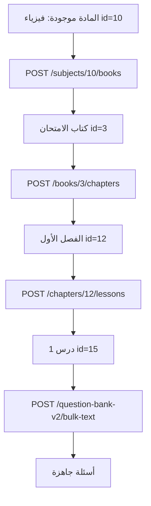

# إدارة محتوى المادة داخل بنك الأسئلة

> **Base URL:** `/api`  
> **الجمهور:** Admin، Employee (صلاحية `question_bank_management`)، Teacher (قراءة + أسئلة حسب التعيين)

**توثيق مرتبط:**
- [`questionBank.md`](./questionBank.md) — بنوك الأسئلة والمواد
- [`question-bank-v2-api.md`](./question-bank-v2-api.md) — أسئلة V2 (تفصيل كامل)
- [`question_bank_admin_change_requests_api.md`](./question_bank_admin_change_requests_api.md) — موافقة الأدمن على طلبات الموظف

---

## 1. الهيكل داخل المادة

```
بنك الأسئلة (مثال: 3 ثانوي)
  └── مادة (مثال: فيزياء)          ← هذا الملف يبدأ من هنا
        └── كتاب (مثال: كتاب الامتحان، كتاب نيوتن)
              └── فصل               ← مشترك بين كل كتب المادة
                    └── درس         ← مشترك بين كل كتب المادة
                          └── أسئلة ← خاصة بكل كتاب (lesson_id مختلف لكل كتاب)
```

| المستوى | جدول DB | مثال |
|---------|---------|------|
| مادة | `subjects` | فيزياء |
| كتاب | `subject_books` | كتاب الامتحان، كتاب نيوتن |
| فصل | `chapters` | الفصل الأول (يُنسَخ تلقائياً لكل الكتب) |
| درس | `lessons` | درس 1 (يُنسَخ تلقائياً لكل الكتب) |
| أسئلة | `questions` / `questions_v2` | MCQ — **مختلفة لكل كتاب** |

**قواعد التفرد:**
- اسم **الكتاب** فريد داخل المادة
- اسم **الفصل** فريد داخل **الكتاب** (ليس المادة كلها)
- اسم **الدرس** فريد داخل الفصل

---

## 2. المصادقة

```http
Authorization: Bearer <JWT>
```

| الدور | إنشاء/تعديل/حذف | قراءة الشجرة |
|-------|-----------------|--------------|
| `admin` | ✅ مباشرة | ✅ |
| `employee` + `question_bank_management` | ✅ تعديل/حذف → **طلب موافقة** (`202`) | ✅ |
| `teacher` | أسئلة فقط (حسب تعيين المادة) | ✅ مواده فقط |

---

## 3. عرض شجرة المادة (قراءة)

### 3.1 مادة + كتب + فصول + دروس (موصى به)

```http
GET /api/subjects/:subjectId/with-books
Authorization: Bearer <token>
```

**Response:**

```json
{
  "success": true,
  "data": {
    "subject": { "id": 10, "name": "فيزياء", "question_bank_id": 1 },
    "books": [
      {
        "id": 3,
        "name": "كتاب الامتحان",
        "order_num": 1,
        "chapters": [
          {
            "id": 12,
            "name": "الفصل الأول",
            "lessons": [{ "id": 15, "name": "درس 1" }]
          }
        ]
      }
    ],
    "chapters": []
  }
}
```

> `chapters` في الجذر = قائمة مسطّحة لكل الفصول (legacy).

### 3.2 قائمة الكتب فقط

```http
GET /api/subjects/:subjectId/books
```

### 3.3 كتاب + فصول + دروس

```http
GET /api/books/:bookId/with-chapters
```

### 3.4 فصل + دروس

```http
GET /api/chapters/:chapterId/with-lessons
```

### 3.5 دروس الفصل (قائمة)

```http
GET /api/chapters/:chapterId/lessons
```

---

## 4. إدارة الكتب

### 4.1 إنشاء كتاب

```http
POST /api/subjects/:subjectId/books
Content-Type: multipart/form-data
Authorization: Bearer <admin_or_employee_token>
```

| الحقل | مطلوب | الوصف |
|-------|--------|--------|
| `name` | ✅ | اسم الكتاب |
| `description` | ❌ | وصف |
| `order_num` | ❌ | ترتيب العرض (افتراضي 1) |
| `image` | ❌ | صورة الغلاف |

**مثال:**

```bash
curl -X POST "http://localhost:8000/api/subjects/10/books" \
  -H "Authorization: Bearer TOKEN" \
  -F "name=كتاب الامتحان" \
  -F "description=أسئلة امتحانات الترم" \
  -F "order_num=1"
```

**Response `201`:**

```json
{
  "success": true,
  "message": "تم إنشاء الكتاب بنجاح",
  "data": {
    "id": 3,
    "subject_id": 10,
    "name": "كتاب الامتحان",
    "order_num": 1,
    "is_active": true
  }
}
```

### 4.2 تعديل كتاب

```http
PUT /api/books/:bookId
Content-Type: multipart/form-data
```

| الحقل | الوصف |
|-------|--------|
| `name`, `description`, `order_num`, `is_active` | اختياري |
| `image` | صورة جديدة |

- **Admin:** تنفيذ فوري `200`
- **Employee:** `202` — طلب موافقة (`entity_type: book`)

### 4.3 حذف كتاب

```http
DELETE /api/books/:bookId
```

> يحذف الفصول والدروس التابعة (CASCADE).

---

## 5. إدارة الفصول

### 5.1 إنشاء فصل (الطريقة المفضلة — داخل كتاب)

```http
POST /api/books/:bookId/chapters
Content-Type: multipart/form-data
```

| الحقل | مطلوب |
|-------|--------|
| `name` | ✅ |
| `description` | ❌ |
| `image` | ❌ |

```bash
curl -X POST "http://localhost:8000/api/books/3/chapters" \
  -H "Authorization: Bearer TOKEN" \
  -F "name=الفصل الأول" \
  -F "description=مقدمة"
```

**Response `201`:**

```json
{
  "success": true,
  "message": "تم إنشاء الفصل بنجاح",
  "data": {
    "id": 12,
    "subject_id": 10,
    "book_id": 3,
    "name": "الفصل الأول"
  }
}
```

### 5.2 إنشاء فصل عبر المادة (Legacy)

```http
POST /api/subjects/:subjectId/chapters
```

| الحقل | ملاحظة |
|-------|--------|
| `book_id` | يُفضّل إرساله |
| بدون `book_id` | يستخدم **أول كتاب** في المادة |
| لا يوجد كتاب | `400` — يجب إنشاء كتاب أولاً |

### 5.3 تعديل فصل

```http
PUT /api/chapters/:chapterId
Content-Type: multipart/form-data
```

- Employee → طلب موافقة (`entity_type: chapter`)

### 5.4 حذف فصل

```http
DELETE /api/chapters/:chapterId
```

---

## 6. إدارة الدروس

### 6.1 إنشاء درس

```http
POST /api/chapters/:chapterId/lessons
Content-Type: multipart/form-data
```

| الحقل | مطلوب |
|-------|--------|
| `name` | ✅ |
| `description` | ❌ |
| `image` | ❌ |

```bash
curl -X POST "http://localhost:8000/api/chapters/12/lessons" \
  -H "Authorization: Bearer TOKEN" \
  -F "name=درس 1 - الحركة"
```

### 6.2 تعديل / حذف درس

| Method | Path |
|--------|------|
| `PUT` | `/api/lessons/:lessonId` |
| `DELETE` | `/api/lessons/:lessonId` |

Employee → طلب موافقة (`entity_type: lesson`)

---

## 7. إدارة الأسئلة

كل الأسئلة تُربط بـ **`lesson_id`** (معرف الدرس في بنك الأسئلة).

### 7.1 نظام Legacy (`questions`)

**Base:** `/api/lesson-questions`

| Method | Path | الوصف |
|--------|------|--------|
| GET | `/lessons/:lessonId/questions` | جلب أسئلة الدرس |
| POST | `/lessons/:lessonId/questions/bulk` | MCQ جماعي من نص |
| POST | `/lessons/:lessonId/questions/text` | نصي جماعي |
| POST | `/lessons/:lessonId/questions/images` | أسئلة صور |

**مثال — MCQ جماعي:**

```http
POST /api/lesson-questions/lessons/15/questions/bulk
Content-Type: application/json

{
  "bulk_text": "ما وحدة القوة؟\nأ) نيوتن\nب) جول\nج) واط\nد) باسكال\n✅ الإجابة الصحيحة: أ"
}
```

**إضافة من Admin عبر نص خام (جدول lesson_questions):**

```http
POST /api/lessons/:lessonId/questions/text-bulk
Content-Type: text/plain
```

(راجع [`questionBank.md`](./questionBank.md) — قسم Lesson Questions)

### 7.2 نظام V2 (`questions_v2`) — موصى به للجديد

**Base:** `/api/question-bank-v2`

| Method | Path | الوصف |
|--------|------|--------|
| POST | `/bulk-text` | أسئلة نصية جماعية |
| POST | `/image-choices` | سؤال باختيارات صور |
| POST | `/passages` | قطعة + أسئلة MCQ |
| GET | `/lessons/:lessonId/questions` | أسئلة الدرس |
| PUT | `/questions/:id/status` | موافقة/رفض (Admin) |

**مثال — bulk text V2:**

```http
POST /api/question-bank-v2/bulk-text
Content-Type: application/json

{
  "lesson_id": 15,
  "questions": [
    {
      "question_text": "ما وحدة القوة؟",
      "correct_answer_index": 0,
      "difficulty_level": "easy",
      "points": 1,
      "options": [
        { "option_index": 0, "option_type": "text", "text_content": "نيوتن" },
        { "option_index": 1, "option_type": "text", "text_content": "جول" },
        { "option_index": 2, "option_type": "text", "text_content": "واط" },
        { "option_index": 3, "option_type": "text", "text_content": "باسكال" }
      ]
    }
  ]
}
```

> التفاصيل الكاملة: [`question-bank-v2-api.md`](./question-bank-v2-api.md)

### 7.3 المدرّس — إضافة سؤال pending

```http
POST /api/teacher/lessons/:lessonId/questions
Content-Type: application/json

{
  "question_text": "نص السؤال",
  "options": ["أ", "ب", "ج", "د"]
}
```

يتطلب تعيين المدرّس على المادة (`teacher_subjects` أو `teacher_permissions`).

### 7.4 استيراد أسئلة مستخرجة بالـ AI (OCR) إلى الدرس

بعد استدعاء `POST /api/ocr/extract-questions`، يمكن إرسال **الـ response كما هو** إلى درس في بنك الأسئلة:

```http
POST /api/question-bank-v2/lesson/:lessonId/import-extraction
Authorization: Bearer <token>
Content-Type: application/json
```

**الصيغ المدعومة للـ body:**

1. **ناتج الاستخراج كامل** (موصى به):

```json
{
  "success": true,
  "data": {
    "filename": "questions.jpeg",
    "passages": [
      { "passage_id": "passage_1", "title": "...", "content": "..." }
    ],
    "extracted_images": [],
    "questions": [
      {
        "number": 1,
        "source_number": "1",
        "passage_id": "passage_1",
        "question_text": "نص السؤال",
        "options": [
          { "label": "أ", "text": "..." },
          { "label": "ب", "text": "..." },
          { "label": "ج", "text": "..." },
          { "label": "د", "text": "..." }
        ],
        "question_images": [],
        "correct_answer": null,
        "correct_answer_index": null,
        "correct_answer_inferred": false
      }
    ]
  }
}
```

2. **كائن `data` مباشرة** (بدون `success`).

3. **الصيغة القديمة:** `{ "extraction": { "passages": [], "questions": [] } }`.

**ما يحدث عند الاستيراد:**

| شكل السؤال في AI | `question_type` في DB | ملاحظات |
|------------------|----------------------|---------|
| 2–5 خيارات نصية | `text_only` أو `text_with_image` | إذا وُجدت `question_images` تُحفظ أول صورة في `question_media` |
| بدون خيارات + 4 صور في `question_images` | `image_choices` | كل صورة تُحفظ كخيار صورة (`question_options.image_url`) — مثل سؤال «في أي من الحالات...» |
| بدون خيارات + إجابة نصية (`correct_answer`) | `text_with_image` أو `text_only` | تُحفظ الإجابة في `explanation` |
| `passages[]` | `question_passages` | ربط عبر `passage_id` المؤقت |

**شكل الـ response بعد الاستيراد** (مطابق لناتج `extract-questions` + حقول DB):

```json
{
  "success": true,
  "message": "تم استيراد 4 سؤال",
  "data": {
    "filename": "questions.jpeg",
    "extracted_images": [],
    "question_count": 4,
    "questions": [
      {
        "number": 4,
        "question_text": "في أي من الحالات...",
        "options": [],
        "question_images": [
          { "image_id": "img-2.jpeg", "image_url": "https://..." }
        ],
        "correct_answer": null,
        "correct_answer_index": null,
        "db_id": 42,
        "question_type": "image_choices",
        "status": "pending"
      }
    ],
    "skipped": []
  }
}
```

> إذا كان `correct_answer_index: null` (لم يُستنتج الإجابة)، يُحفظ السؤال بحالة `pending` ويُعيَّن `correct_answer_index = 0` مؤقتًا حتى يحدّد الأدمن الإجابة الصحيحة.

**بديل (OCR مباشرة):**

```http
POST /api/ocr/import-question-bank-v2
```

```json
{
  "lesson_id": 15,
  "success": true,
  "data": { "...": "نفس ناتج extract-questions" }
}
```

**مثال cURL:**

```bash
curl -X POST "http://localhost:8000/api/question-bank-v2/lesson/15/import-extraction" \
  -H "Authorization: Bearer $TOKEN" \
  -H "Content-Type: application/json" \
  -d @extraction-response.json
```

---

## 8. سير العمل الكامل (مثال: فيزياء — كتاب الامتحان)



**ترتيب الـ API calls:**

1. `POST /api/subjects/10/books` → `book_id = 3`
2. `POST /api/books/3/chapters` → `chapter_id = 12`
3. `POST /api/chapters/12/lessons` → `lesson_id = 15`
4. `POST /api/question-bank-v2/bulk-text` مع `lesson_id: 15`

**التحقق:**

```http
GET /api/subjects/10/with-books
```

---

## 9. موظف → طلب موافقة

عند **تعديل أو حذف** كتاب / فصل / درس، الموظف يحصل على:

```json
{
  "success": true,
  "message": "تم إرسال طلب تعديل الكتاب للأدمن للموافقة",
  "data": { "id": "...", "status": "pending", "entity_type": "book" }
}
```

الأدمن يراجع عبر:

```http
GET /api/question-banks/change-requests/all?status=pending
PATCH /api/question-banks/change-requests/:id/approve
PATCH /api/question-banks/change-requests/:id/reject
```

راجع [`question_bank_admin_change_requests_api.md`](./question_bank_admin_change_requests_api.md).

---

## 10. أخطاء شائعة

| HTTP | السبب |
|------|--------|
| `400` | `name` مفقود / لا يوجد كتاب قبل إنشاء فصل |
| `403` | Employee بدون صلاحية / Teacher غير معيّن على المادة |
| `404` | `subjectId` / `bookId` / `chapterId` / `lessonId` غير موجود |
| `409` | اسم مكرر (كتاب في المادة، فصل في الكتاب، درس في الفصل) |
| `202` | Employee — الطلب بانتظار موافقة الأدمن |

---

## 11. ملخص سريع — كل الـ Endpoints

### كتب
| Method | Path |
|--------|------|
| GET | `/api/subjects/:subjectId/books` |
| POST | `/api/subjects/:subjectId/books` |
| PUT | `/api/books/:id` |
| DELETE | `/api/books/:id` |
| GET | `/api/books/:id/with-chapters` |

### فصول
| Method | Path |
|--------|------|
| POST | `/api/books/:bookId/chapters` ⭐ |
| POST | `/api/subjects/:subjectId/chapters` (legacy) |
| PUT | `/api/chapters/:id` |
| DELETE | `/api/chapters/:id` |
| GET | `/api/chapters/:id/with-lessons` |

### دروس
| Method | Path |
|--------|------|
| GET | `/api/chapters/:chapterId/lessons` |
| POST | `/api/chapters/:chapterId/lessons` |
| PUT | `/api/lessons/:id` |
| DELETE | `/api/lessons/:id` |

### أسئلة
| Method | Path |
|--------|------|
| GET | `/api/lesson-questions/lessons/:lessonId/questions` |
| POST | `/api/lesson-questions/lessons/:lessonId/questions/bulk` |
| POST | `/api/question-bank-v2/bulk-text` |
| POST | `/api/question-bank-v2/image-choices` |
| POST | `/api/question-bank-v2/passages` |
| GET | `/api/question-bank-v2/lessons/:lessonId/questions` |

### عرض الشجرة
| Method | Path |
|--------|------|
| GET | `/api/subjects/:id/with-books` ⭐ |
| GET | `/api/subjects/:id/with-chapters` (flat) |

---

## 12. ملاحظات للفرونت (لوحة الإدارة)

1. **ابدأ دائماً بإنشاء كتاب** قبل الفصول — لا تستخدم `/subjects/:id/chapters` مباشرة بدون كتاب.
2. **التصفح:** مادة → قائمة كتب → فصول الكتاب → دروس الفصل → أسئلة الدرس.
3. **البيانات القديمة:** فصول قديمة تحت «كتاب عام» — اعرض الكتب للمستخدم أو أنشئ كتباً جديدة وانقل المحتوى يدوياً.
4. **صورتان للشجرة:** استخدم `with-books` للواجهة الجديدة؛ `chapters` flat للتوافق فقط.
