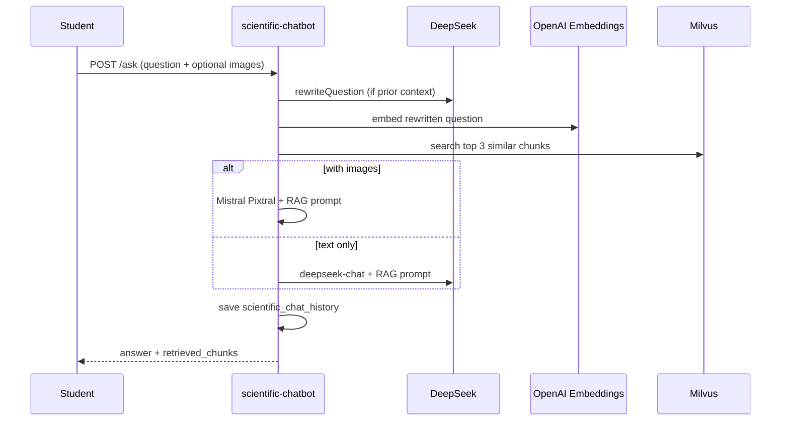

# Scientific Chatbot API — المساعد العلمي (RAG)

توثيق تكامل **شات بوت الدعم العلمي** الحالي في المنصة. النظام يعتمد على **RAG**:

1. المدرس يرفع مواد دراسية (نص / Markdown / PDF)
2. النص يُقسّم ويُحوَّل إلى **embeddings** ويُخزَّن في **Milvus**
3. الطالب يسأل → يُسترجَع السياق الأقرب → **DeepSeek** (أو **Mistral Pixtral** مع صور) يُجيب من المادة فقط

---

## Base URL

```txt
https://YOUR_API_DOMAIN/api/scientific-chatbot
```

تطوير محلي:

```txt
http://localhost:8000/api/scientific-chatbot
```

**المسار في الكود:** `src/routes.ts` → `/scientific-chatbot`

---

## المصادقة

```http
Authorization: Bearer <ACCESS_TOKEN>
```

| الدور | الصلاحيات |
|-------|-----------|
| `teacher` | رفع/إدارة ملفات كورساته + ملفات على مستوى المدرس |
| `admin` | إدارة أي كورس؛ يمرّر `teacher_id` عند الحاجة |
| `student` | طرح أسئلة + سجل المحادثة (بعد الاشتراك) |

---

## أدوات الذكاء الاصطناعي والبنية

| المكوّن | الأداة | الاستخدام |
|---------|--------|-----------|
| **Embeddings** | OpenAI (`OPENAI_EMBEDDING_MODEL`) | تحويل النص إلى vectors للبحث |
| **Vector DB** | Milvus (`course_content_vectors`) | تخزين وبحث أجزاء المحتوى |
| **إعادة صياغة السؤال** | DeepSeek (`deepseek-chat`) | جعل السؤال مستقلاً عند وجود سياق سابق |
| **توليد الإجابة (نص)** | DeepSeek (`deepseek-chat`) | RAG answer |
| **توليد الإجابة (مع صور)** | Mistral Pixtral (`pixtral-12b-2409`) | عند إرفاق صور مع السؤال |
| **استخراج PDF** | Mistral OCR (`MistralOcrService`) | استخراج نص من ملفات PDF المرفوعة |

**متغيرات البيئة الشائعة:**

```env
OPENAI_API_KEY=...
OPENAI_EMBEDDING_MODEL=text-embedding-3-small
OPENAI_EMBEDDING_DIMENSIONS=1536
DEEPSEEK_API_KEY=...
DEEPSEEK_API_URL=https://api.deepseek.com
MISTRAL_API_KEY=...
MISTRAL_API_BASE_URL=...
# + إعدادات Milvus حسب milvusService
```

---

## نطاقان للمحتوى والأسئلة

| النطاق | رفع الملفات | طرح السؤال | السجل |
|--------|-------------|-------------|--------|
| **كورس** | `POST /courses/:courseId/files` | `POST /courses/:courseId/ask` | `GET /courses/:courseId/history` |
| **مدرس (كل مواد المدرس)** | `POST /files` | `POST /teachers/:teacherId/ask` | `GET /teachers/:teacherId/history` |

> ملفات مستوى المدرس تُخزَّن بـ `course_id = null` وتُفهرَس لجميع كورسات/محتوى ذلك المدرس.

---

## نظرة عامة على المسارات

```http
# ── محتوى على مستوى المدرس (Teacher/Admin) ──
POST /files
GET  /files
POST /reset-embeddings

# ── محتوى على مستوى الكورس (Teacher/Admin) ──
POST   /courses/:courseId/files
GET    /courses/:courseId/files
POST   /courses/:courseId/reset-embeddings
DELETE /files/:fileId

# ── طالب — أسئلة على كورس ──
POST /courses/:courseId/ask
GET  /courses/:courseId/history

# ── طالب — أسئلة على كل مواد مدرس ──
POST /teachers/:teacherId/ask
GET  /teachers/:teacherId/history

# ── مدرس — مراجعة شاتات الطلاب مع AI ──
GET /teacher/student-chats
GET /teacher/student-chats/:studentId/messages
```

---

# 1) المدرس / الأدمن — محتوى على مستوى المدرس

### `POST /files`

رفع ملف مواد علمية **للمدرس** (ليست مربوطة بكورس واحد).

**Auth:** `teacher` | `admin`  
**Content-Type:** `multipart/form-data`

| Field | الوصف |
|-------|--------|
| `file` | `.txt`, `.md`, `.pdf` — حد **10MB** |
| `teacher_id` | **إلزامي للأدmin** (body أو query: `teacher_id` / `teacherId`) |

**شروط:**

- المدرس يجب أن يملك **كورساً واحداً على الأقل**
- PDF يُمرَّر على **Mistral OCR** لاستخراج النص

**Response `201`:**

```json
{
  "message": "File uploaded and processed successfully",
  "file": {
    "id": 1,
    "course_id": null,
    "teacher_id": 10,
    "file_name": "physics-notes.txt",
    "file_path": "uploads/course-content/scientific-content-....txt",
    "file_size": 45678,
    "file_type": "text/plain",
    "content_text": "...",
    "uploaded_at": "...",
    "updated_at": "..."
  }
}
```

**Response مع تحذير embeddings (الخدمة غير متاحة):**

```json
{
  "message": "File saved. Embeddings could not be generated...",
  "file": { "...": "..." },
  "warning": "Embedding service (OpenAI) was unavailable..."
}
```

---

### `GET /files`

قائمة ملفات المدرس.

**Query (admin):** `teacher_id` أو `teacherId`

**Response `200`:**

```json
{ "files": [ /* CourseContentFile[] */ ] }
```

---

### `POST /reset-embeddings`

إعادة توليد embeddings **لجميع** ملفات المدرس (مستوى المدرس + يمكن استخدامه بعد عودة OpenAI/Milvus).

**Body/Query (admin):** `teacher_id`

**Response `200`:**

```json
{ "message": "Embeddings reset successfully" }
```

---

# 2) المدرس / الأدمن — محتوى على مستوى الكورس

### `POST /courses/:courseId/files`

**Auth:** `teacher` (مالك الكورس) | `admin`

**Form:** `file` — `.txt`, `.md`, `.pdf` — **10MB**

**Response `201`:** مثل `/files` لكن `course_id` = معرف الكورس

**أخطاء:**

| HTTP | السبب |
|------|--------|
| `403` | المدرس ليس مالك الكورس |
| `404` | الكورس غير موجود |

---

### `GET /courses/:courseId/files`

**Response `200`:** `{ "files": [...] }`

---

### `POST /courses/:courseId/reset-embeddings`

حذف embeddings الكورس وإعادة توليدها من الملفات الحالية.

---

### `DELETE /files/:fileId`

حذف ملف وembeddings المرتبطة.

**Response `200`:**

```json
{
  "message": "File deleted successfully",
  "warning": "Vector index (Milvus) was unavailable..." 
}
```

(`warning` اختياري إذا Milvus غير متاح)

---

# 3) الطالب — أسئلة على **كورس**

### `POST /courses/:courseId/ask`

**Auth:** `student`  
**Content-Type:** `multipart/form-data` (ليس JSON)

| Field | إلزامي | الوصف |
|-------|--------|--------|
| `question` | نعم | نص السؤال |
| `images` | لا | حتى **5** صور — `image/*` — **5MB** لكل صورة |

**شروط الوصول:**

- الطالب **مشترك** في الكورس (`enrollments`)
- الكورس فيه **محتوى مرفوع**

**Response `200`:**

```json
{
  "answer": "الإجابة بالعربية أو الإنجليزية حسب لغة السؤال...",
  "retrieved_chunks": [
    {
      "chunk_text": "نص الجزء المسترجع من المادة...",
      "file_id": 12,
      "chunk_index": 4
    }
  ]
}
```

**أخطاء:**

| HTTP | Body |
|------|------|
| `400` | `{ "error": "Question is required" }` |
| `403` | `{ "error": "You must be subscribed to this course to ask about its content." }` |
| `404` | `{ "error": "This course does not have uploaded content yet..." }` |
| `503` | `{ "error": "Answer service is temporarily unavailable..." }` |
| `500` | خطأ عام |

**مثال curl:**

```bash
curl -X POST "http://localhost:8000/api/scientific-chatbot/courses/5/ask" \
  -H "Authorization: Bearer STUDENT_TOKEN" \
  -F "question=ما هو قانون نيوتن الثاني؟" \
  -F "images=@diagram.png"
```

---

### `GET /courses/:courseId/history`

**Query:**

| Param | Default | الوصف |
|-------|---------|--------|
| `limit` | `50` | عدد الرسائل |
| `beforeId` | — | pagination (id أصغر) |

**Response `200`:**

```json
{
  "history": [
    {
      "id": 150,
      "student_id": 123,
      "course_id": 5,
      "teacher_id": 10,
      "question": "ما هو...",
      "rewritten_question": "ما هو قانون نيوتن الثاني؟",
      "answer": "...",
      "retrieved_chunks": [ /* ... */ ],
      "images": ["uploads/chat-images/chat-image-....png"],
      "created_at": "2026-06-16T12:00:00.000Z"
    }
  ]
}
```

> الترتيب في الاستجابة: **من الأقدم للأحدث** داخل الصفحة.

---

# 4) الطالب — أسئلة على **كل مواد مدرس**

### `POST /teachers/:teacherId/ask`

يبحث في **كل** ملفات المدرس (كورسات + ملفات مستوى المدرس).

**Auth:** `student`  
**Content-Type:** `multipart/form-data`

| Field | إلزامي |
|-------|--------|
| `question` | نعم |
| `images` | لا (حتى 5) |

**شروط:**

- الطالب مشترك في **كورس واحد على الأقل** لهذا المدرس
- المدرس لديه **ملفات مرفوعة**

**Response `200`:** نفس شكل `/courses/:courseId/ask`

**أخطاء إضافية:**

| HTTP | Body |
|------|------|
| `403` | `{ "error": "You must be subscribed to at least one course with this teacher." }` |

---

### `GET /teachers/:teacherId/history`

سجل أسئلة الطالب مع هذا المدرس (`course_id IS NULL` في السجل).

**Query:** `limit`, `beforeId` — نفس الكورس.

---

# 5) المدرس — مراجعة شاتات الطلاب مع AI

يسمح للمدرس بمتابعة أسئلة الطلاب وردود الـ AI للمراجعة والتدقيق.

### `GET /teacher/student-chats`

قائمة مختصرة بمحادثات الطلاب (آخر سؤال/رد + عدد الرسائل).

**Auth:** `teacher` | `admin`

**Query:**

| Param | الوصف |
|-------|--------|
| `courseId` | فلترة على كورس معيّن |
| `scope=teacher` | محادثات نطاق المدرس العام فقط (`course_id IS NULL`) |
| `studentId` | فلترة على طالب معيّن |
| `limit` | default `30` |
| `offset` | default `0` |
| `teacher_id` | **للأدmin فقط** |

**Response `200`:**

```json
{
  "chats": [
    {
      "student_id": 14,
      "student_name": "أحمد محمد",
      "student_avatar": "https://...",
      "course_id": 1,
      "course_name": "كيمياء 3ث",
      "message_count": 5,
      "last_question": "ما هي العناصر الانتقالية؟",
      "last_answer": "العناصر الانتقالية هي...",
      "last_at": "2026-06-16T20:47:00.000Z"
    }
  ]
}
```

---

### `GET /teacher/student-chats/:studentId/messages`

تفاصيل المحادثة الكاملة (كل الأسئلة + ردود AI + المصادر المسترجعة).

**Auth:** `teacher` | `admin`

**Query:**

| Param | الوصف |
|-------|--------|
| `courseId` | كورس معيّن |
| `scope=teacher` | محادثات نطاق المدرس العام |
| `limit` | default `50` |
| `beforeId` | pagination |
| `teacher_id` | **للأدmin** |

**Response `200`:**

```json
{
  "messages": [
    {
      "id": 120,
      "student_id": 14,
      "course_id": 1,
      "teacher_id": 5,
      "question": "ما هي العناصر الانتقالية؟",
      "rewritten_question": "ما هي العناصر الانتقالية في الجدول الدوري؟",
      "answer": "...",
      "retrieved_chunks": [
        { "chunk_text": "...", "file_id": 36, "chunk_index": 2 }
      ],
      "images": [],
      "created_at": "2026-06-16T20:47:00.000Z",
      "student_name": "أحمد محمد",
      "student_avatar": "https://...",
      "course_name": "كيمياء 3ث"
    }
  ]
}
```

**أخطاء:** `403` — لا صلاحية | `400` — معرف غير صالح

> **ملاحظة:** تُحفظ في السجل المحادثات التي تم فيها توليد إجابة فعلية. رسائل "الخدمة غير متاحة" لا تُسجَّل حالياً.

---

# 6) آلية الإجابة (RAG Pipeline)



**قواعد الإجابة:**

- الإجابة **من المادة المسترجعة فقط**
- نفس **لغة** سؤال الطالب
- إن لم يُوجَد سياق: `"لا يمكنني العثور على هذه المعلومات في مواد الدورة التدريبية."`

---

# 7) معالجة الملفات

| الخطوة | التفاصيل |
|--------|----------|
| رفع | `uploads/course-content/` |
| PDF | Mistral OCR → نص |
| txt/md | قراءة UTF-8 |
| Chunking | 500 حرف، تداخل 15% |
| Embedding | OpenAI → Milvus |
| Fallback | الملف يُحفظ في DB حتى لو فشل embedding؛ استخدم `reset-embeddings` لاحقاً |

---

# 8) أمثلة `curl` سريعة

### مدرس — رفع ملف لكورس

```bash
curl -X POST "http://localhost:8000/api/scientific-chatbot/courses/5/files" \
  -H "Authorization: Bearer TEACHER_TOKEN" \
  -F "file=@notes.txt"
```

### مدرس — رفع ملف على مستوى المدرس

```bash
curl -X POST "http://localhost:8000/api/scientific-chatbot/files" \
  -H "Authorization: Bearer TEACHER_TOKEN" \
  -F "file=@general-physics.pdf"
```

### أدmin — رفع لمدرس معيّن

```bash
curl -X POST "http://localhost:8000/api/scientific-chatbot/files?teacher_id=10" \
  -H "Authorization: Bearer ADMIN_TOKEN" \
  -F "file=@notes.txt"
```

### طالب — سؤال على كورس

```bash
curl -X POST "http://localhost:8000/api/scientific-chatbot/courses/5/ask" \
  -H "Authorization: Bearer STUDENT_TOKEN" \
  -F "question=اشرح قانون أوم"
```

### طالب — سؤال على كل مواد المدرس

```bash
curl -X POST "http://localhost:8000/api/scientific-chatbot/teachers/10/ask" \
  -H "Authorization: Bearer STUDENT_TOKEN" \
  -F "question=ما الفرق بين التيار والجهد؟"
```

---

# 9) الفرق بين الشات بوتات في المنصة

| | **المساعد العلمي** | **دعم فني** (`/support`) | **محلل البيانات** |
|--|-------------------|--------------------------|-------------------|
| **الهدف** | أسئلة علمية من المادة | مشاكل تقنية + تقارير مدرس | تحليل أداء الطلاب |
| **المستخدم** | طالب (سؤال) + مدرس (رفع) | طالب/مدرس/ضيف | مدرس |
| **المصدر** | ملفات RAG | بيانات المنصة + DeepSeek | SQL + DeepSeek |
| **صور مع السؤال** | ✅ (Mistral) | ❌ (دعم فني) | ❌ |

---

## الملفات المصدرية

| الملف | الدور |
|--------|--------|
| `src/controllers/scientificChatbot.ts` | مسارات HTTP |
| `src/services/scientificChatbot.ts` | RAG، Milvus، حفظ السجل |
| `src/services/embeddingService.ts` | OpenAI embeddings |
| `src/services/milvusService.ts` | Vector search |
| `src/services/mistralOcr.ts` | استخراج PDF |
| `migrations/1700000000960_create_scientific_chatbot_tables.sql` | جداول أساسية |
| `migrations/1772107203678_add_images_to_scientific_chat_history.sql` | صور في السجل |
| `migrations/1772108800000_update_scientific_chatbot_for_teachers.sql` | نطاق المدرس |

---

## توثيق إضافي (قديم / جزئي)

- [`scientific-chatbot-students-api.md`](./scientific-chatbot-students-api.md) — تركيز على الطالب (إنجليزي)
- [`scientific-chatbot-teachers-api.md`](./scientific-chatbot-teachers-api.md) — تركيز على المدرس (إنجليزي)

> **هذا الملف** هو المرجع الموحّد المحدّث لجميع الـ APIs الحالية.

---

*آخر تحديث يتوافق مع `src/controllers/scientificChatbot.ts` و`src/services/scientificChatbot.ts`.*
