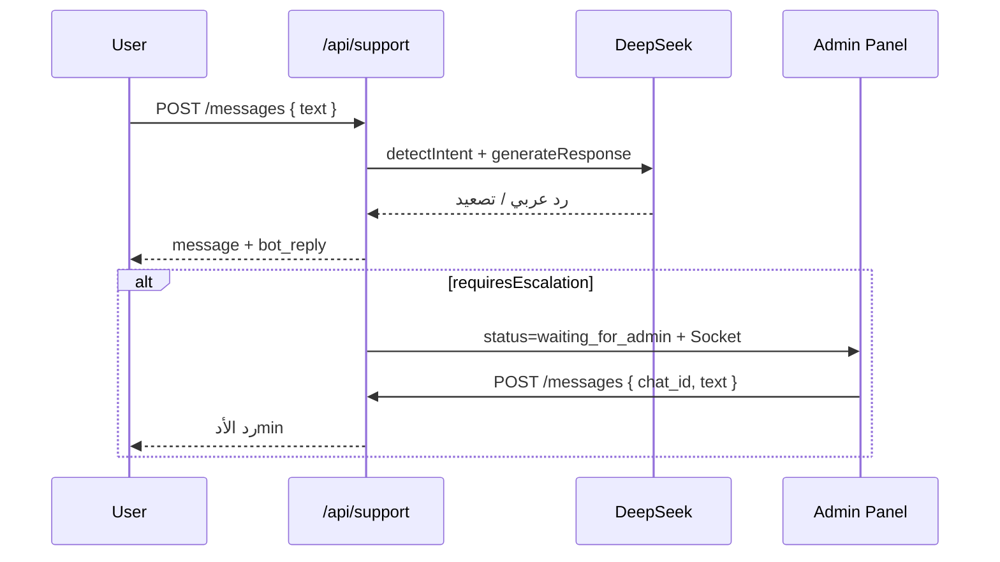

# Support Chatbot API — شات بوت الدعم الفني

توثيق تكامل **شات الدعم الحالي** في المنصة. النظام يدعم ثلاث قنوات:

| القناة | المستخدم | البوت |
|--------|----------|--------|
| **دعم الطالب** | `student` (+ ضيف `guest`) | **DeepSeek** — فهم المشكلة، خطوات حل، تصعيد للأدمن |
| **دعم المدرس** | `teacher` | **DeepSeek** (تحليل النية) + منطق داخلي — تقارير، أفكار تسويق، تصعيد مشاكل |
| **إدارة يدوية** | `admin` | رد بشري على شاتات الطلاب/المدرسين |

للتفاصيل التقنية الداخلية للبوت (Intents، التصعيد) راجع أيضاً: [`support-chatbot-ai.md`](./support-chatbot-ai.md)

---

## Base URL

```txt
https://YOUR_API_DOMAIN/api/support
```

تطوير محلي:

```txt
http://localhost:8000/api/support
```

---

## المصادقة

| نوع المستخدم | المصادقة |
|--------------|-----------|
| **طالب** | `Authorization: Bearer <STUDENT_TOKEN>` |
| **مدرس** | `Authorization: Bearer <TEACHER_TOKEN>` |
| **أدمن** | `Authorization: Bearer <ADMIN_TOKEN>` |
| **ضيف (Guest)** | **بدون توكن** — يستخدم `guest_token` |

---

## أدوات الذكاء الاصطناعي المستخدمة

| الأداة | الاستخدام |
|--------|-----------|
| **DeepSeek** (`deepseek-chat`) | شات الطالب والضيف: كشف النية + توليد الردود |
| **DeepSeek** | شات المدرس: `detectTeacherIntent` عند الحاجة (تصنيف: مشكلة / تقرير / تسويق) |
| **منطق داخلي** | شات المدرس: تقارير الطلاب، أفكار تسويق، كلمات مفتاحية — **بدون** توليد نص كامل بالـ LLM |

**متغيرات البيئة:**

```env
DEEPSEEK_API_KEY=...
DEEPSEEK_API_URL=https://api.deepseek.com
```

---

## حالات الشات (`status`)

### شات الطالب / الضيف

| الحالة | المعنى |
|--------|--------|
| `bot_handling` | البوت يتولى المحادثة |
| `waiting_for_admin` | تم التصعيد — الطالب **لا يستطيع** إرسال رسائل جديدة |
| `admin_handling` | الأدمن يرد يدوياً |
| `open` | مفتوح |
| `resolved` | تم الحل |
| `closed` | مغلق |

### شات المدرس

| الحالة | المعنى |
|--------|--------|
| `waiting_for_admin` | مشكلة مُصعَّدة للإدارة |
| `admin_handling` | الأدمن يرد |
| **أخرى** | المدرس **يستطيع الإرسال دائماً** (`can_teacher_send: true`) |

---

## نظرة عامة على المسارات

```http
# ── ضيف (بدون تسجيل) ──
POST /guest/start
GET  /guest/chat
POST /guest/messages

# ── طالب ──
GET  /chat
GET  /chats/:chatId/messages
POST /messages
POST /messages/media
POST /messages/audio
GET  /unread-count
GET  /notifications
GET  /notifications/latest
GET  /faq

# ── مدرس ──
GET  /teacher/chat
GET  /teacher/messages
POST /teacher/messages
GET  /teacher/notifications
GET  /teacher/notifications/latest
GET  /teacher/chats/:chatId/messages

# ── أدمن ──
GET  /chats
GET  /chats/:chatId/messages
POST /messages                    # رد على طالب أو مدرس
PATCH /chats/:chatId/status
POST /chats/:chatId/assign
GET  /teacher/chats
GET  /teacher/chats/:chatId/messages
GET  /teacher/tickets
PATCH /teacher/tickets/:ticketId
GET  /unread-count
GET  /notifications

# ── FAQ (إدارة) ──
POST   /faq
GET    /faq/admin
PUT    /faq/:id
DELETE /faq/:id
POST   /faq/test-match
```

---

# 1) شات الضيف (Guest)

للزائر الذي لا يستطيع تسجيل الدخول أو إنشاء حساب.

### `POST /guest/start`

بدء محادثة أو استئناف محادثة موجودة.

**Body (JSON):**

```json
{ "guest_token": "optional-existing-token" }
```

**Response `200`:**

```json
{
  "chat_id": 12,
  "guest_token": "uuid-token",
  "chat": {
    "id": 12,
    "status": "bot_handling",
    "guest_token": "uuid-token"
  }
}
```

> احفظ `guest_token` في التخزين المحلي للمتصفح/التطبيق.

---

### `GET /guest/chat?guest_token=...`

جلب الشات وآخر **100** رسالة.

**Response `200`:**

```json
{
  "chat": { "id": 12, "status": "bot_handling", "guest_token": "..." },
  "messages": [ /* SupportMessage[] */ ]
}
```

---

### `POST /guest/messages`

إرسال رسالة + رد البوت (نفس منطق الطالب مع DeepSeek).

**Body:**

```json
{
  "guest_token": "uuid-token",
  "text": "مش عارف أسجل دخول"
}
```

**Response `201`:**

```json
{
  "message": { /* رسالة الضيف */ },
  "bot_reply": { /* رد البوت، is_auto_reply: true */ }
}
```

---

# 2) شات دعم الطالب

### `GET /chat`

جلب شات الطالب (إنشاء تلقائي إن لم يوجد) + **تحديد كل الرسائل كمقروءة**.

**Auth:** `student`

**Response `200`:**

```json
{ "chat": { "id": 5, "status": "bot_handling", "student_id": 42, ... } }
```

---

### `GET /chats/:chatId/messages`

**Auth:** `student` (شاته فقط) | `admin`

**Query:**

| Param | Default | الوصف |
|-------|---------|--------|
| `limit` | `50` | عدد الرسائل |
| `before` | — | pagination (ISO timestamp) |

**Response `200`:**

```json
{ "messages": [ /* SupportMessage[] */ ] }
```

**حقول الرسالة (`SupportMessage`):**

| الحقل | الوصف |
|--------|--------|
| `sender_role` | `student` \| `admin` |
| `message_type` | `text` \| `image` \| `file` \| `audio` \| `auto_reply` |
| `is_auto_reply` | `true` لردود البوت |
| `text` | النص |
| `media_url` | رابط Cloudinary للمرفقات |
| `status` | `sent` \| `delivered` \| `read` |

---

### `POST /messages`

إرسال رسالة نصية. **للطالب:** يُفعّل البوت تلقائياً.

**Auth:** `student` | `admin`

**Body (طالب):**

```json
{ "text": "الفيديو مش شغال" }
```

**Body (أدmin — رد على شات طالب):**

```json
{ "text": "جرب تحديث الصفحة", "chat_id": 5 }
```

**Response `201`:**

```json
{
  "message": { /* رسالة المرسل */ },
  "bot_reply": { /* اختياري — رد البوت للطالب فقط */ }
}
```

**أخطاء:**

| HTTP | السبب |
|------|--------|
| `403` | الطالب في حالة `waiting_for_admin` — لا يمكنه الإرسال |

**سلوك البوت (DeepSeek):**

1. كشف النية (`LOGIN_PROBLEM`, `ACTIVATION_CODE`, …)
2. توليد رد عربي بخطوات حل
3. تصعيد → `waiting_for_admin` + رسالة «سيتم تحويلك للدعم»
4. إذا قال الطالب إن المشكلة حُلّت → سؤال تأكيد → `resolved`

**Intent types (طالب):**

```txt
LOGIN_PROBLEM | PASSWORD_RESET | ACCOUNT_LOCKED | COURSE_ACCESS
VIDEO_LOADING | PAYMENT | BUG_ERROR | ACTIVATION_CODE | OTHER
```

---

### `POST /messages/media`

رفع صورة / فيديو / ملف.

**Auth:** `student` | `admin`  
**Content-Type:** `multipart/form-data`

| Field | إلزامي |
|-------|--------|
| `file` | نعم (حد 50MB) |
| `chat_id` | للأدmin فقط |
| `text` | لا — تعليق اختياري |

**Response `201`:** `{ "message": { ... } }`

> **ملاحظة:** رفع المedia **لا يُشغّل** البوت تلقائياً (نص فقط).

---

### `POST /messages/audio`

رفع رسالة صوتية.

**Fields:** `audio` (file), `chat_id` (admin), `duration` (ثوانٍ)

---

### `GET /unread-count`

**Auth:** `student` | `teacher` | `admin`

```json
{ "unread_count": 3 }
```

---

### `GET /notifications`

**Auth:** `student` | `admin`  
**Query:** `limit`, `offset`  
للطالب: **غير المقروءة فقط** (تُصفّر بعد فتح الشات).

---

### `GET /notifications/latest`

**Auth:** `student`  
آخر إشعار غير مقروء + العدد — مناسب للـ Push/Badge.

---

### `GET /faq`

**Auth:** `student`  
أسئلة شائعة نشطة + **تحديد الشات كمقروء**.

```json
{
  "faqs": [
    { "id": 1, "question": "...", "answer": "...", "priority": 0 }
  ]
}
```

---

# 3) شات دعم المدرس

البوت يساعد المدرس في:

- **تقرير مستوى الطلاب** (لكل صف/كورس)
- **تقرير طالب** (بالاسم أو الكود)
- **أفكار تسويقية**
- **الإبلاغ عن مشكلة** → تصعيد + تذكرة للأدمن

> لتقارير تحليلية متقدمة (AI + JSON) استخدم شات **محلل البيانات**: [`data-analyst-chatbot-api.md`](./data-analyst-chatbot-api.md)

### `GET /teacher/chat`

**Auth:** `teacher`

```json
{
  "chat": { "id": 8, "teacher_id": 5, "status": "open", ... },
  "quick_buttons": [
    { "label": "تقرير طلابي", "payload": "تقرير مستوى الطلاب" },
    { "label": "تقرير طالب بالاسم", "payload": "تقرير الطالب " },
    { "label": "فكرة تسويقية", "payload": "أفكار تسويقية" },
    { "label": "الإبلاغ عن مشكلة", "payload": "أريد الإبلاغ عن مشكلة" }
  ],
  "can_teacher_send": true
}
```

---

### `GET /teacher/messages`

**Auth:** `teacher`  
**Query:** `limit` (default 50), `before`

---

### `POST /teacher/messages`

**Auth:** `teacher`

**Body:**

```json
{ "text": "تقرير مستوى الطلاب" }
```

**Response `201`:**

```json
{
  "message": { /* رسالة المدرس */ },
  "bot_reply": { /* رد البوت */ },
  "can_teacher_send": true
}
```

**أمثلة طلبات:**

| النص | النتيجة |
|------|---------|
| `تقرير مستوى الطلاب` | تقارير يومية لكل صف |
| `تقرير الطالب 15` | تقرير طالب بالكود |
| `تقرير الطالب أحمد` | بالاسم (أو قائمة إن وُجد أكثر من واحد) |
| `أفكار تسويقية` | نصيحة تسويق عشوائية |
| `أريد الإبلاغ عن مشكلة` | تصعيد + `createTicket` + إشعار الأدmin |

**عند التصعيد (`problem`):**

- `SupportChatService.createSupportTicket`
- `escalateTeacherChat` → `waiting_for_admin`
- Socket: `support:teacher-problem-escalated` للأدmin

---

### `GET /teacher/notifications`

**Auth:** `teacher`  
**Query:** `limit`, `offset`  
دائماً **غير مقروءة فقط**.

---

### `GET /teacher/notifications/latest`

**Auth:** `teacher`

```json
{
  "notification": { /* آخر إشعار */ },
  "unread_count": 2
}
```

---

### `GET /teacher/chats/:chatId/messages`

**Auth:** `teacher` (شاته) | `admin`

---

# 4) مسارات الأدمن

### `GET /chats`

قائمة شاتات **الطلاب**.

**Query:** `limit`, `offset`, `status` (`open` \| `closed` \| `resolved` \| …)

```json
{
  "chats": [ /* SupportChat[] */ ],
  "pagination": { "total": 10, "limit": 50, "offset": 0, "has_more": false }
}
```

**مثال — شاتات تنتظر رد:**

```http
GET /api/support/chats?status=waiting_for_admin
```

---

### `POST /messages` (أدمن)

- **شات طالب:** `{ "text": "...", "chat_id": 5 }`
- **شات مدرس:** نفس الـ endpoint — إذا `chat_id` لشات مدرس يُوجَّه تلقائياً لـ `saveTeacherMessage`

---

### `PATCH /chats/:chatId/status`

```json
{ "status": "closed" }
```

**قيم مسموحة:**

```txt
open | closed | resolved | bot_handling | waiting_for_admin | admin_handling
```

---

### `POST /chats/:chatId/assign`

تعيين الأدmin الحالي للشات → `admin_handling`.

---

### `GET /teacher/chats`

قائمة شاتات المدرسين.

**Query:** `limit`, `offset`, `status`

---

### `GET /teacher/tickets`

تذاكر مشاكل المدرسين (بعد التصعيد).

---

### `PATCH /teacher/tickets/:ticketId`

تحديث التذكرة + إرسال رسالة للمدرس عند الحل.

**Body:**

```json
{
  "status": "resolved",
  "admin_notes": "تم إصلاح الخطأ",
  "message_to_teacher": "تم حل مشكلتك، جرّب الآن"
}
```

**Response:**

```json
{
  "ticket": { /* محدّث */ },
  "message_sent_to_teacher": true
}
```

---

# 5) FAQ — إدارة الأسئلة الشائعة

| Method | Path | Auth | الوصف |
|--------|------|------|--------|
| `POST` | `/faq` | admin | إنشاء سؤال |
| `GET` | `/faq/admin` | admin | كل الأسئلة (`?active_only=true`) |
| `PUT` | `/faq/:id` | admin | تحديث |
| `DELETE` | `/faq/:id` | admin | حذف |
| `POST` | `/faq/test-match` | admin | اختبار مطابقة نص مع FAQ |

**إنشاء FAQ:**

```json
{
  "question": "كيف أفعل الكورس؟",
  "answer": "ادخل كود التفعيل من...",
  "keywords": ["تفعيل", "كود"],
  "priority": 1
}
```

---

# 6) Socket.io (Real-Time)

الغرف (Rooms) الشائعة:

```txt
support:chat:{chatId}           — شات طالب/ضيف
support:student:{studentId}   — إشعارات الطالب
support:teacher:{teacherId}   — إشعارات المدرس
support:teacher-chat:{chatId} — شات المدرس
support:admin                 — لوحة الأدmin
```

**Events (استقبال):**

| Event | الوصف |
|-------|--------|
| `support:new-message` | رسالة جديدة |
| `message:receive` | رسالة (alias) |
| `support:notification` | إشعار |
| `notification:new` | إشعار (alias) |
| `support:admin-message` | رد أدmin للطالب |
| `support:teacher-notification` | إشعار للمدرس |
| `support:teacher-problem-escalated` | مشكلة مدرس للأدmin |
| `conversation:update` | تحديث قائمة المحادثات (أدmin) |
| `notifications:message` | إشعار موحّد (`user:{id}`) |

---

# 7) أمثلة `curl`

### طالب — إرسال رسالة

```bash
curl -X POST "http://localhost:8000/api/support/messages" \
  -H "Authorization: Bearer STUDENT_TOKEN" \
  -H "Content-Type: application/json" \
  -d "{\"text\":\"نسيت كلمة المرور\"}"
```

### مدرس — تقرير طلاب

```bash
curl -X POST "http://localhost:8000/api/support/teacher/messages" \
  -H "Authorization: Bearer TEACHER_TOKEN" \
  -H "Content-Type: application/json" \
  -d "{\"text\":\"تقرير مستوى الطلاب\"}"
```

### أدmin — شاتات بانتظار الرد

```bash
curl "http://localhost:8000/api/support/chats?status=waiting_for_admin" \
  -H "Authorization: Bearer ADMIN_TOKEN"
```

### ضيف — بدء شات

```bash
curl -X POST "http://localhost:8000/api/support/guest/start" \
  -H "Content-Type: application/json" \
  -d "{}"
```

---

# 8) تدفق مقترح للواجهة



---

# 9) الفرق بين شات الدعم ومحلل البيانات

| | **شات الدعم** (`/support`) | **محلل البيانات** (`/teacher/data-analyst`) |
|--|---------------------------|-----------------------------------------------|
| **الهدف** | دعم فني + تقارير مبسطة للمدرس | تحليل بيانات تعليمية متقدم |
| **الطالب** | ✅ | ❌ |
| **المدرس** | تقارير + مشاكل + تسويق | تقارير AI مفصّلة |
| **التصعيد للأدmin** | ✅ | ❌ |
| **Socket.io** | ✅ | ❌ |

---

## الملفات المصدرية

| الملف | الدور |
|--------|--------|
| `src/controllers/supportChat.ts` | كل مسارات HTTP |
| `src/services/deepseekChatbot.ts` | بوت الطالب/الضيف (DeepSeek) |
| `src/services/teacherSupportChatbot.ts` | بوت المدرس |
| `src/services/supportChat.ts` | قاعدة البيانات والمنطق |
| `src/services/supportChatSocket.ts` | أحداث Socket.io |
| `src/routes.ts` | `/support` |

---

*آخر تحديث يتوافق مع `src/controllers/supportChat.ts` و`src/services/deepseekChatbot.ts`.*
