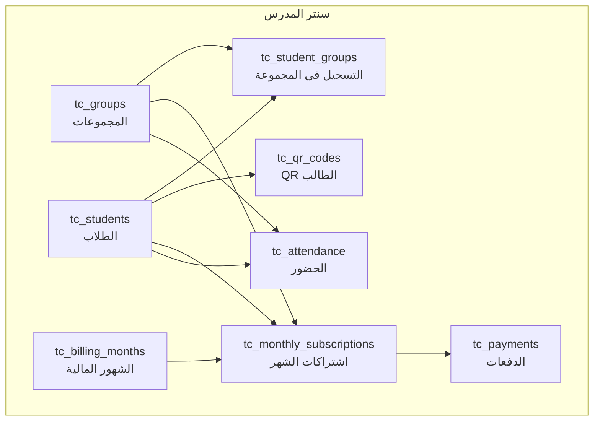

# إدارة سنتر المدرس (Teacher Center Management)

توثيق نظام **سنتر المدرس**: يساعد المدرس على إدارة مجموعاته الحضورية، تسجيل الطلاب، متابعة الاشتراكات الشهرية، وأخذ الحضور يدوياً أو بمسح QR.

> هذا النظام **جديد ومستقل** عن النظام القديم (`/api/study-groups` و `/api/center-groups`).  
> التوثيق القديم: [`center-management-system-ar.md`](./center-management-system-ar.md)  
> مرجع API مختصر: [`teacher-center-api-ar.md`](./teacher-center-api-ar.md)

---

## البداية السريعة

| الخطوة | المسار | الوصف |
|--------|--------|--------|
| 1 | `POST /api/teacher/center/groups` | إنشاء مجموعة (اسم + أيام + قيمة الاشتراك) |
| 2 | `POST /api/teacher/center/groups/:id/students` | إضافة طالب للمجموعة + إنشاء QR |
| 3 | `GET /api/teacher/center/students/:id/qr` | جلب كود الطالب وصورته QR |
| 4 | `POST /api/teacher/center/billing/months` | فتح شهر مالي وتحديد من جددوا |
| 5 | `POST /api/teacher/center/attendance/scan` | تسجيل حضور بمسح QR |
| 6 | `GET /api/teacher/center/reports/attendance/student/:id` | تقرير حضور/غياب للطالب |

**المسار في الكود:** `src/modules/centerMgmt` → يُربَط من `src/routes.ts` على `/teacher/center`

---

## Base URL

```txt
https://YOUR_API_DOMAIN/api/teacher/center
```

تطوير محلي:

```txt
http://localhost:8000/api/teacher/center
```

---

## المصادقة

```http
Authorization: Bearer <ACCESS_TOKEN>
```

| الدور | الصلاحية |
|-------|----------|
| `teacher` | إدارة سنتره فقط (كل البيانات مربوطة بـ `teacher_id`) |
| `admin` | نفس العمليات؛ يمكن تمرير `teacher_id` للعمل نيابة عن مدرس |

**للأدمن — تحديد المدرس:**

```http
?teacher_id=5
```

أو في body: `teacher_id` / `teacherId`

---

## ماذا يفعل النظام؟

المدرس في السنتر الحضوري يحتاج أربع قدرات أساسية:

1. **مجموعات دراسية** — كل مجموعة لها اسم، أيام حضور، وقيمة اشتراك شهري.
2. **طلاب داخل المجموعة** — اسم، رقم الهاتف، رقم ولي الأمر (اختياري)، وحالة دفع.
3. **مالية شهرية** — كل شهر يُفتح على حدة؛ المدرس يحدد من جددوا ومن لم يجددوا، مع دعم الدفع الجزئي والإعفاء.
4. **حضور وغياب** — بالسكان (QR) أو يدوياً، مع تقارير لكل طالب ولكل مجموعة.

الطلاب هنا **طلاب سنتر** (جداول `tc_*`) وليسوا بالضرورة حسابات منصة (`users`). كل طالب له:

- `student_code` مثل `TC-12-0001`
- `qr_token` ثابت يُستخدم في الحضور
- صورة QR جاهزة (`qr_image_base64`)

---

## المكوّنات والعلاقات



| الجدول | الدور |
|--------|--------|
| `tc_groups` | مجموعات المدرس (أيام + اشتراك) |
| `tc_students` | طلاب السنتر + كود داخلي |
| `tc_student_groups` | ربط طالب ↔ مجموعة (طالب واحد ممكن في أكثر من مجموعة) |
| `tc_qr_codes` | توكن وصورة QR لكل طالب |
| `tc_billing_months` | سجل فتح الشهور المالية |
| `tc_monthly_subscriptions` | حالة اشتراك كل طالب في كل مجموعة لكل شهر |
| `tc_payments` | سجل الدفعات الفعلية |
| `tc_attendance` | حضور يومي (يدوي / QR) |
| `tc_activity_logs` | سجل تدقيق للعمليات |

**Migration:** `migrations/1774200000000_teacher_center_mgmt.sql`

```bash
npm run migrate up
```

---

## المفاهيم الأساسية

### 1) المجموعة الدراسية

| الحقل | مطلوب | الوصف |
|--------|--------|--------|
| `name` | نعم | اسم المجموعة |
| `days` | نعم | أيام الحضور كمصفوفة نصية، مثل `["السبت","الثلاثاء"]` |
| `monthly_fee` | نعم | قيمة الاشتراك الشهري |
| `grade_id` | لا | الصف الدراسي |
| `subject_id` | لا | المادة |
| `start_time` / `end_time` | لا | وقت الحصة |
| `status` | لا | `active` أو `paused` |

### 2) الطالب

| الحقل | مطلوب | الوصف |
|--------|--------|--------|
| `full_name` | نعم | اسم الطالب (يُقبل أيضاً `name`) |
| `phone` | نعم | رقم الطالب |
| `parent_phone` | لا | رقم ولي الأمر |
| `payment_status` | لا | حالة اشتراك الشهر الحالي عند الإنشاء |
| `amount_paid` | لا | مطلوب عملياً مع `partial` |
| `exemption_reason` | لا | سبب الإعفاء عند `exempt` |

عند الإضافة يتم تلقائياً:

- إنشاء `group_student_id` / `member_no` يبدأ من **1 داخل كل مجموعة** (مستقل لكل مجموعة)
- `student_code` = نفس الرقم داخل المجموعة (`"1"`, `"2"`, …)
- إنشاء QR وحفظه
- تسجيل الطالب في المجموعة
- إنشاء اشتراك للشهر الحالي

### 3) حالات الاشتراك الشهري

| الحالة | المعنى |
|--------|--------|
| `paid` | دفع كامل قيمة الاشتراك |
| `unpaid` | لم يدفع |
| `partial` | دفع جزء من المبلغ — يُحدَّث `amount_paid` و `remaining` |
| `exempt` | معفي من المصاريف لهذا الشهر |

### 4) الحضور

| الحالة | المعنى |
|--------|--------|
| `present` | حاضر |
| `absent` | غائب |
| `late` | متأخر |
| `excused` | غياب بعذر |

طرق التسجيل: `manual` أو `qr`.

---

## تدفق العمل المقترح (للواجهة)

```text
1) إنشاء مجموعة
2) إضافة الطلاب للمجموعة (مع حالة الدفع الابتدائية)
3) طباعة / عرض QR لكل طالب
4) بداية كل شهر → فتح الشهر المالي + تحديد من جددوا
5) أثناء الشهر → تسجيل دفعات / تعديل حالات الاشتراك
6) يوم الحصة → حضور يدوي أو مسح QR
7) التقارير → حضور طالب أو ملخص مجموعة + داشبورد مالي
```

---

## Dashboard

### `GET /dashboard`

ملخص سريع لسنتر المدرس:

- عدد المجموعات
- عدد الطلاب (الكل / النشطين)
- ملخص مالية الشهر الحالي
- ملخص حضور اليوم

**مثال رد:**

```json
{
  "success": true,
  "data": {
    "groups_count": 3,
    "students_count": 45,
    "active_students_count": 42,
    "current_month": { "year": 2026, "month": 7 },
    "finances": {
      "expected": 13500,
      "collected": 9200,
      "remaining": 4300,
      "paid_count": 28,
      "unpaid_count": 10,
      "partial_count": 4,
      "exempt_count": 3
    },
    "today_attendance": {
      "present": 18,
      "absent": 4,
      "late": 1,
      "excused": 0
    }
  }
}
```

---

## المجموعات

### إنشاء مجموعة

`POST /groups`

```json
{
  "name": "مجموعة السبت والثلاثاء",
  "days": ["السبت", "الثلاثاء"],
  "monthly_fee": 300,
  "grade_id": 1,
  "subject_id": null,
  "start_time": "16:00",
  "end_time": "18:00",
  "notes": null
}
```

**مثال رد:**

```json
{
  "success": true,
  "message": "تم إنشاء المجموعة بنجاح",
  "data": {
    "id": 1,
    "name": "مجموعة السبت والثلاثاء",
    "days": ["السبت", "الثلاثاء"],
    "monthly_fee": "300.00",
    "status": "active",
    "students_count": 0
  }
}
```

### قائمة / تفاصيل / تعديل / حذف

| Method | Path | الوصف |
|--------|------|--------|
| `GET` | `/groups` | قائمة — فلاتر: `search`, `status`, `page`, `limit` |
| `GET` | `/groups/:groupId` | تفاصيل مجموعة |
| `PATCH` | `/groups/:groupId` | تعديل (أي حقل اختياري) |
| `DELETE` | `/groups/:groupId` | حذف ناعم (soft delete) |

---

## الطلاب

### إضافة طالب داخل مجموعة

`POST /groups/:groupId/students`

```json
{
  "full_name": "أحمد محمد",
  "phone": "01012345678",
  "parent_phone": "01098765432",
  "payment_status": "unpaid",
  "amount_paid": 0,
  "exemption_reason": null
}
```

**حالات الدفع عند الإنشاء:**

```json
{ "payment_status": "paid" }
```

```json
{ "payment_status": "partial", "amount_paid": 150 }
```

```json
{ "payment_status": "exempt", "exemption_reason": "طالب متفوق" }
```

**مثال رد (مختصر):**

```json
{
  "success": true,
  "message": "تم إضافة الطالب بنجاح",
  "data": {
    "id": 5,
    "student_code": "TC-12-0001",
    "full_name": "أحمد محمد",
    "phone": "01012345678",
    "parent_phone": "01098765432",
    "groups": [{ "id": 1, "name": "مجموعة السبت والثلاثاء", "status": "active" }],
    "qr_token": "a1b2c3d4-....",
    "qr_image_base64": "data:image/png;base64,...."
  }
}
```

### مسارات الطلاب الأخرى

| Method | Path | الوصف |
|--------|------|--------|
| `GET` | `/groups/:groupId/students` | طلاب مجموعة واحدة |
| `GET` | `/students` | كل طلاب المدرس — فلاتر: `group_id`, `search`, `is_active`, `page`, `limit` |
| `GET` | `/students/:studentId` | تفاصيل طالب + مجموعاته |
| `PATCH` | `/students/:studentId` | تعديل الاسم/الأرقام/التفعيل |
| `DELETE` | `/students/:studentId` | حذف ناعم + إخراجه من المجموعات |
| `GET` | `/students/:studentId/qr` | جلب QR (يُنشأ تلقائياً إن لم يوجد) |
| `POST` | `/students/:studentId/groups/:groupId` | تسجيل الطالب في مجموعة إضافية |
| `DELETE` | `/students/:studentId/groups/:groupId` | إزالة الطالب من مجموعة |

### محتوى الـ QR

الـ payload المخزّن داخل الصورة تقريباً:

```json
{
  "type": "tc_student",
  "teacher_id": 12,
  "student_id": 5,
  "student_code": "TC-12-0001",
  "public_id": "uuid...",
  "qr_token": "uuid..."
}
```

عند المسح يكفي إرسال `qr_token` أو `qr_payload` كاملاً إلى `/attendance/scan`.

---

## الماليات الشهرية

### فتح شهر جديد

`POST /billing/months`

ينشئ اشتراكاً لكل طالب **نشط** مسجّل في مجموعة **نشطة**.

```json
{
  "year": 2026,
  "month": 7,
  "renewed_student_ids": [1, 5, 9],
  "default_status": "unpaid",
  "notes": "شهر يوليو"
}
```

| الحقل | الوصف |
|--------|--------|
| `renewed_student_ids` | الطلاب اللي جددوا → حالتهم `paid` وقيمة مدفوعة = قيمة الاشتراك |
| `default_status` | حالة الباقي (افتراضي `unpaid`) |

**مثال رد:**

```json
{
  "success": true,
  "message": "تم فتح الشهر المالي وإنشاء الاشتراكات",
  "data": {
    "billing_month": { "id": 3, "year": 2026, "month": 7 },
    "subscriptions_count": 45,
    "summary": {
      "expected": 13500,
      "collected": 2700,
      "remaining": 10800,
      "paid_count": 9,
      "unpaid_count": 36,
      "partial_count": 0,
      "exempt_count": 0
    }
  }
}
```

### عرض شهر / قائمة الشهور

| Method | Path | الوصف |
|--------|------|--------|
| `GET` | `/billing/months` | كل الشهور المفتوحة |
| `GET` | `/billing/months/:year/:month` | اشتراكات الشهر + ملخص مالي |

فلاتر شهر واحد: `group_id`, `status`, `search`

### تحديث حالة اشتراك

`PATCH /billing/subscriptions/:subscriptionId`

```json
{ "status": "paid" }
```

```json
{ "status": "partial", "amount_paid": 150 }
```

```json
{ "status": "exempt", "exemption_reason": "طالب متفوق" }
```

```json
{ "status": "unpaid" }
```

### تحديث جماعي

`POST /billing/subscriptions/bulk`

```json
{
  "updates": [
    { "subscription_id": 10, "status": "paid" },
    { "subscription_id": 11, "status": "unpaid" },
    { "subscription_id": 12, "status": "partial", "amount_paid": 100 }
  ]
}
```

مناسب لشاشة «تحديد من جددوا / من لم يجددوا» دفعة واحدة.

### تسجيل دفعة

`POST /billing/payments`

```json
{
  "student_id": 5,
  "group_id": 1,
  "subscription_id": 10,
  "year": 2026,
  "month": 7,
  "amount": 150,
  "method": "cash",
  "notes": null
}
```

| `method` | المعنى |
|----------|--------|
| `cash` | نقدي |
| `transfer` | تحويل بنكي |
| `vodafone_cash` | فودافون كاش |
| `other` | أخرى |

عند التسجيل مع `subscription_id` يتم تحديث `amount_paid` / `remaining` / `status` تلقائياً.

### سجل الدفعات

`GET /billing/payments`

فلاتر: `year`, `month`, `student_id`, `group_id`, `page`, `limit`

---

## الحضور

### حضور يدوي لطالب واحد

`POST /attendance/manual`

```json
{
  "group_id": 1,
  "student_id": 5,
  "attendance_date": "2026-07-12",
  "status": "present",
  "notes": null
}
```

### حضور جماعي لليوم

`POST /attendance/bulk`

```json
{
  "group_id": 1,
  "attendance_date": "2026-07-12",
  "records": [
    { "student_id": 5, "status": "present" },
    { "student_id": 6, "status": "absent" },
    { "student_id": 7, "status": "late" }
  ]
}
```

### حضور بمسح QR

`POST /attendance/scan`

```json
{
  "group_id": 1,
  "qr_token": "a1b2c3d4-....",
  "attendance_date": "2026-07-12",
  "status": "present"
}
```

أو:

```json
{
  "group_id": 1,
  "qr_payload": "{\"type\":\"tc_student\",\"qr_token\":\"a1b2c3d4-....\",...}"
}
```

الشروط:

- الـ QR يخص طالب عند نفس المدرس
- الطالب مسجّل في المجموعة المحددة
- إن تكرر المسح لنفس اليوم يحدّث السجل (upsert) بدل إنشاء صف جديد

**مثال رد:**

```json
{
  "success": true,
  "message": "تم تسجيل الحضور بالـ QR",
  "data": {
    "attendance": {
      "id": 88,
      "status": "present",
      "method": "qr",
      "attendance_date": "2026-07-12"
    },
    "student": {
      "id": 5,
      "full_name": "أحمد محمد",
      "student_code": "TC-12-0001",
      "phone": "01012345678"
    }
  }
}
```

### استعلامات الحضور والتقارير

| Method | Path | الوصف |
|--------|------|--------|
| `GET` | `/attendance?group_id=1&date=2026-07-12` | حضور يوم لمجموعة |
| `GET` | `/attendance/students/:studentId?from=&to=&group_id=` | سجل أيام طالب |
| `GET` | `/reports/attendance/student/:studentId?group_id=&from=&to=` | تقرير حضور/غياب لطالب مع الإجماليات |
| `GET` | `/reports/attendance/group/:groupId?from=&to=` | ملخص كل طلاب المجموعة في الفترة |

**مثال تقرير طالب:**

```json
{
  "success": true,
  "data": {
    "student": {
      "id": 5,
      "full_name": "أحمد محمد",
      "student_code": "TC-12-0001"
    },
    "group_id": 1,
    "group_name": "مجموعة السبت والثلاثاء",
    "from": "2026-07-01",
    "to": "2026-07-31",
    "totals": {
      "present": 6,
      "absent": 1,
      "late": 1,
      "excused": 0,
      "total_days": 8
    },
    "records": []
  }
}
```

---

## أكواد الأخطاء الشائعة

| الحالة | المعنى |
|--------|--------|
| `400` | بيانات ناقصة/غير صالحة، أو الطالب غير مسجل في المجموعة، أو QR غير صالح |
| `401` | غير مسجّل الدخول |
| `403` | لا توجد صلاحية (دور غير مسموح) |
| `404` | مجموعة / طالب / اشتراك غير موجود |

شكل الخطأ:

```json
{
  "success": false,
  "message": "المجموعة غير موجودة"
}
```

عند فشل التحقق (Zod):

```json
{
  "success": false,
  "message": "بيانات غير صالحة",
  "errors": {}
}
```

---

## هيكل الكود

```text
src/modules/centerMgmt/
  index.ts
  routes.ts
  types.ts
  validators/
  middleware/access.ts
  controllers/center.controller.ts
  repositories/
    groups.repository.ts
    students.repository.ts
    subscriptions.repository.ts
    payments.repository.ts
    attendance.repository.ts
    activityLogs.repository.ts
  services/
    groups.service.ts          # مجموعات + طلاب + QR
    subscriptions.service.ts   # شهور مالية + دفعات
    attendance.service.ts      # حضور + داشبورد
```

---

## الفرق عن النظام القديم

| | النظام الجديد `/teacher/center` | النظام القديم `/study-groups` |
|--|----------------------------------|-------------------------------|
| الطلاب | جداول `tc_students` مستقلة | غالباً عبر `users` |
| الاشتراك | شهري مع `paid/unpaid/partial/exempt` | حالة دفع أبسط على المستخدم |
| فتح شهر | نعم (`tc_billing_months`) | غير موجود بهذا الشكل |
| QR | ثابت ومخزّن لكل طالب | غالباً مرتبط بالمجموعة/JWT |
| النطاق | مدرس واحد يملك كل بياناته | نفس الفكرة لكن schema مختلف |

يُفضَّل بناء الواجهات الجديدة على `/api/teacher/center`.

---

## Checklist للفرونت

- [ ] شاشة مجموعات: إنشاء/تعديل مع أيام متعددة + قيمة اشتراك
- [ ] شاشة طلاب المجموعة: إضافة بالاسم والرقم + حالة دفع أولية
- [ ] بطاقة طالب: عرض `student_code` + صورة QR للطباعة
- [ ] شاشة الشهر المالي: فتح شهر + تحديد المجددين + فلترة بالحالة
- [ ] شاشة الدفع الجزئي والإعفاء
- [ ] شاشة حضور اليوم: قائمة يدوية + سكانر QR
- [ ] تقرير حضور طالب بين تاريخين
- [ ] داشبورد ملخص (مجموعات / طلاب / تحصيل / حضور اليوم)
