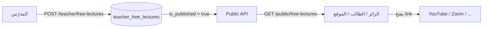
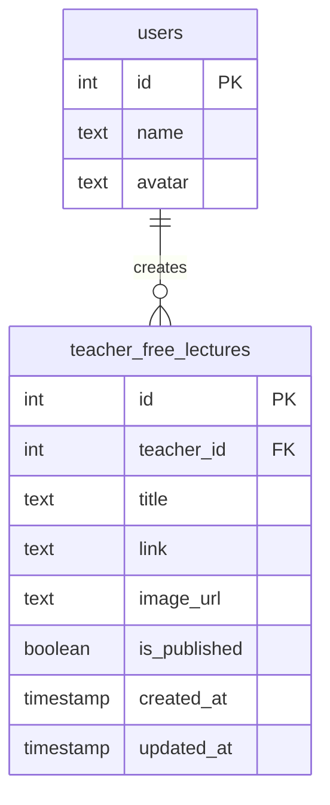

# نظام المحاضرات المجانية — التوثيق الكامل

> **Teacher API:** `/api/teacher/free-lectures`  
> **Public API:** `/api/public/free-lectures`  
> **Controller:** `src/controllers/teacherFreeLectures.ts`  
> **Migration:** `migrations/1772400000000_teacher_free_lectures.sql`

---

## 1. نظرة عامة

نظام **المحاضرات المجانية** يتيح للمدرّس نشر محاضرات خارج الكورسات المدفوعة — كل محاضرة تحتوي على:

| الحقل | الوصف |
|-------|--------|
| **اسم المحاضرة** | `title` |
| **الرابط** | `link` — YouTube، Zoom، Google Drive، إلخ |
| **صورة تعريفية** | `image_url` — غلاف/بوستر المحاضرة |

يوجد مسار **عام (Public)** لعرض المحاضرات المنشورة **بدون مصادقة** — مناسب لصفحة هبوط، تطبيق الطالب، أو موقع المنصة.

### الفرق عن أنظمة أخرى في المنصة

| النظام | الغرض |
|--------|--------|
| **المحاضرات المجانية** (`teacher_free_lectures`) | محتوى مجاني مستقل — رابط خارجي + صورة |
| محاضرات الكورس (`lectures`) | داخل كورس مدفوع/مسجّل |
| الكورسات العامة (`general_courses`) | نظام تفعيل ومجموعات منفصل |

---

## 2. مخطط النظام





---

## 3. قاعدة البيانات

### جدول `teacher_free_lectures`

| العمود | النوع | الوصف |
|--------|-------|--------|
| `id` | SERIAL PK | معرف المحاضرة |
| `teacher_id` | INTEGER FK → `users(id)` ON DELETE CASCADE | المدرّس المنشئ |
| `title` | TEXT NOT NULL | اسم المحاضرة |
| `link` | TEXT NOT NULL | رابط المحاضرة (http/https) |
| `image_url` | TEXT | رابط الصورة التعريفية (Cloudinary أو URL خارجي) |
| `is_published` | BOOLEAN DEFAULT TRUE | `true` = تظهر في Public API |
| `created_at` | TIMESTAMP | تاريخ الإنشاء |
| `updated_at` | TIMESTAMP | يُحدَّث تلقائيًا عبر trigger |

**Indexes:**
- `idx_teacher_free_lectures_teacher_id`
- `idx_teacher_free_lectures_published` — `(is_published, created_at DESC)`

**Cascade:** حذف المدرّس → حذف كل محاضراته.

---

## 4. المصادقة والصلاحيات

| Endpoint | Auth | الدور |
|----------|------|-------|
| `GET /api/public/free-lectures` | ❌ لا | الجميع |
| `GET /api/public/free-lectures/:id` | ❌ لا | الجميع |
| `POST/GET/PUT/DELETE /api/teacher/free-lectures/*` | ✅ Bearer Token | `teacher` فقط |

### قواعد الملكية

- المدرّس يرى ويعدّل **محاضراته فقط**
- لا يمكن لمدرّس تعديل أو حذف محاضرة مدرّس آخر
- Public API يعرض فقط المحاضرات ذات `is_published = true`

---

## 5. قائمة الـ Endpoints

### Public (بدون Token)

| Method | Path | الوظيفة |
|--------|------|---------|
| GET | `/api/public/free-lectures` | قائمة المحاضرات المنشورة |
| GET | `/api/public/free-lectures?teacher_id={id}` | محاضرات مدرّس معيّن |
| GET | `/api/public/free-lectures/:id` | تفاصيل محاضرة واحدة |

### Teacher (Bearer Token)

| Method | Path | الوظيفة |
|--------|------|---------|
| POST | `/api/teacher/free-lectures` | إنشاء محاضرة |
| GET | `/api/teacher/free-lectures` | قائمة محاضراتي (منشورة + مخفية) |
| GET | `/api/teacher/free-lectures/:id` | تفاصيل محاضرة |
| PUT | `/api/teacher/free-lectures/:id` | تعديل |
| DELETE | `/api/teacher/free-lectures/:id` | حذف |

---

## 6. تفاصيل الـ API

### 6.1 Public — قائمة المحاضرات

```http
GET /api/public/free-lectures
```

**Query Parameters (اختياري):**

| Param | النوع | الوصف |
|-------|-------|--------|
| `teacher_id` | number | فلترة محاضرات مدرّس واحد |

**Response `200`:**

```json
{
  "success": true,
  "lectures": [
    {
      "id": 1,
      "title": "مقدمة في الفيزياء — الحركة",
      "link": "https://www.youtube.com/watch?v=dQw4w9WgXcQ",
      "image_url": "https://res.cloudinary.com/demo/image/upload/v1/cover.jpg",
      "created_at": "2026-06-16T10:00:00.000Z",
      "updated_at": "2026-06-16T10:00:00.000Z",
      "teacher_id": 5,
      "teacher_name": "أ. محمد أحمد",
      "teacher_avatar": "https://res.cloudinary.com/demo/avatar.jpg"
    }
  ]
}
```

> الترتيب: الأحدث أولًا (`created_at DESC`).

---

### 6.2 Public — محاضرة واحدة

```http
GET /api/public/free-lectures/1
```

**Response `200`:**

```json
{
  "success": true,
  "lecture": {
    "id": 1,
    "title": "مقدمة في الفيزياء",
    "link": "https://www.youtube.com/watch?v=...",
    "image_url": "https://...",
    "created_at": "...",
    "updated_at": "...",
    "teacher_id": 5,
    "teacher_name": "أ. محمد",
    "teacher_avatar": "https://..."
  }
}
```

**Response `404`:** المحاضرة غير موجودة أو `is_published = false`.

---

### 6.3 Teacher — إنشاء محاضرة

```http
POST /api/teacher/free-lectures
Authorization: Bearer {token}
Content-Type: multipart/form-data
```

| Field | إلزامي | الوصف |
|-------|--------|--------|
| `title` | ✅ | اسم المحاضرة |
| `link` | ✅ | رابط يبدأ بـ `http://` أو `https://` |
| `image` | ❌ | ملف صورة — jpg, png, webp, gif — حد **5MB** |
| `image_url` | ❌ | بديل عن رفع الملف (URL جاهز) |
| `is_published` | ❌ | افتراضي `true` — `false` لإخفاء من Public |

**Response `201`:**

```json
{
  "success": true,
  "lecture": {
    "id": 1,
    "teacher_id": 5,
    "title": "محاضرة مجانية — الكهرباء",
    "link": "https://youtube.com/watch?v=abc",
    "image_url": "https://res.cloudinary.com/.../free-lecture-123.jpg",
    "is_published": true,
    "created_at": "2026-06-16T10:00:00.000Z",
    "updated_at": "2026-06-16T10:00:00.000Z"
  }
}
```

**ملاحظات رفع الصورة:**
- عند إرسال `image` (ملف): يُرفع تلقائيًا إلى **Cloudinary**
- عند إرسال `image_url` فقط: يُحفظ الرابط كما هو
- يمكن ترك الصورة فارغة (`image_url = null`)

---

### 6.4 Teacher — قائمة محاضراتي

```http
GET /api/teacher/free-lectures
Authorization: Bearer {token}
```

يرجع **كل** المحاضرات بما فيها `is_published = false`.

```json
{
  "success": true,
  "lectures": [
    {
      "id": 1,
      "teacher_id": 5,
      "title": "...",
      "link": "...",
      "image_url": "...",
      "is_published": true,
      "created_at": "...",
      "updated_at": "..."
    }
  ]
}
```

---

### 6.5 Teacher — تعديل محاضرة

```http
PUT /api/teacher/free-lectures/1
Authorization: Bearer {token}
Content-Type: multipart/form-data
```

| Field | إلزامي | الوصف |
|-------|--------|--------|
| `title` | ❌ | اسم جديد |
| `link` | ❌ | رابط جديد |
| `image` | ❌ | صورة جديدة (تستبدل القديمة) |
| `image_url` | ❌ | URL صورة — أرسل `""` لحذف الصورة |
| `is_published` | ❌ | إظهار/إخفاء من Public |

**Response `200`:**

```json
{
  "success": true,
  "lecture": { "...": "..." }
}
```

---

### 6.6 Teacher — حذف محاضرة

```http
DELETE /api/teacher/free-lectures/1
Authorization: Bearer {token}
```

**Response `200`:**

```json
{ "success": true }
```

---

## 7. أكواد الأخطاء

| HTTP | الرسالة | السبب |
|------|---------|-------|
| 400 | اسم المحاضرة مطلوب | `title` فارغ |
| 400 | رابط المحاضرة مطلوب | `link` فارغ |
| 400 | الرابط يجب أن يبدأ بـ http:// أو https:// | رابط غير صالح |
| 400 | teacher_id غير صحيح | query param خاطئ |
| 400 | id غير صحيح | معرف غير رقمي |
| 401 | Unauthorized | token مفقود أو غير صالح |
| 403 | Forbidden | دور غير `teacher` |
| 404 | المحاضرة غير موجودة | id خاطئ أو لا تخص المدرّس |

---

## 8. تدفقات الواجهة (Frontend)

### 8.1 صفحة المحاضرات المجانية (Public)

```
GET /api/public/free-lectures
  → عرض Grid/List: صورة + عنوان + اسم المدرّس
  → عند الضغط: فتح lecture.link في متصفح/WebView
```

### 8.2 صفحة مدرّس معيّن

```
GET /api/public/free-lectures?teacher_id=5
  → محاضرات هذا المدرّس فقط
```

### 8.3 لوحة المدرّس — إدارة المحاضرات

```
GET  /api/teacher/free-lectures     → قائمة + حالة is_published
POST /api/teacher/free-lectures     → نموذج: title + link + image
PUT  /api/teacher/free-lectures/:id → تعديل / إخفاء (is_published=false)
DELETE /api/teacher/free-lectures/:id
```

### 8.4 مثال TypeScript (React Native / Web)

```typescript
// Public — جلب المحاضرات
const res = await fetch(`${API_URL}/public/free-lectures`);
const { lectures } = await res.json();

// Teacher — إنشاء
const form = new FormData();
form.append('title', 'محاضرة تجريبية');
form.append('link', 'https://youtube.com/watch?v=abc');
form.append('image', {
  uri: imageUri,
  name: 'cover.jpg',
  type: 'image/jpeg',
} as any);

await fetch(`${API_URL}/teacher/free-lectures`, {
  method: 'POST',
  headers: { Authorization: `Bearer ${token}` },
  body: form,
});
```

---

## 9. أمثلة curl

```bash
# ── Public ──
curl "http://localhost:8000/api/public/free-lectures"
curl "http://localhost:8000/api/public/free-lectures?teacher_id=5"
curl "http://localhost:8000/api/public/free-lectures/1"

# ── Teacher ──
curl "http://localhost:8000/api/teacher/free-lectures" \
  -H "Authorization: Bearer $TOKEN"

curl -X POST "http://localhost:8000/api/teacher/free-lectures" \
  -H "Authorization: Bearer $TOKEN" \
  -F "title=محاضرة مجانية" \
  -F "link=https://youtube.com/watch?v=abc" \
  -F "image=@cover.jpg"

curl -X PUT "http://localhost:8000/api/teacher/free-lectures/1" \
  -H "Authorization: Bearer $TOKEN" \
  -F "title=عنوان محدّث" \
  -F "is_published=false"

curl -X DELETE "http://localhost:8000/api/teacher/free-lectures/1" \
  -H "Authorization: Bearer $TOKEN"
```

---

## 10. الملفات المصدرية

| الملف | الدور |
|-------|--------|
| `src/controllers/teacherFreeLectures.ts` | Teacher CRUD + Public read |
| `src/routes.ts` | تسجيل المسارات |
| `migrations/1772400000000_teacher_free_lectures.sql` | إنشاء الجدول |
| `uploads/teacher-free-lectures/` | تخزين مؤقت قبل Cloudinary |

---

## 11. ملخص سريع للمطور

| المفهوم | القيمة |
|---------|--------|
| Public listing | `GET /api/public/free-lectures` |
| Teacher CRUD | `GET/POST/PUT/DELETE /api/teacher/free-lectures` |
| رفع الصورة | `multipart/form-data` — field name: `image` |
| إخفاء بدون حذف | `is_published = false` |
| Public يرى | `is_published = true` فقط |
| الرابط | يُفتح مباشرة في المتصفح — لا streaming داخلي |

---

*آخر تحديث يتوافق مع `src/controllers/teacherFreeLectures.ts`.*
