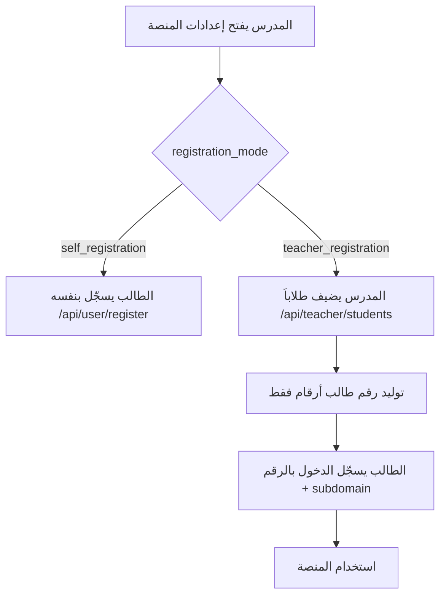

# نظام إدارة تسجيل الطلاب — Teacher Managed Students API

> **Base URL (المدرس):** `/api/teacher/students`  
> **Base URL (عام):** `/api/tenants/public/{subdomain}/registration-settings`  
> **السياق:** نطاق منصة المدرس (subdomain) — **ليس** النطاق الافتراضي `default`  
> **الدور:** `teacher` (صاحب المنصة فقط)

---

## نظرة عامة

يدعم النظام **طريقتين** لتسجيل الطلاب داخل منصة كل مدرس:

| الوضع | القيمة | الوصف |
|-------|--------|--------|
| تسجيل ذاتي | `self_registration` | الطالب ينشئ حسابه بنفسه (النظام الحالي) |
| إدارة المدرس | `teacher_registration` | المدرس فقط يُنشئ الحسابات؛ الطالب يسجّل الدخول بـ **Student ID** |

الإعدادات تُخزَّن في `tenant_settings.data` تحت المفتاح `registration_mode`.

---

## المصادقة

```http
Authorization: Bearer <teacher_jwt>
Host: {subdomain}.yourdomain.com
```

أو مع reverse proxy:

```http
X-Tenant-Subdomain: {subdomain}
```

> المدرس يجب أن يكون `owner_user_id` للمنصة (`tenants.owner_user_id`).

---

## قاعدة البيانات

### Migration

`migrations/1773200000000_teacher_managed_students.sql`

### حقول جديدة في `users`

| الحقل | النوع | الوصف |
|-------|--------|--------|
| `student_code` | `VARCHAR(20)` UNIQUE | رقم الطالب للدخول — أرقام فقط مثل `10001` |
| `must_change_password` | `BOOLEAN` | إلزام تغيير كلمة المرور (غير مستخدم في وضع الدخول بالرقم فقط) |
| `managed_by_teacher_id` | `INTEGER` | المدرس الذي أنشأ الحساب |

### تسلسل توليد الأكواد

`student_code_seq` — يُنتج أرقاماً فقط بصيغة 5 خانات (مثال: `10001`, `10002`). الأكواد القديمة التي تبدأ بـ `ST` تُحوَّل تلقائياً لأرقام فقط.

### الجداول المرتبطة

- `user_grades` — صف الطالب الدراسي
- `group_students` + `study_groups` — مجموعة السنتر (اختياري)
- `tenant_settings` — إعدادات `registration_mode`

---

## 1. إعدادات طريقة التسجيل

### 1.1 قراءة الإعدادات (المدرس)

```http
GET /api/teacher/students/registration-settings
```

**Response:**

```json
{
  "success": true,
  "data": {
    "registration_mode": "self_registration",
    "default_password_from_phone": true
  }
}
```

### 1.2 تحديث الإعدادات (المدرس)

```http
PUT /api/teacher/students/registration-settings
Content-Type: application/json
```

```json
{
  "registration_mode": "teacher_registration",
  "default_password_from_phone": true
}
```

| الحقل | القيم | الافتراضي |
|-------|-------|-----------|
| `registration_mode` | `self_registration` \| `teacher_registration` | `self_registration` |
| `default_password_from_phone` | `boolean` | `true` |

### 1.3 الإعدادات العامة (بدون تسجيل دخول — للفرونت)

```http
GET /api/tenants/public/{subdomain}/registration-settings
```

**Response:**

```json
{
  "success": true,
  "data": {
    "registration_mode": "teacher_registration",
    "self_registration_enabled": false,
        "login_with_student_code": true,
        "login_with_code_only": true,
        "student_code_digits_only": true,
        "message": "يتم إنشاء الحسابات بواسطة المدرس. سجّل الدخول برقم الطالب و subdomain المنصة فقط."
  }
}
```

**استخدام الفرونت:**

- إذا `self_registration_enabled === false` → أخفِ زر «إنشاء حساب»
- إذا `login_with_code_only === true` → صفحة الدخول: **رقم الطالب** + **subdomain** فقط (بدون كلمة مرور)

---

## 2. قائمة الطلاب

```http
GET /api/teacher/students
```

### Query parameters

| المعامل | الوصف |
|---------|--------|
| `search` | بحث بالاسم، Student ID، هاتف الطالب، هاتف ولي الأمر |
| `grade_id` | فلترة حسب الصف |
| `group_id` | فلترة حسب مجموعة السنتر |
| `account_status` | `active` \| `inactive` \| `suspended` |
| `page` | رقم الصفحة (افتراضي: 1) |
| `limit` | عدد النتائج (افتراضي: 20، أقصى: 100) |
| `sort` | `name` \| `created_at` \| `student_code` |
| `order` | `asc` \| `desc` |

**Response:**

```json
{
  "success": true,
  "data": {
    "students": [
      {
        "id": 42,
        "student_code": "10001",
        "name": "أحمد محمد علي",
        "phone": "01012345678",
        "parent_phone": "01198765432",
        "email": null,
        "avatar": null,
        "account_status": "active",
        "must_change_password": true,
        "created_at": "2026-06-24T10:00:00.000Z",
        "grade": { "id": 3, "name": "الصف الثالث الثانوي", "slug": "grade-12" },
        "group": { "id": 5, "name": "مجموعة السبت" }
      }
    ],
    "pagination": {
      "page": 1,
      "limit": 20,
      "total": 45,
      "total_pages": 3
    }
  }
}
```

> تُعرض فقط الطلاب الذين أنشأهم هذا المدرس (`managed_by_teacher_id`).  
> الطلاب المسجّلون ذاتياً (بدون `managed_by_teacher_id`) يظهرون في `GET /api/teacher/platform-students` وليس هنا.

### كل طلاب المنصة (مشترك + غير مشترك)

```http
GET /api/teacher/platform-students
Authorization: Bearer <TEACHER_TOKEN>
```

يعرض **كل** طلاب منصة المدرس (`tenant_id` الحالي) سواء مشتركين أو لا.

**Query (اختياري):** `limit`, `offset`, `search`, `is_subscribed=true|false`, `account_status`

```json
{
  "success": true,
  "data": {
    "tenant_id": 5,
    "summary": { "total": 240, "subscribed": 180, "not_subscribed": 60 },
    "total_students": 240,
    "total": 240,
    "limit": 100,
    "offset": 0,
    "students": [
      {
        "id": 101,
        "name": "محمد علي",
        "email": "student@example.com",
        "phone": "01000000000",
        "is_subscribed": true,
        "subscription_label": "مشترك",
        "grades": [],
        "activation_codes": []
      }
    ]
  }
}
```

---

## 3. إضافة طالب

```http
POST /api/teacher/students
Content-Type: application/json
```

```json
{
  "name": "أحمد محمد علي",
  "grade_id": 3,
  "phone": "01012345678",
  "parent_phone": "01198765432",
  "group_id": 5,
  "use_phone_as_password": true
}
```

| الحقل | إجباري | الوصف |
|-------|--------|--------|
| `name` | نعم | الاسم الثلاثي |
| `grade_id` | نعم | معرّف الصف (من صفوف المدرس في `teacher_grades`) |
| `phone` | لا | رقم هاتف الطالب |
| `parent_phone` | لا | رقم ولي الأمر |
| `group_id` | لا | مجموعة من `study_groups` التابعة للمدرس |
| `password` | لا | كلمة مرور مخصصة (بدلاً من الافتراضية) |
| `use_phone_as_password` | لا | إن وُجد هاتف: استخدامه ككلمة مرور (افتراضي: `true`) |

**Response `201`:**

```json
{
  "success": true,
  "data": {
    "student": {
      "id": 42,
      "student_code": "10001",
      "name": "أحمد محمد علي",
      "phone": "01012345678",
      "parent_phone": "01198765432",
      "account_status": "active",
      "must_change_password": true,
      "grade": { "id": 3, "name": "الصف الثالث الثانوي", "slug": "grade-12" },
      "group": { "id": 5, "name": "مجموعة السبت" }
    },
    "credentials": {
      "student_code": "10001",
      "login_with_code_only": true,
      "must_change_password": false
    }
  }
}
```

> اعرض `credentials` للمدرس مرة واحدة بعد الإنشاء (لطباعة بطاقة أو إرسال لولي الأمر).

---

## 4. عرض / تعديل / حذف طالب

### 4.1 عرض بيانات طالب

```http
GET /api/teacher/students/:studentId
```

### 4.2 تعديل بيانات طالب

```http
PUT /api/teacher/students/:studentId
```

```json
{
  "name": "أحمد محمد علي حسن",
  "grade_id": 4,
  "phone": "01099998888",
  "parent_phone": "01111112222",
  "group_id": 7,
  "account_status": "active"
}
```

جميع الحقول اختيارية.

### 4.3 نقل الطالب لمجموعة أخرى

```http
PATCH /api/teacher/students/:studentId/group
```

```json
{ "group_id": 7 }
```

لإزالة الطالب من أي مجموعة:

```json
{ "group_id": null }
```

### 4.4 حذف طالب

```http
DELETE /api/teacher/students/:studentId
```

يحذف: `group_students`, `user_grades`, `enrollments`, ثم `users`.

إذا وُجدت سجلات مرتبطة أخرى → `409` مع اقتراح إيقاف الحساب بدلاً من الحذف.

---

## 5. إعادة تعيين كلمة المرور

```http
POST /api/teacher/students/:studentId/reset-password
```

```json
{
  "new_password": "MyNewPass123",
  "use_phone_as_password": true
}
```

- إن لم يُرسل `new_password` و`use_phone_as_password` مفعّل والطالب له هاتف → تُستخدم كلمة المرور = رقم الهاتف.
- وإلا يُولَّد رمز عشوائي.

**Response:**

```json
{
  "success": true,
  "data": {
    "student_id": 42,
    "student_code": "10001",
    "temporary_password": "01012345678",
    "must_change_password": true
  }
}
```

---

## 6. تفعيل / إيقاف الحساب

```http
PATCH /api/teacher/students/:studentId/status
```

```json
{ "account_status": "suspended" }
```

القيم: `active` | `inactive` | `suspended`

الطالب ذو الحالة غير `active` لا يستطيع تسجيل الدخول (`403 STUDENT_ACCOUNT_INACTIVE`).

---

## 7. استيراد طلاب من CSV

```http
POST /api/teacher/students/import
Content-Type: multipart/form-data
```

| الحقل | الوصف |
|-------|--------|
| `file` | ملف `.csv` |

بديلاً: إرسال نص CSV في JSON:

```json
{ "csv": "name,grade,phone,parent_phone,group\nأحمد محمد,الصف الثالث الثانوي,010...,011...,مجموعة السبت" }
```

### أعمدة CSV المدعومة

| إنجليزي | عربي (بديل) |
|---------|-------------|
| `name` | `الاسم`, `الاسم_الثلاثي` |
| `grade` أو `grade_id` | `الصف`, `الصف_الدراسي` |
| `phone` | `رقم_الهاتف`, `هاتف_الطالب` |
| `parent_phone` | `ولي_الامر`, `رقم_ولي_الامر` |
| `group` أو `group_id` | `المجموعة` |

- الصف: بالمعرّف الرقمي أو بالاسم/الـ slug (من صفوف المدرس).
- المجموعة: بالمعرّف أو بالاسم (من `study_groups` للمدرس).

**Response:**

```json
{
  "success": true,
  "data": {
    "total_rows": 50,
    "created_count": 47,
    "failed_count": 3,
    "results": [
      {
        "row": 2,
        "name": "أحمد محمد",
        "success": true,
        "student_id": 42,
        "student_code": "10001"
      },
      {
        "row": 5,
        "name": "",
        "success": false,
        "error": "الاسم مطلوب"
      }
    ]
  }
}
```

---

## 8. تسجيل الدخول والتسجيل (تأثير الوضع)

### 8.1 منع التسجيل الذاتي

عند `registration_mode = teacher_registration`:

```http
POST /api/user/register
```

**Response `403`:**

```json
{
  "success": false,
  "code": "SELF_REGISTRATION_DISABLED",
  "message": "يتم إنشاء الحسابات بواسطة المدرس. يرجى التواصل مع مدرسك للحصول على بيانات تسجيل الدخول."
}
```

### 8.2 تسجيل الدخول برقم الطالب فقط (وضع المدرس)

عند `registration_mode = teacher_registration` لا حاجة لكلمة مرور — **رقم الطالب + subdomain** فقط.

```http
POST /api/login
```

```json
{
  "student_code": "10001",
  "subdomain": "omar"
}
```

> `student_code`: أرقام فقط (يُزال أي حرف تلقائياً).  
> `subdomain` أو `tenant_subdomain`: **مطلوب** عند الدخول من host افتراضي (`localhost` / `default`).  
> من نطاق المنصة مباشرة (`omar.yourdomain.com`) يكفي `student_code` فقط.

**Response (مقتطف):**

```json
{
  "user": {
    "id": 42,
    "name": "أحمد محمد علي",
    "student_code": "10001",
    "role": "student",
    "must_change_password": false
  },
  "token": "...",
  "tenant": { "id": 2, "subdomain": "omar", "display_name": "..." }
}
```

> في وضع `self_registration` يبقى الدخول بالهاتف/البريد + كلمة المرور كما هو.

---

## 9. المجموعات والصفوف (مراجع)

| الغرض | المسار |
|-------|--------|
| مجموعات السنتر | `GET/POST /api/study-groups` |
| صفوف المدرس (عام) | `GET /api/tenants/public/{subdomain}/grades` |
| كل طلاب المنصة (قديم) | `GET /api/teacher/platform-students` |

---

## 10. رموز الأخطاء الشائعة

| HTTP | `code` | المعنى |
|------|--------|--------|
| 403 | `SELF_REGISTRATION_DISABLED` | التسجيل الذاتي معطّل |
| 403 | `STUDENT_ACCOUNT_INACTIVE` | حساب الطالب موقوف |
| 400 | `SUBDOMAIN_REQUIRED` | دخول برقم الطالب بدون subdomain من host افتراضي |
| 400 | `PHONE_REGISTERED_ON_TENANT` | رقم الهاتف مكرر على المنصة |
| 404 | — | الطالب غير موجود أو لا يخص المدرس |
| 409 | — | تعذر الحذف — سجلات مرتبطة |

---

## 11. تدفق العمل (مخطط)



---

## 12. ملفات الكود

| الملف | الدور |
|-------|--------|
| `src/services/teacherManagedStudents.ts` | المنطق الأساسي |
| `src/controllers/teacherStudents.ts` | مسارات API |
| `src/controllers/auth.ts` | دخول بـ `student_code` |
| `src/controllers/user.ts` | منع التسجيل الذاتي |
| `src/controllers/tenantsPublic.ts` | إعدادات عامة للفرونت |
| `migrations/1773200000000_teacher_managed_students.sql` | Migration |

---

## 13. ملاحظات للفرونت إند

1. **صفحة إعدادات المنصة:** قسم «طريقة تسجيل الطلاب» → `GET/PUT registration-settings`.
2. **صفحة الطلاب:** جدول من `GET /api/teacher/students` مع pagination وsearch.
3. **Modal إضافة طالب:** `POST /api/teacher/students` — اعرض `credentials` بعد النجاح.
4. **صفحة الدخول:** `student_code` (أرقام) + `subdomain` — بدون كلمة مرور في وضع المدرس.
